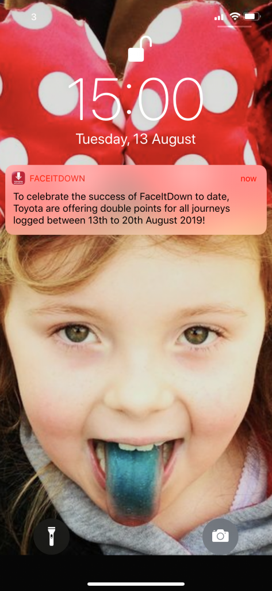
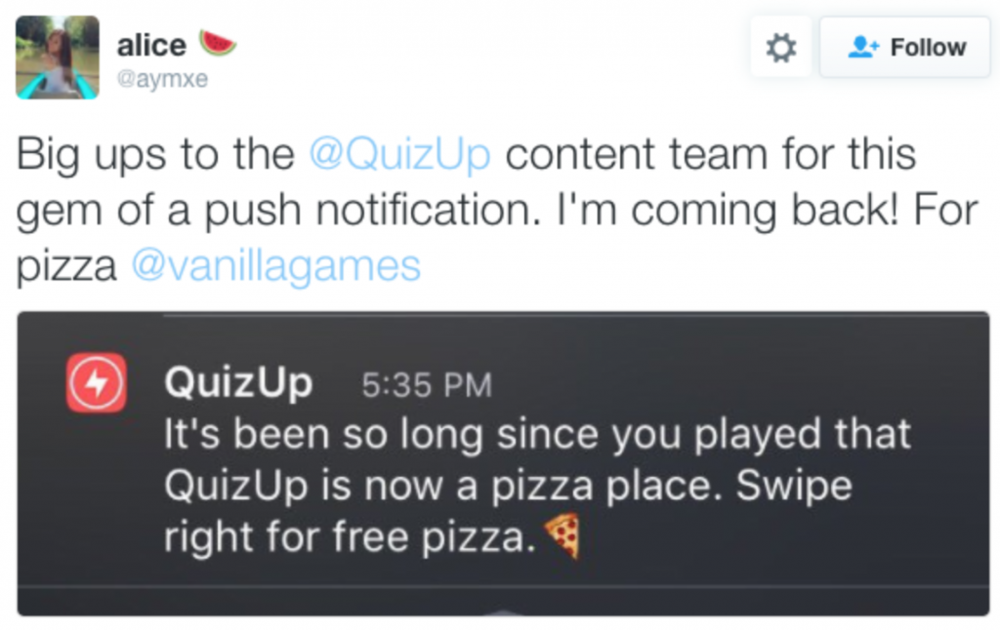
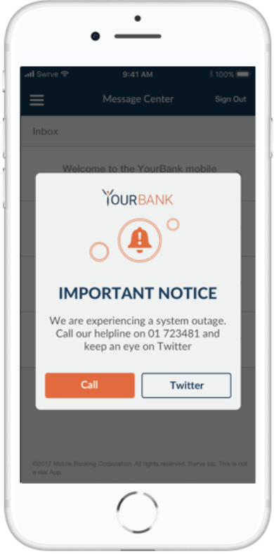
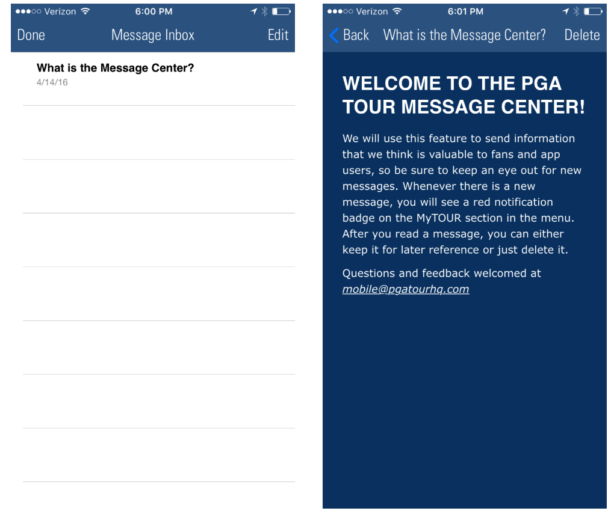

#### **1\. Push notifications**

[Push notifications](https://tapadoo.wpengine.com/unsure-about-app-push-notifications/), although not technically in-app communication, is a form of communication for your app. The difference between [push notifications](https://tapadoo.wpengine.com/unsure-about-app-push-notifications/) and in-app messages and the message centre is that push messages can be sent outside the app. See the example below of a push notification sent for the Toyota FaceItDown app.

[Push notifications](https://tapadoo.wpengine.com/unsure-about-app-push-notifications/) are probably the most controversial form of app communication. Mainly because it's the most abused form of app communication. You can read a previous post [here](https://tapadoo.wpengine.com/unsure-about-app-push-notifications/) on how we advise clients on the best use of [push notifications](https://tapadoo.wpengine.com/unsure-about-app-push-notifications/). However, if used correctly they can be an effective form of communication for your app.

**Push notification done right**

Toyota FaceItDown Push Notification

You can send a push notification anytime the app is installed. The user doesn’t need to be in it to receive them. However, users need to give permission for these. And if they say no to this permission or deactivate it because of spam notifications, then you've lost the opportunity to engage with them outside of the app.

The key is to ask for this permission at the right stage of the onboarding process. Ask for it after the user has gone through the initial tour of the app. At least that way they have seen the benefits of using it. You've also hopefully shown them a valid reason for sending push notifications.

If you abuse push notifications the user might opt out of receiving them, or worse, uninstall the app.

**Push notification done wrong**

[Source](https://www.theverge.com/2018/12/18/18145289/apple-iphone-ios-push-notifications-carpool-karaoke)

Let user data determine when to send a push notification. This way you can personalise the experience for the user. It will also entice them to engage with the notification.

Have you ever received a push notification that was personal and sent at the right time? It’s almost as if the app could anticipate your next move and the notification just acts as a gentle prompt.

[Source](https://www.leanplum.com/blog/7-most-creative-push-notifications/)

Some interesting stats from [Localytics](http://info.localytics.com/blog/6-stats-that-prove-how-important-push-notifications-in-app-messaging-are-to-your-apps-success) on push notifications:

> Push notifications boost app engagement by 88%
> 
> 65% of users return to an app within 30 days when push is enabled
> 
> 50% of users opt into push and find push messages useful

#### **2\. In-app messages**

Another form of communication within your app is in-app messages. These are the message that users receive within the app. And apps that use in-app messaging have increased retention by [3.5x](http://ebooks.localytics.com/2016-app-marketing-guide#find-6-push-opt-in-rates-decreased). This is a very good reason for marketers to use them yet only [33%](https://venturebeat.com/2015/06/30/only-33-of-app-marketers-use-in-app-messaging-but-they-get-3-5x-higher-retention/) of marketers do.

[Source](https://www.swrve.com/weblog/what-in-app-messages-mean-for-different-verticals)

Like with push notifications, you only send in-app messages when needed. If they detract from the user experience, they will be considered spam.

The best use of in-app messaging is to match it to the users activity. This can help move the user along to the next step. A gentle nudge without interrupting their experience.

And again, don’t use in-app messaging every time you want to send a message. Remember, it's about the user and their experience.

Some interesting stats from [Localytics](http://info.localytics.com/blog/6-stats-that-prove-how-important-push-notifications-in-app-messaging-are-to-your-apps-success) on in-app messages:

> App launches increase by 27% with in-app messages
> 
> In-app messages boost engagement by 3x
> 
> In-app messages triggered from an in-app event increase conversions by 4x

#### **3\. Message centre**

The message centre is a great way to provide content on the other features within your app. An icon appears over the message centre to indicate each time a new message has been added. 

The good news about the message centre is that its content generates [8x](https://www.urbanairship.com/lp/mobile-engagement-benchmarks-message-center-response-rates) the read rate of push notifications alone. And message centre read rates more than double when used in combination with a push notification.

The message centre is a good way to activate new users. You can use it to store information on the features of the app that you didn't show in your onboarding. Or even features that you did show that you want made available to users so that they can refer back to them at any time.

[Mobile Marketer](https://www.mobilemarketer.com/ex/mobilemarketer/cms/opinion/columns/23271.html) notes that notifications virtually disappear on iOS once the user has unlocked their device and that even though these notifications can be found in a pull-down menu, its not a highly used feature. So it makes sense that apps consider a message centre as part of their communication strategy.

[Source](https://www.airship.com/blog/7-in-app-message-center-best-practices/)

#### Conclusion

In-app communication will play a big part in the user experience within your app. Consider your in-app communication strategy at the outset of the user experience process and change it regularly to reflect the likes and dislikes of users. Keep the user at the centre of the communication strategy always, personalise the message and above all, don't abuse these channels.

Maria Colgan

Digital Marketing Manager
