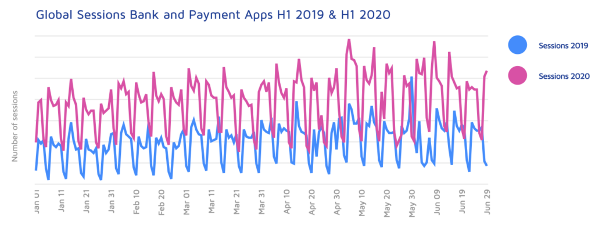
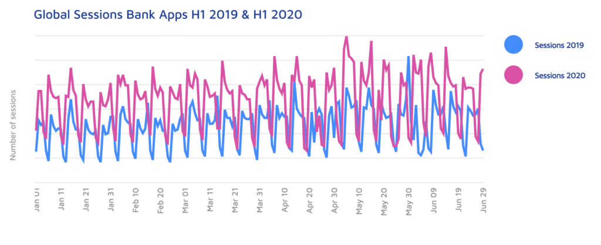
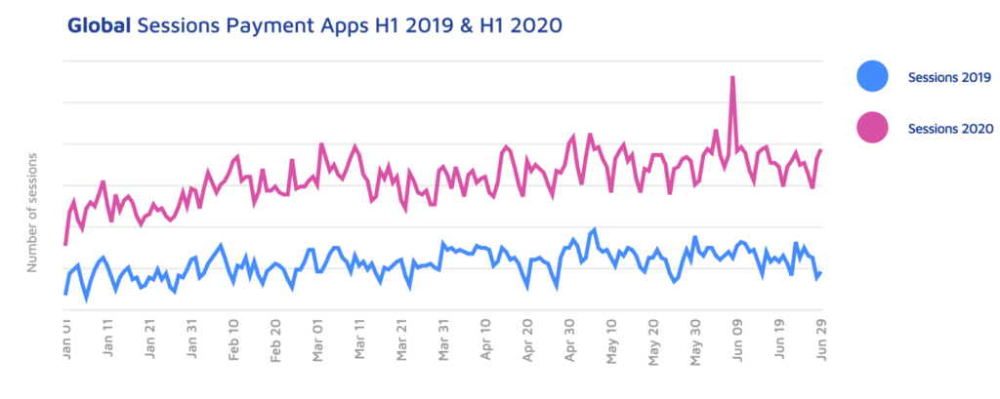
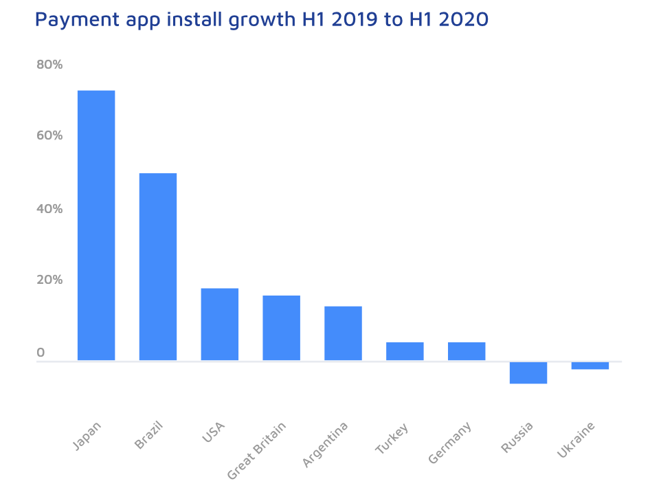

Mobile app usage during the COVID-19 pandemic has skyrocketed and one of the many verticals seeing the biggest uptake is the finance industry.

According to [Adjusts](https://www.adjust.com/resources/downloads/mobile-finance-report-2020/?utm_source=autoresponder&utm_campaign=mobile-finance-report-2020) latest report on the health of the finance industry, global sessions for banking and payment apps combined increased by an average of 26% in 2020.

The key takeaways from this report are:

- From January to June 2020, activity in investment apps saw and 88% growth in average sessions per day.
- Emerging markets are driving global growth and fintech is seen as less of a disruptor in those markets and more of a filling a need that traditional banks couldn't supply.
- The number of sessions in payment apps increased by 49%, with the most notable increases being Japan at 75%, Germany at 45%, Turkey at 39%, the US at 33% and Great Britain at 29%.
- Sessions for banking and payment apps combined increased by 26%, with the most notable being Japan at 142%, Germany at 40%, Turkey at 31%, and the US at 27%.
- Super-apps such as WeChat and KaKaoTalk, remain one of the top trends in Asia. WeChat and Alipay have exceeded one billion users and Zalo surpassed the 100 million mark.

The Fintech lending market is also on the increase. A growth rate of [9.1%](https://www.bmmagazine.co.uk/in-business/fintech-lending-industry-to-hit-291bn-in-2020/) is expected for Fintech lending in 2020. This is fuelled by the number of users taking out loans via Fintech loans or neobanks offering loan services. The Fintech lending market is expected to reach $291.4 billion in transaction value this year, and $396.8 billion by 2024.

#### Global Sessions Bank and Payment Apps H1 2019 and H1 2020

The image below shows the combined bank and payment app sessions globally for H1 2019 & H1 2020.

Source: [Adjust](https://www.adjust.com/resources/downloads/mobile-finance-report-2020/?utm_source=autoresponder&utm_campaign=mobile-finance-report-2020)

Mobile payments and transactions are increasing because of the likes of PayPal, Samsung Pay, Apple Pay, AliPay, PayPay and WeChat having all adapted to processing mobile payments and transactions. According to a [Business Insider](https://www.businessinsider.com/mobile-banking-market-trends?r=US&IR=T) study, half of credit unions surveyed saw a 56% increase in mobile wallet adoption and a 53% increase in mobile transactions. Also driving this increase is that more than [25% of consumers](https://www.businesswire.com/news/home/20200406005318/en/Global-Mobile-Payments-Market-2020---Growth) make weekly purchases from their mobile device and mobile payments are predicted to rise to [$138 billion in 2020](https://www.forbes.com/sites/shelleykohan/2020/03/01/fueled-by-increased-consumer-comfort-mobile-pay).

#### Global Sessions in Bank Apps

COVID-19 may not be the only factor that's driving global sessions on bank apps. According to [Finder](https://www.finder.com/neobank-adoption), 60% of millennials, 54% of Gen X and 56% of baby boomers either already use or plan to use only digital banking. But COVID is also playing its part with [82% of consumers](https://www.icarvision.com/en/the-impact-of-covid-19-on-the-use-of-online-banking) concerned about going to the bank and [63%](https://www.icarvision.com/en/the-impact-of-covid-19-on-the-use-of-online-banking) willing to try an app. Time spent on finance apps in Japan and South Korea has increased by [85%](https://www.forbes.com/sites/johnkoetsier/2020/04/15/report-35-85-fintech-growth-on-mobile-thanks-to) from December 2019 to March 2020.

Source: [Adjust](https://www.adjust.com/resources/downloads/mobile-finance-report-2020/?utm_source=autoresponder&utm_campaign=mobile-finance-report-2020)

> "The impact the pandemic has had on banking and the increase in mobile digital services should not be underestimated. While the banking sector has been adapting to digital disruption for several years, COVID-19 is accelerating the transformation, opening up access and opportunity to millions of un- and under-banked consumers around the world."
> 
> Paul H. Müller,  
> Co-founder and CTO of Adjust

#### Payment Apps

According to Adjust, sessions in payment apps increased by 49% in the first half of 2020. This correlates with data from [BuyShares UK](https://thepaypers.com/mobile-payments/mobile-wallet-payments-to-surge-by-50-percent-in-2020--1242730#) who estimated that mobile payments would increase by 50% during the COVID-19 pandemic. In Germany [41%](https://www.dw.com/en/paying-in-cash-in-germany-and-the-coronavirus-corona-crisis-epidemic/a-5334987) more people are making cashless payments than before the pandemic. The biggest growth rates in mobile payments are Japan at 75%, Germany at 45%, Turkey at 39%, Great Britain at 29% and the US at 33%.

Source: [Adjust](https://www.adjust.com/resources/downloads/mobile-finance-report-2020/?utm_source=autoresponder&utm_campaign=mobile-finance-report-2020)

#### Payment app install growth H1 2019 to H1 2020

Below are the installs of the top payment apps worldwide.  Up until now, Japan has been slow to [adopt payment apps](https://www.pymnts.com/news/mobile-payments/2019/are-mobile-payments-finally-ready-to-ignite-in-japan/). The Japanese Government introduced a cashless payment reward system in October 2019. The scheme ended in June 2020 but this hasn't stopped Japan’s trajectory of having [28 million](https://www.pymnts.com/news/mobile-payments/2020/mobile-payments-on-smartphones-soar-in-japan/) mobile payment users by 2023, reaching 25% of the population. 

Source: [Adjust](https://www.adjust.com/resources/downloads/mobile-finance-report-2020/?utm_source=autoresponder&utm_campaign=mobile-finance-report-2020)

More than [1 billion](https://www.emarketer.com/content/global-mobile-payment-users-2019) people worldwide are predicted to make a mobile payment in 2020. The top mobile payment providers globally are Apple Pay, Google Pay and Samsung Pay. While Alipay and WeChat are the main providers in China. 

Maria Colgan

Digital Marketing Manager
