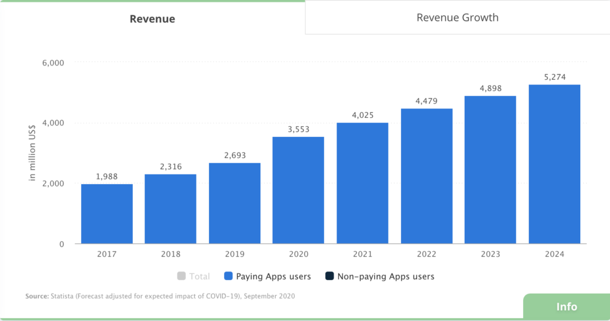
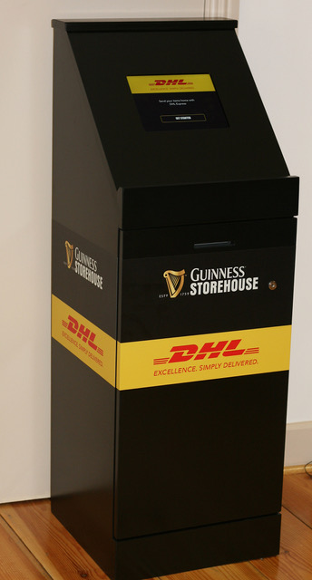
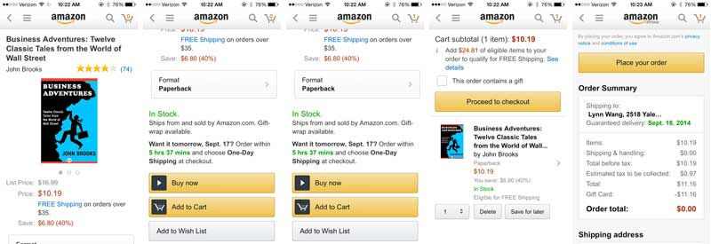
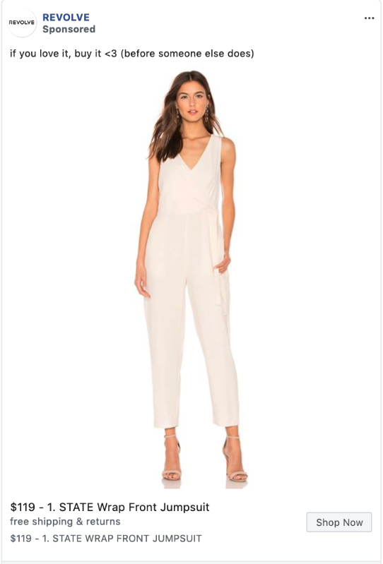
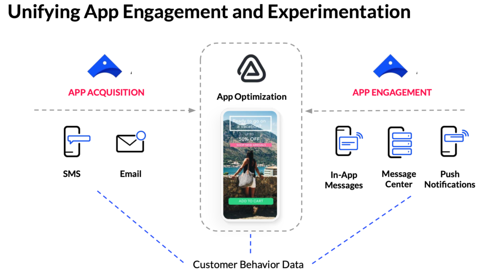
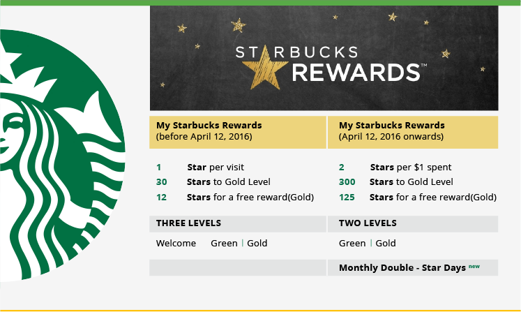

Mobile apps benefit and enhance the customer experience with your brand. They also generate revenue for your business if done right.

According to [Statista](https://www.statista.com/outlook/318/100/apps/worldwide) revenue within mobile apps will see a sharp growth over the next number of years.

- Revenue in the apps segment is projected to reach US$3,553m by end of 2020.
- Revenue is expected to show an annual growth rate (CAGR 2020-2024) of 10.4%, resulting in a projected market volume of US$5,274m by 2024.
- User penetration will be 11.1% in 2020 and is expected to hit 13.4% by 2024.
- The average revenue per user (ARPU) is expected to amount to US$4.30.
- In global comparison, most revenue will be generated in the United States (US$1,269m in 2020)

#### **Growth In App Revenue to 2024**

[Statista](https://www.statista.com/outlook/318/100/apps/worldwide)

Here are five things you can do to help boost sales within your app.

### 1\. Focus on solving the users pain point, not on selling a product

While it's tempting to see your app as a product brochure for your business, this may not be very enticing for the user. Using a mobile app is about the user experience journey and apps that succeed at this keep users coming back for more. They understand that it's not just about selling a product but making the customer experience easy, intuitive and enjoyable.

Users download an app out of a need. They have a need to address a specific problem, be that with their health, fitness or need for connection through social media and gaming. This need is their paint point. If you can identify a paint point your users have and build it into an app you are on the road to developing a successful app.

Apps that fail are built for the wrong reasons and it's becoming a major weakness for companies to conduct effective user research and identify user pain points. 

By identifying users pain points you can seamlessly build these into the user experience journey. A good place to start is through user research, looking at apps currently on the market to see how you can improve on them and identifying specific issues users are having with your service.

#### Example:

Below is an example of an iPad app we developed for DHL for the Guinness Storehouse. When the Storehouse was busy it was time-consuming for staff members to complete a DHL shipping form for customers to send their purchases back home. As a result, many customers weren't offered this service. After becoming aware of this issue DHL worked with us to develop an iPad app that would sit within a kiosk. It meant that after the customer purchased their item they could use the iPad app situated in the kiosk to process their own shipping. This resulted in a 60% sales growth in shipping for DHL. A figure that has remained year on year.

DHL Kiosk in Guinness Storehouse

### 2\. Streamline the process

It's important that the payment process within your app is streamlined both in terms of the number of screens and the design. It's also important to offer a number of payment methods. Many apps offer one type of payment option, such as through PayPal but [56%](https://www.columnfivemedia.com/work-items/infographic-no-cart-left-behind-why-shoppers-arent-following-through-on-online-purchases) of people expect a number of payment options.

During the COVID-19 pandemic, our local gymnastics club had a new app developed to accept payments as a way of stopping parents dropping into the club with their bank card. While the app was a good idea and had the potential to make life easier, it actually made paying more difficult. Even though the payment would be taken only once the payment method was set up as a direct debit. This meant you needed to locate the BIC and IBAN for your bank. Whatever about grabbing your bank card from your wallet and paying, you now had to log into your bank account to source the BIC and IBAN making it a cumbersome process and one I gave up on.

If the payment process and number of screens are streamlined you make it easier for users to pay and not abandon their cart. The average cart abandonment rate is [69.57%](https://sleeknote.com/blog/cart-abandonment-statistics), but for mobile apps, it's even higher at 85.65%. You really only have one chance to make the right impression with your payment process.

#### Example:

Amazon has a very sleek payment process. The user will have already set up the account and registered their payment details, so it makes it easy for future purchases. I'm sure their sleek payment process is one of the reasons why last year Amazon became the world's second-ever public company to be valued at $1 trillion, after Apple, and it has the second-highest market valuation in the world, after Microsoft. The ease of payment is a major draw for many users.

Amazon App Payment Screen: [Source](https://apptimize.com/blog/2014/09/mobile-ux-optimizing-checkout-flows/)

### 3\. Give users a reason to keep coming back

Users often need to be reminded to keep coming back to your app. A powerful way to do this is through a retargeting campaign. Mobile app retargeting is an ad campaign that targets people who have previously visited your mobile app. You can serve personalised ads to encourage users to re-engage, re-install, or complete a down-funnel conversion.

Retargeting helps you re-engage the users you've already spent money acquiring. It's a nice reminder to bring them back to the app. It also helps drive user engagement, boost your apps retention rates and increase conversions. Sales conversions for mobile retargeting is [13 times higher](http://www.atelier.net/en/trends/articles/retargeting-mobile-proving-more-effective-desktop-pcs_427425) than desktop retargeting and mobile retargeting has a 46% higher click-through rate than on desktops.

#### Example:

Revolve is a personal favourite of mine. They are excellent at their retargeting campaigns and always entice me back. When I browse through the different clothing categories through their app and then leave the app to go onto social media, the exact same clothing choices will appear in my feed as an ad. This is reinforcing the message of why I was looking at them in the first place. They also do an effective email campaign highlighting the browsed items and letting you know how many are left in stock. This type of retargeting is very personalised and creates a stronger connection with the brand. There's a sense of "they know me", thus pushing me to make the purchase.

Revolve has also had great success with lookalike audiences on Facebook, so much so, that Facebook has done a case study on it, which you can read about [here](https://www.facebook.com/business/success/revolve).

### 4\. Use communication channels effectively

I'm sure you've heard a lot about push notifications. They can be a bone of contention here in Tapadoo. In fact, our CEO wrote a [post](https://tapadoo.com/unsure-about-app-push-notifications/) on them explaining what push notifications are designed for. But there's no denying that push plays a part in increasing sales.

The key with push notifications is asking for permission at the right time. If users opt into receiving them you still have to be careful to not abuse this channel. One of the best practices is to personalise your push notifications. Getting the most out of this communication channel means appealing to users' personal interests. Timing is also key for sending push notifications and this can vary from user to user.

For push notifications to be effective they need to be sent based on users and data. You can't just send a blank push notification and hope for the best. That's the reason why [71%](https://twitter.com/chrismaddern/status/756612969807699968/photo/1) of all app uninstalls are triggered by a push notification. The three key ingredients with push notifications are: personalise, timely and curiosity. If you can get these ingredients right you can be part of the success of push notifications and not the failure.

The key also is to remember the other communication channels you have at your disposal.

#### Example:

This isn't an example per se, but it sums up how there are other communication channels at your disposal and how push notifications are part of a bigger picture of communication channels at your disposal. Every communication decision should be based on customer behaviour data. If it's not, you run the risk of people opting out of certain communication channels at best, and at worst uninstalling your app. Push is a great option but it should only be used at the right time and with the right message.

[Airship](https://www.airship.com/)

### 5\. Set up a loyalty scheme

In-app loyalty and rewards programs create customer loyalty and help with brand engagement and retention. The reward process incentivises users to keep coming back to your app. So it not only builds relationships with your users it also encourages repeat business, enhances your business reputation, and creates trust.

Many small businesses don't have the budgets to develop and maintain a loyalty program app. But you don't need to invest a lot of time and money building your own loyalty app instead you can use an existing loyalty app provider and pay a monthly or annual service fee. Fee's vary between providers but you can pay as little as $20 per month.

#### Example:

Starbucks loyalty scheme uses stars as in-app points. When users earn enough points they get a free drink. Users earn stars by using their registered Starbucks card or with a card registered on the Starbucks mobile app. Starbucks also allows users to send eGifts to friends. The Starbucks loyalty program has [16 million](https://digital.hbs.edu/platform-digit/submission/starbucks-winning-on-rewards-loyalty-and-data/) active members as of March 2019, 11% growth of their user base in Q2 2018 and contributes to 40% of its revenue and saw a sales increase of 7% in 2019.

Starbucks Rewards: [Source](https://medium.com/zinrelo/loyalty-rewards-case-study-new-starbucks-rewards-program-33a037a8d5f1)

Maria Colgan

Digital Marketing Manager
