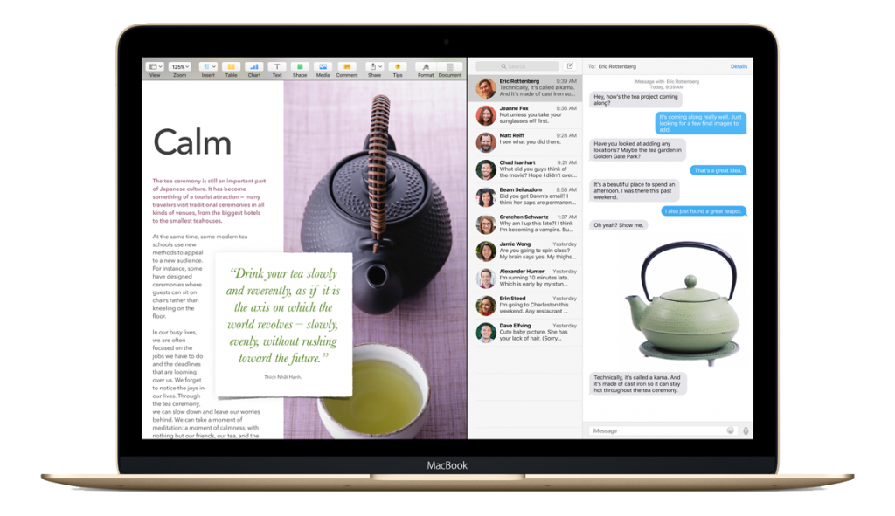
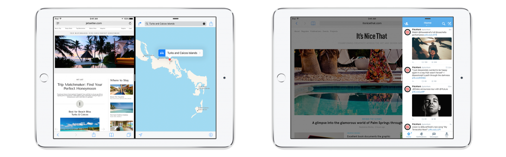
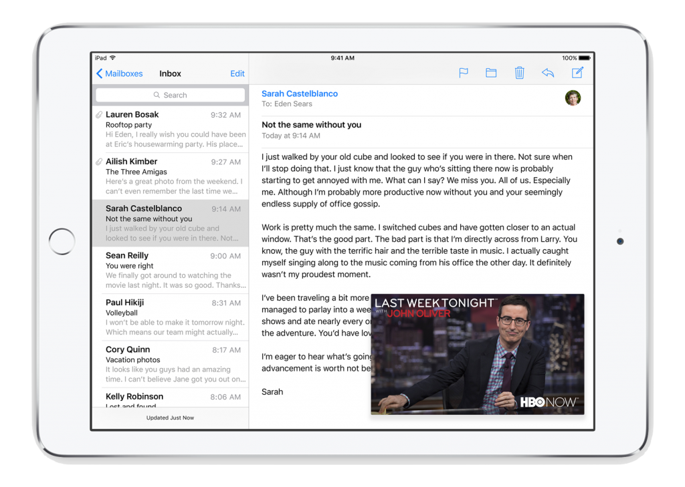

It’s safe to say that this year’s [WWDC Keynote](http://www.apple.com/live/2015-june-event/) scratched an itch that a lot of Apple users had for quite some time - the ability to multitask efficiently on all devices.

Apple already had some useful features to juggle all our software needs at once: a double press of the iOS home button would allow you to swipe between running apps, mimicking the ability to swipe between screens on your Mac. However this was essentially as far as iOS went. With newer Mac operating systems, circa OS X Mavericks, came better features such as Mission Control, which allowed the user to switch between multiple desktop workspaces independently on different displays. However complete multitasking, particularly on devices like the iPad, always felt slightly lacking. Now, Tim Cook and His Merry Men, and Women (yes, we noticed Apple included women executives in their keynote for the [first time](http://qz.com/422340/all-the-women-on-stage-at-apple-keynotes-charted/)) have finally done it, introducing a complete multitasking experience for both Macs and iPads.

_Split Screen on OS X El Capitan_

Along with OS X 10.11 El Capitan comes the ability to run two screens side by side at once. This is very similar to Windows 8’s Snapscreen function but don’t worry, Apple has added its usual aesthetically pleasing and user friendly bells and whistles. Better window management allows the user to take advantage of El Capitan’s additional features, including the ability to pin sites in Safari which turns your home screen into a personalised ‘Pinterest’-esque directory of your favourite sites. Apple's senior vice president of Software Engineering, Craig Federighi, claims El Capitan will be able to open applications 1.4 times faster than previous operating systems, making it ‘Higher, faster and better’.

The really exciting news is this side-by-side feature isn’t just restricted to El Capitan - iPads running iOS 9 will also have this functionality. This long-awaited enhancement puts iPads right back in the race against rival Surface Tablets, which have included multi-screen viewing for the past few years.

_Split Over & Spit View on iPad_

Not only does this transform the iPad into a miniature computer, it makes it a far more functional device for all of its varied users. Two different multitasking modes were announced and displayed: Split View and Slide Over. The difference? Split View allows for asynchronous running of two apps. Think “tweeting while watching”, all on the one screen. With the Slide Over functionality, a user can open another app on-screen while the other is running in the background. Once you Slide Over, interaction with the original app is paused. These modes are all enhanced with a new App Switcher that lets you swipe to pull other apps into view. It even allows you to run videos within other apps - and all of this with a simple four fingered swipe (a gesture so new to WWDC attendees that many felt they were learning to ride a bike all over again).

_Inline Video on iPad_

But how does this affect us developers? Does this mean a whole new screen size to consider when designing and implementing UI’s? Federighi reassures everyone that “if you’ve adopted auto layout, this will all just work,”, which puts our constraint-driven minds at ease.

So where can we begin our multitasking experience? Split view is only available on the iPad Air 2 while Slide Over multitasking is available on iPad Air, Air 2, Mini 2, and Mini 3. While yesterday’s Keynote may be seen as Apple simply ‘playing catch up’, they unveiled a beautiful side by side display, not only in their operating system updates, but also in their gender equality on stage, both of which were long overdue and gratefully accepted.

Image Credit: [Cheon Fong Liew on Flickr](https://www.flickr.com/photos/liewcf/)

Apple screenshots are from the [iOS 9 Preview](http://www.apple.com/ios/ios9-preview/)
