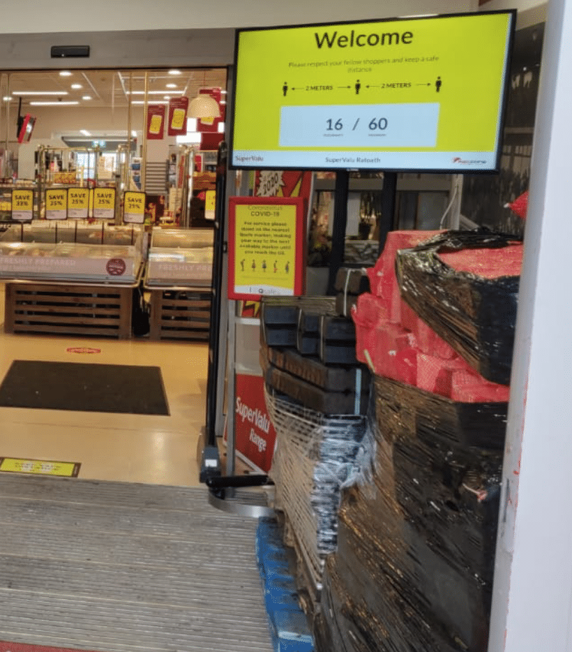
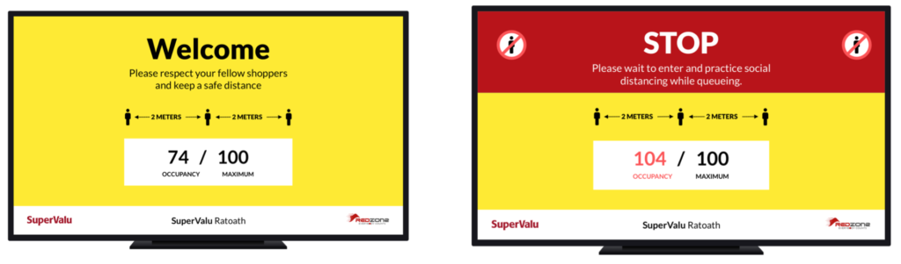
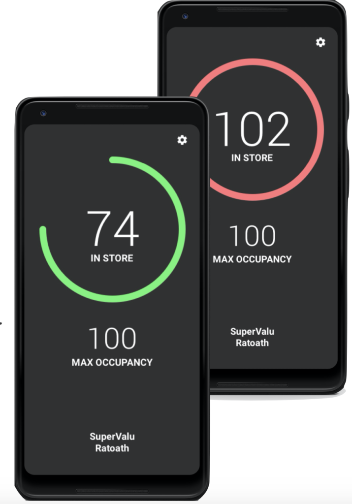

Retail outlets providing essential services must remain open during the current Covid-19 pandemic. In order to prevent the spread of the disease, they must ensure safe distancing for the welfare of staff and customers. Key to this is ensuring that their premises does not get crowded. Occupancy must be limited.

It’s often a poor use of a staff members time and skill to have them staffing entrances to the store. Along with it being costly, it also puts the staff member at a higher risk of infection than their colleagues. They may also have to deal with customer disagreements on whether the store is full or not and if they should be allowed to enter. 

To solve these problems, Tapadoo has partnered with RedZone to offer a tech system that will help control the number of people entering the retail store at any one time. It's a fully automated people counting system.

## **Introducing TRUCount**; People Counting System

TRUCount is an automated, real-time, accurate people counting system to help manage your occupancy levels. It consists of Internet of Things (IoT) laser scanners at entrance/exit that relay the numbers entering to central servers digital signage and staff apps.

The live count is displayed on a large screen at the store's entrance/exit.

TRUCount Live in SuperValu Ratoath

### **How the People Counting System Works**

- Laser scanners count people as they enter and exit store 
- Data is relayed to the cloud for counting purposes 
- Servers power digital signage and apps 

See the video below of the people counting system live in SuperValu, Ratoath, Co Meath. SuperValu adopted this new way of monitoring the numbers in its store a few weeks back and are having great success with it.

https://www.youtube.com/watch?v=ISoatcgVht4&feature=youtu.be

### Digital Signage

The digital signage at the entrance to each retail store is large and clear, which removes any ambiguity around the occupancy level. If the retail store's count goes over the allowed occupancy level, the screen changes colour. This aims to eliminate any conflict with customers regarding occupancy levels.

Digital Signage at the entrance to retail stores

You can still provide the personal touch. The staff app also shows the current occupancy level. You can put a staff member on the door when you're near full occupancy. However, if staff members are busy elsewhere they can rely on TRUCount signage to do the job for them.

Staff App

## **Privacy and Security First**

As the technology is based on laser scanning and not cameras it does not capture personal identities in the way that CCTV cameras do. So counting is fully anonymous. As only counts are relayed and there is no identifying data there are no GDPR concerns. The system also uses its own router and is not connected to a customer network.

If you'd like to find out more about our people counting system, TRUCount [get in touch](https://tapadoo.com/contact/).

Maria Colgan

Digital Marketing Manager
