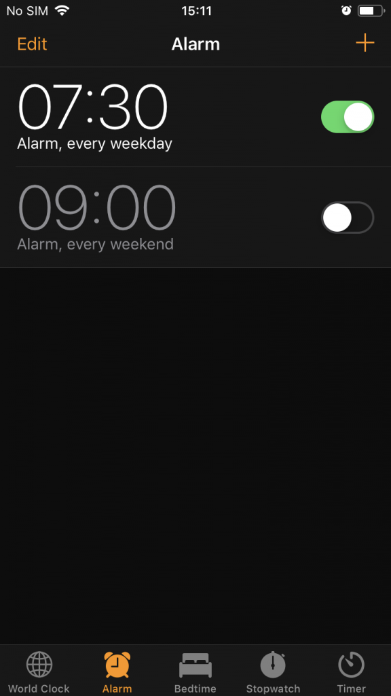
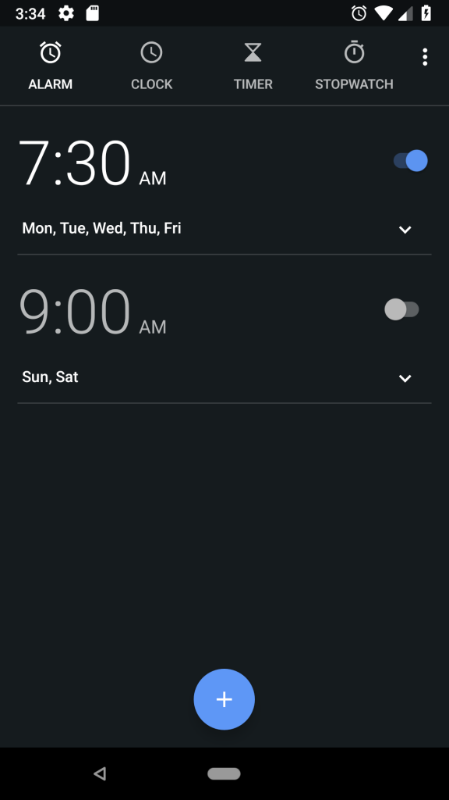
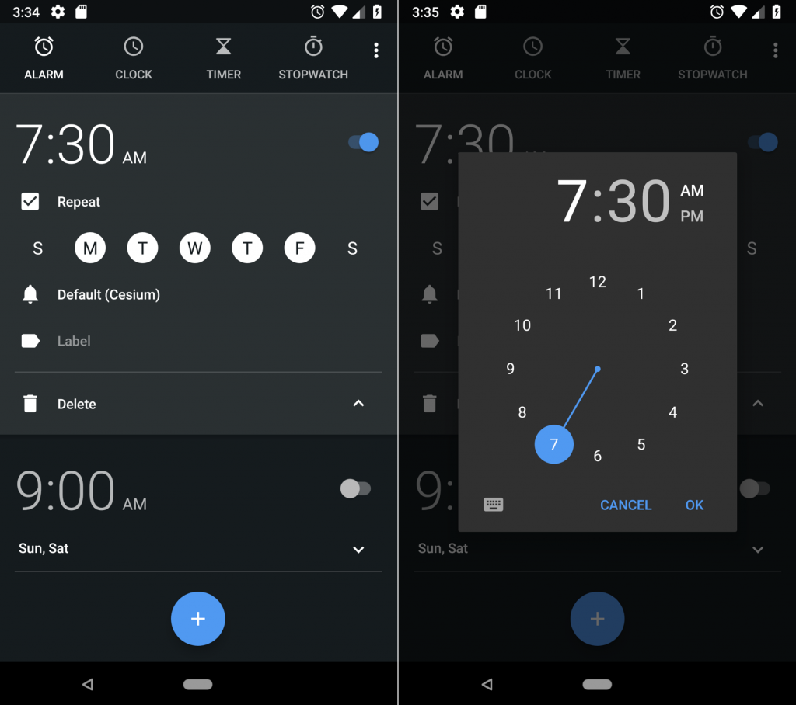
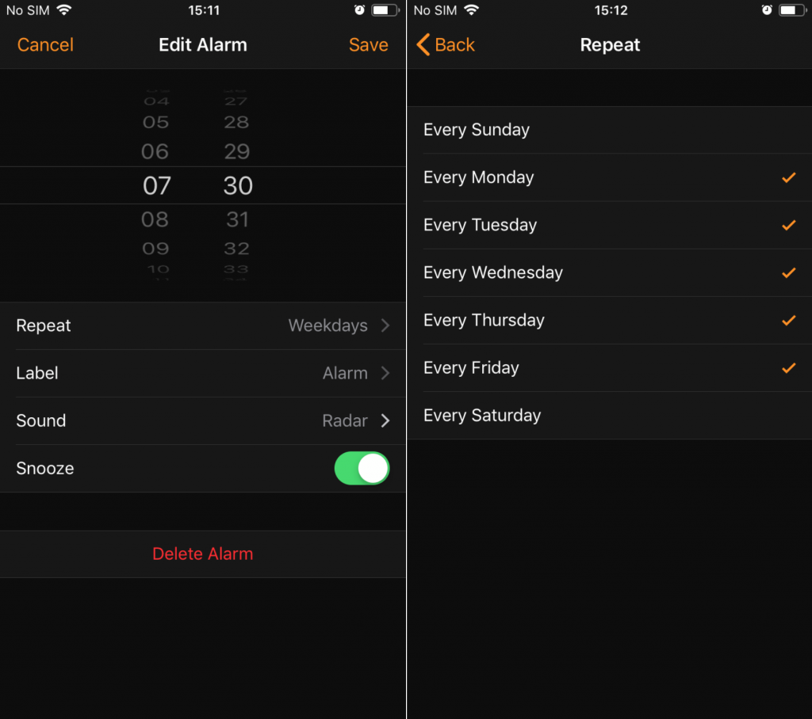
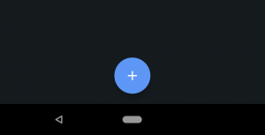
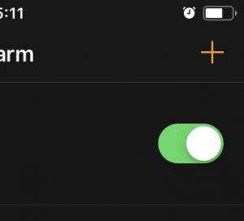
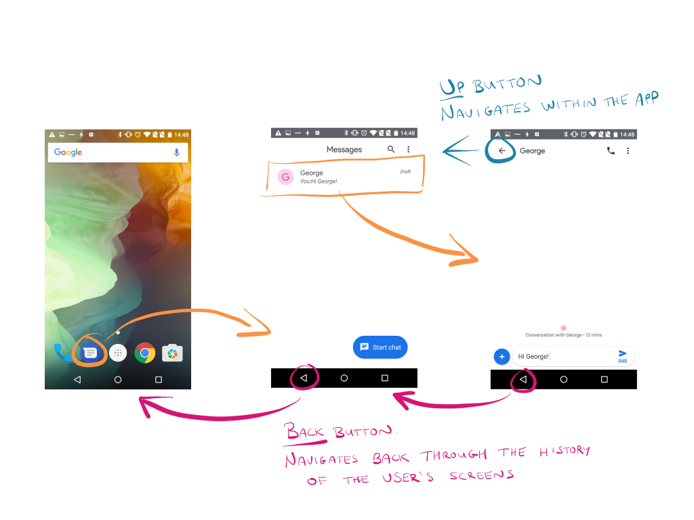
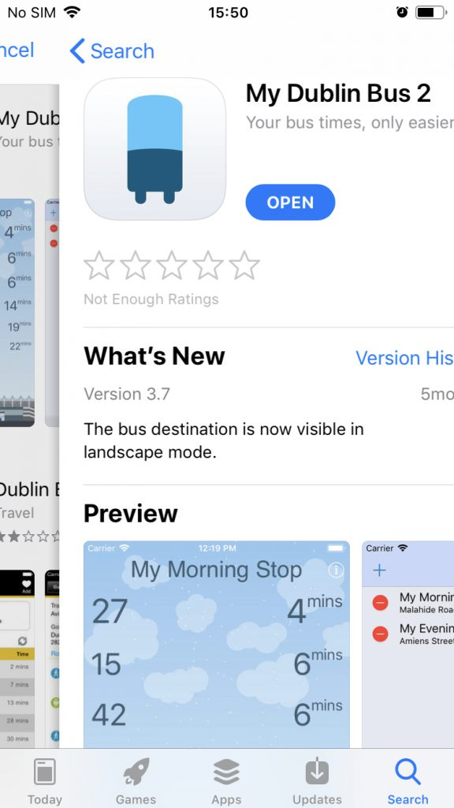

## Is iOS and Android design really that different?

A common request we get here at Tapadoo is to build an app that has the same iOS and Android design features. A reasonable ask, by all means.

> “Our app should look the same to everyone no matter what platform they are on!”
> 
> “What if someone has both an Android and an iOS device?”
> 
> “Surely a perfectly designed app can only look one way!”

We hear you!

There’s no doubt that the idea of identical iOS and Android design features is seductive. However, dig a bit deeper into app design and it becomes apparent that, in many instances, this is a bad idea. One that often leads to increased cost, time and an inferior product.

The problem is that iOS and Android design is specific to their individual platforms. As in, each platform has their own design styles, idioms and ideologies. Therefore, users expect apps to look and act in a certain manner according to their platform of choice. And it can be really difficult to move away from this!

## Benefits of Tailoring the iOS and Android Design to its Specific Platform

There's benefits to tailoring the iOS and Android design to their platform. An app immediately feels familiar to the user once a platform’s rules are adhered to. Therefore, allowing them to easily navigate and use the app without having to stop and think. And we know how highly ranked user experience is with app design. So we should endeavour to give users the best experience possible. 

In contrast, when faced with designs that are not familiar or do not follow the rules of the platform, the inherent advantage provided by the individual platforms user experience is lost.

Compounding this issue, both the development environments for iOS and Android provide tools that fit into the platforms respective designs and ideologies. Each provide many of the standard UI elements we see on each platform.

For example, Android provides standard dropdown menus whereas iOS does not have a direct equivalent. Instead, iOS achieves the same goals with it’s own design patterns. A dropdown menu on iOS would require it to be built from the ground up. This would increase both cost and time. All for something that may feel less familiar and intuitive to the user.

## **iOS and Android Design Guidelines**

Thankfully, both Apple and Google provide detailed documentation on design for their platforms. Apple provide the [Human Interface Guidelines](https://developer.apple.com/design/human-interface-guidelines/) and Google the [Material Design](https://material.io) guidelines. Both are living documents and change over time. Indeed, both Apple and Google have recently seen radical changes to their design. Fortunately, as such, both are likely to remain quite stable for the foreseeable future focusing on incremental changes.

### Human Interface Design

With the release of iOS 7 in 2013, Apple made extensive changes to the look and feel of their mobile platform. Gone were the metaphors of old, the 3D shapes and shadows, and the detailed textures that had come to dominate the iOS ecosystem. Instead, Apple shifted to a “flatter" design. This aimed, in Apple’s words, to embody the themes of deference, clarity and depth.

### Material Design

Android too has seen a gradual transition and maturing of its design. This culminated in the announcement of Material Design in 2014. With Material Design, Google is attempting to create a consistent visual language across Android and their other products.

Their guidelines describe an artificial “material” for which Google has defined properties and rules. This new Material aims to provide familiar tactile attributes that bare a resemblance to the rules of physics while also stretching their bounds. Thus providing something both familiar and powerful.

### Adherence

Neither Apple nor Google enforce absolute adherence to their design guidelines. Everyone accepts that certain apps and experiences call for unique or different experiences. However, both heavily encourage staying true to the standard UI elements and design principles of their respective platforms.

They argue that consistency across their platforms avoids increased cognitive burden for the user. That the novelty of a customised design wears off quickly. And worse, that it becomes a hindrance for user’s who simply wish to accomplish tasks efficiently. Google even provide an article called [“Design from iOS to Android (and Back Again)”](https://design.google/library/design-ios-android-and-back-again/). This points out some of the differences and pitfalls that you should be aware of when creating for both platforms.

## **iOS & Android Design Case Studies**

The differences between both platforms are numerous and often subtle. Documenting all of these differences could probably fill the pages of a moderately sized book. However, lets take just a few examples of the differences for illustrative purposes. We’ll start by comparing the task of setting an alarm in the Clock apps of iOS and Android.

### **Case Study 1: Clock App vs Clock App** 

\[caption id="attachment\_2982" align="aligncenter" width="576"\] iOS Clock App\[/caption\]

\[caption id="attachment\_2981" align="aligncenter" width="576"\] Android Clock App\[/caption\]

Take a few moments to examine both screens.

It may first strike you that they are actually remarkably similar. That being said, an Android or iOS user would have little trouble matching a screen to their preferred platform. Each screen would only feel comfortable and familiar to one platform. This is often termed “feeling native” to a platform. There are subtle differences all over. From colouring, structure, animation, to navigation and font. They are myriad and vital to providing that platform native feel to an app.

Starting with the tab bars, both apps feature similar options. Yet notice their locations and icons. Android’s app bar is located at the top of the screen. By contrast, iOS’s tab bar is located at the bottom of the screen.

Notice too the difference in iconography and how the selected tab is corresponded. On iOS, we see the use of colour in highlighting the tabs. Importantly, an Android user will expect to be able to swipe left and right between these tabs. The Android Clock app rightfully fulfils that expectation. Not so on iOS where gestures are often used differently.

Note also the fifth icon at the far right on Android. This overflow icon presents an app bar dropdown menu. The same one we previously discussed above as not having a direct iOS equivalent.

\[caption id="attachment\_2988" align="aligncenter" width="1024"\] Setting an alarm on Android.\[/caption\]

\[caption id="attachment\_2989" align="aligncenter" width="1024"\] Setting an alarm on iOS.\[/caption\]

Adding a new alarm shows a greater divergence in thinking. We see the contrast between Android’s circular time picker and the iOS slot machine style scrolling time picker. iOS presents a new screen to the user to edit their alarm settings. While Android expands the details on the same screen. Thus the Clock app adheres to the principles of Material Design which states that Material can change shape.

###  **Case Study 2: Floating Action Buttons**

\[caption id="attachment\_2983" align="aligncenter" width="300"\] The Floating Action Button, a feature of Material Design\[/caption\]

\[caption id="attachment\_2985" align="aligncenter" width="300"\] The add button on iOS, nested in the corner deferring to the content.\[/caption\]

One of the more striking changes that Material Design brought to Android was the Floating Action Button (FAB). It can be seen as the “+” button in our Clock example. Big, boldly coloured and free to float over other content, the FAB is a daring and distinctive aspect of Material Design. It's meant to represent the single action users perform the most on that particular screen.

On iOS, no single button is given such prominence. Buttons tend to be placed in the corners of screens. The focus instead is placed on deferring to the content. The add button can be seen nestled neatly in the top right of the screen.

### **Case Study 3: Back navigation**

\[caption id="attachment\_2986" align="aligncenter" width="1024"\] Android back navigation.\[/caption\]

Among the biggest differences between the platforms is Android’s system Back button. iOS has just one physical button on the front of its devices, the Home button. This button returns the user to the iconic iOS apps screen. All other navigation on iOS is context sensitive and displayed on screen.

Android, by contrast, offers a system Back button. This button acts similarly to how a back button on an internet browser works. It brings you back to the last screen you were on, even if it was part of another app.

Both platforms often offer a sort of back button at the top left of the screen within apps. This is known as the “Up” button in Android to distinguish it from the system Back button.

This may not sound like a profound difference on paper. But backward navigation is a fundamental of app navigation. Many a time I've seen an Android user with an iPhone momentarily paw below the bottom left of the screen trying to find their way back. Or seen a seasoned iOS user looking baffled as they study an Android device looking for an on screen back button.

### **Case Study 4: Left Swipes**

\[caption id="attachment\_2987" align="aligncenter" width="576"\] Swiping from the left to go back on iOS.\[/caption\]

Swiping left or right from the edge of the screen is a common gesture on mobile devices. On iOS, swiping in from the left of the screen will take you back one screen. This is generally pervasive throughout the experience. It's a key expected behaviour and generally a must in iOS design.

Android however, reserves sideways swipes for other purposes. On Android, if an app utilises a navigation drawer, swiping in from the left of the screen should open this drawer. And as previously discussed in Case Study 1, tabs should be navigable by swiping between them.

## Conclusion

None of this is to say that an app can’t carry a strong sense of consistency across both platforms. Indeed many of the apps we use everyday such as Facebook, WhatsApp, Twitter and Instagram maintain what feels like a consistent user experience across both Android and iOS. And yet they still account for the differences between iOS and Android.

This is the ultimate aim. A user experience that feels native to each platform while still delivering a unique and consistent brand experience. As [Toptal](https://www.toptal.com/android/android-and-ios-app-design-tips) states: "Native elements are what people are used to and find easier and more intuitive to use".

Achieving this requires a deep understanding of both mobile platforms and an appreciation for the differences between them. And that, of course, is where our wonderful design team come in!

If you'd like to discuss the the design of your app or need help developing it [get in touch](https://tapadoo.wpengine.com/contact/).

Mike McNamara

iOS Developer

Photo by [Alexandre Godreau](https://unsplash.com/photos/i0nOnIN3ZU4?utm_source=unsplash&utm_medium=referral&utm_content=creditCopyText) on [Unsplash](https://unsplash.com/search/photos/mobile-phone?utm_source=unsplash&utm_medium=referral&utm_content=creditCopyText)
