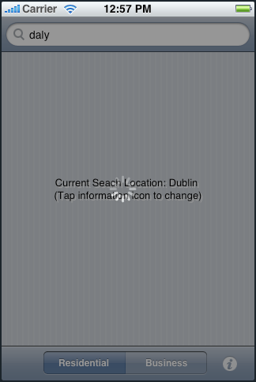

I've seen questions about how feed back to a user that something is pending, where you don't want any input from the user. An example may be making an XML request for data from your iPhone app back to your server. While it is pending you want to show that your app is busy, but don't want the user to interact with it.

The iPhone SDK has an activity indicator control that is used for such a purpose, but you may want to essentially make the fact that it is pending to be "modal"

Doing it is quite simple. Here's how:

1. Create a new view (this can be done in Interface builder) - Lets call it ProgressView. Make it full size, and stick an activity monitor in the middle of it.
2. Set the view's background to black, with its alpha set to 0.5. Create an outlet for the activity indicator in the ProgressView's controller (call it myActivityIndicator)
3. In the ProgressView's controller, add the following code: `- (void)viewDidLoad { [myActivityIndicator startAnimating]; }``- (void)viewWillDisappear: (BOOL)animated { [myActivityIndicator stopAnimating]; }`
4. Now. Say we are going to do something that's going to take some time in our main view controller. Just as we are starting it, we do this: `[self.view addSubview:progressViewController.view];`
5. When we have completed our long running task, we do this: `[progressViewController.view removeFromSuperview];`

Voila - You have a nice progress indicator "modal dialog" (in old speak).

Of course, there are a number of ways of indicating progress, and you may not wish to disable interaction - Then you just use an activity indicator somewhere obvious in your UI. Here's how it looks in my app:

Any other ideas? Please comment.
