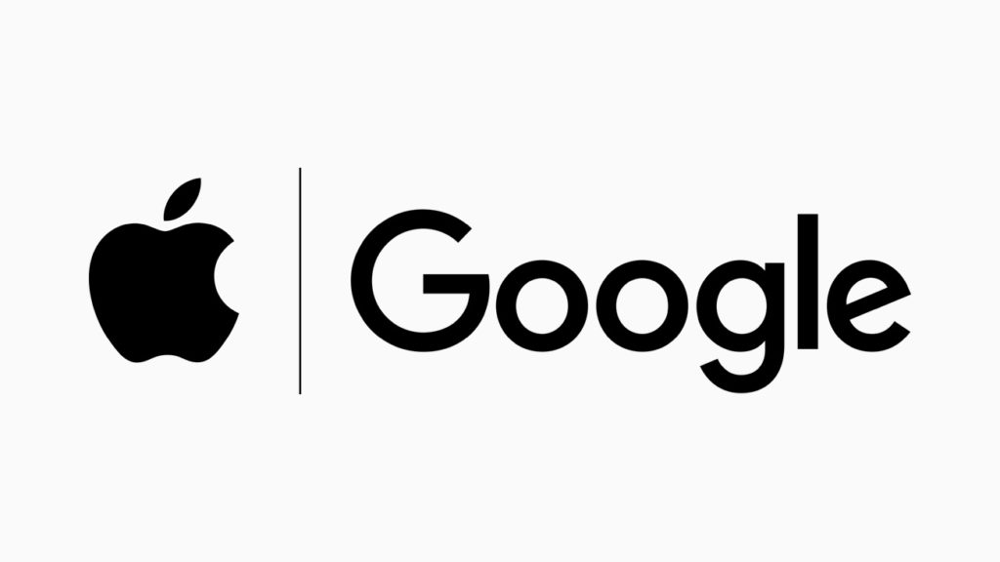

In the last number of weeks, we've been approached a number of times about development of a contact tracing app to help curb the spread of COVID-19. As we now know, one of the biggest things we can do to fight the spread of the disease is to "flatten the curve". This is achieved through a combination of social distancing, volume testing, and contact tracing to help find those most likely to require a test.

Often in times of high societal stress, two things can happen 1. People jump to assuming technology is the quick answer, and 2. Society may accept the high-stress time as the "new normal" and agree to measures that previously would not have been acceptable. (Restrictions on movement is a good example).

When asked about development of a contact tracing solution, I've remained sceptical. I think many people who are considering mobile apps as the answer may not be aware of the potential barriers to the success of such an app. Here are some of the points I put across to some of the people who asked for our input.

I spoke about problems on three fronts. Technology, Social and Practical.

> 1\. **Technology**.  The approach for a high level of tracing involves two potential ways of doing this 1. By tracking each user’s GPS or 2. By making the app act as a beacon, while simultaneously looking for those beacons.  Both of these approaches have issues:
> 
> High quality GPS tracing really runs the battery.  A phone that lasts say 12 hours, will run for about 2 if GPS tracking is on.  It also means capturing lots of data and constantly sending it to the cloud.
> 
> Beacons tend to be platform dependent - so, for example iBeacons, are an iPhone only technology (Android has a similar technology called Eddystone).  The problem here is that Apple devices can range for iBeacons in an efficient manner (although acting as an iBeacon is more battery intensive), and Android devices can range for Eddystone beacons in an efficient manner, but an Apple device looking for Eddystone devices (and vice versa) cannot really be done efficiently.

> 2\. **Social**. The idea of an app tracking our every move, and giving it to a third party is something that a lot of people wouldn’t feel comfortable with.  So, even if the battery problem could be solved, the concept of constant tracking and sharing a person’s position feels a little too “big brother”. I think enough people would shy away from this for this reason alone

\[Aside: This was before the "[Singapore solution](https://www.straitstimes.com/singapore/coronavirus-spore-government-to-make-its-contact-tracing-app-freely-available-to)" was posted, and I believe they had a great solution to this while maintaining privacy.\]

> 3\. **Practical**. Which leads to another problem. Unless everyone has the app and is using it, you end up a very similar problem to herd immunity - if only say 60% of the users are using it, the data is simply not good enough.  In fact, unless you can get to high nineties coverage, the data will be not good enough. If you can trace nine people someone came in contact with, but there’s one or two missing, that’s just too big a hole in the data.
> 
> So, even if you could solve the above, you’re left with a marketing problem - how can you make everyone 1. Aware of your app?, then 2, motivated to download it?.  Realistically for it to be useful, it has to be as popular as WhatsApp or Facebook.  The only apps that have this level of penetration are run by companies with many billions of spare marketing dollars.  And it takes many years to get to the level of ownership necessary.

> People only download apps when they feel it will bring them a lot of benefit.  “Insurance” apps never hit this.  Essentially, the idea is everyone should download this app to help; the upside to the end user is it may help with contact tracing.  So, if I got the virus and I had the app, it would help me find those I potentially either got it from or gave it too.  As a person with the virus, I’m not sure I actually care about that - I know the authorities care about it, but the infected person, it’s already too late.   Put simply, the upside for the end user isn’t there - I just can't see this being a successful project.

For those who I spoke to on twitter, I tried to put it more succinctly.

**_"How do you expect to make an app as popular as WhatsApp, in a short time, with no budget"_**

I went on to say:  
**_"Honestly, I believe there are only 2 companies in the world who could pull this off - they are Apple and Google.  In theory, they can already do it, but Apple makes a big song and dance about their attitude to privacy. In theory, they could be helping governments already, but it certainly doesn’t appear like they are."_**

Yesterday, Apple and Google made a joint press release ([Apple](https://www.apple.com/ie/newsroom/2020/04/apple-and-google-partner-on-covid-19-contact-tracing-technology/), [Google](https://www.blog.google/inside-google/company-announcements/apple-and-google-partner-covid-19-contact-tracing-technology/)) saying they are doing just that. They are going to build contact tracing initially as an API, but soon after embed it into the operating system. I believe this is the _only_ viable, practical way in which this can be done. It has to happen at a scale that only Apple and Google can provide (because they are the operating system vendors), and privacy must be maintained.

Reading the follow on documentation from the press releases, I'd believe that the solution is considered in a "privacy-first" context. Apple has a good track record in the area of privacy, and Google's trajectory on Android is also following a privacy path.

A joint solution is the ONLY answer. In order to get everyone tracing, it needs to be on both Android and iOS and it needs to be interoperable. (This is the guts of my "technical" barrier point above).

Large brands are usually very particular about how their logo is used. Generally, companies don't like seeing their logo side by side with another companies logo, let alone one of their bitter rival. I believe this image from the press release speaks volumes:

