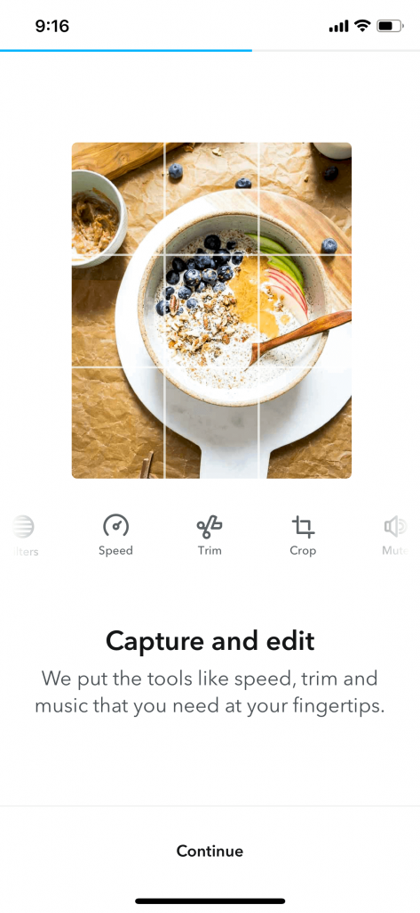

How a user first enters your app is an important experience. It's the first opportunity for the brand to build [trust](https://tapadoo.wpengine.com/focused-engagement-through-ux-design-strategy/) and set the users expectations. Depending on the type of product, the app onboarding experience will be different. Over the next few minutes, we'll take a look at the different type of app onboarding patterns and how and why they're used.

#### Preach

The best onboarding is no onboarding. Essentially, all onboarding has the potential to become a point of friction. Truth be told, most onboarding patterns get in the way of a user using your app for its purpose.

In a perfect world we'd never have to create a password, connect a bluetooth device manually or give some marketing strategist a DOB and email address. Which is why a UX designer and product owner should always advocate for the user and remove anything that isn't absolutely essential during the onboarding process.

## What is mobile app onboarding?

App onboarding refers to how a user becomes a member of your app, or how they come into your app for the first time. Some apps require identity as an onboarding step, others allow a user to enter an app without an account.

It's a common belief that creating an account to use an app is just standard practice, but a lot of the time, identity is used for the business needs rather than the user needs. But their is a brief moment before this happens that we need to consider.

#### Launch/Splash screens

While both Apple and Google agree that a launch screen should lead to the sense of decreased loading times by providing an empty state or placeholder of the apps actual UI, they differ on whether it should be used as a branding opportunity.

Apple states that "it isn’t an opportunity for artistic expression" and that "the launch screen isn’t a branding opportunity... don’t include logos or other branding elements unless they’re a static part of your apps first screen". 

[iOS Safari App](https://developer.apple.com/design/human-interface-guidelines/ios/icons-and-images/launch-screen/)

Whereas Googles Material Design acknowledges that the launch screen "has the potential to add delight to the user experience", and that a [launch screen](https://material.io/design/communication/launch-screen.html#branded-launch) "provides momentary brand exposure."

[Material Design : Types of launch screens](https://material.io/design/communication/launch-screen.html#usage)

Because the mobile canvas is limited in size, designers don't want to waste valuable screen real estate in the apps main UI. Therefore it's best practice to not include logos on every screen (which is often the case on the web where there's an abundance of screen real estate). The hook here is that a user can a lot of the time stumble across a website. So brand exposure is important for memory.

However, a user has to consciously find an app, download it, and tap on your app icon to open it. They know where they are, they don't need to be reminded on every screen. Although, a sense of decreased loading time, with placeholder UI would be preferable for a UX designer, often designers compromise and use branded splash screen as a way to make a brand statement so that the logo isn't taking up space in the main parts of the app.

**When should launch screens be used?:**

- A launch screen must be provided in both iOS & Android.
- Placeholder UI is a great way to convey a sense of content loading.
- Branded launch screens can be used as a brief brand exposure.

#### Logins

It's very common to be asked to login or sign up when a user firsts downloads an app. It has become so common, it's almost become the default behaviour when using a new app. A login suggests that a user has previously created an account in the app or through an online version of the product. Logging in will restore any user data that has previously been included in the app.

An app can offer multiple ways for a user to login; email, username, password, phone number etc. Social media logins are often used as a "convenient" way for a user to login. However, this can mean that a product has access to information about a user that they don't need. It also means that the app may have to jump out to the social media app or web for approval. This can make the onboarding experience feel disjointed. It's against best practice to only offer social media login options.

If a device needs to be verified, an app will often use phone + SMS code as a way to authenticate the user.

- 
    
    Onboarding: Log in - Zero  
    
- 
    
    Onboarding: Log in - Netfilx  
    
- 
    
    Onboarding: Log in - Seatgeek  
    
- 
    
    Onboarding: Log in - Headspace  
    
- 
    
    Onboarding: Log in - HQ Trivia
    
- 
    
    Onboarding: Log in - Robinhood  
    

**When should sign ups be used?:**

- When the product has a pre-exisiting user base.
- Only at the point when it becomes nessecary. i.e if parts of the app can be used without an account, these shouldn't require a logged in state.

#### Sign ups

Sign up/sign in is crucial when a user needs to create an account in order for the app to have value. Social media platforms are a good example of this. It's important that the user can log out, and their identity has some sort of footprint.

However, many apps seek account creation at the very beginning of onboarding without necessarily needing them. The account creation is simply a marketing tool to gain insights into their user base and market to them accordingly. From a business point of view this may seem reasonable, but from a user point of view this can be intrusive. It starts the interaction with the brand with a sense of mistrust.

For example, task based apps look for account creation in order to save your data or send you reminders. But there's really no need to know my name, age, gender, and DOB. And in a lot of cases, an email address may not even be necessary. A lot of this information can be stored locally on the device.

A forced sign up, is known as a "door slam". The app essentially locks the user out and asks them to commit before having a chance to look around to see if it's a suitable product for them.

- 
    
    Sign up: Zero
    
- 
    
    Sign up: Otter
    
- 
    
    Sign up: Zenly
    
- 
    
    Sign up: Zenly
    
- 
    
    Sign up: Headspace
    
- 
    
    Sign up: WAV
    

**When should sign up screens be used?:**

- Only when an account is fundamental to a product.
- After a user has been given the chance to look around or try the app for a period of time.

#### Personalised Set ups

Some apps require personalisation in order for the app to provide value, or a personalised experience to the user. Often apps ask users to choose things that interest them. This is a useful way to provide customised content.

- 
    
    Setup; Brightside
    
- 
    
    Setup: Pinterest
    

#### Functional setup tasks

In other cases, there are a number of steps the user will need to complete in order to use the app. This may be for instance, connecting a bluetooth device, or verifying your device via SMS. These are a more tedious user experience so it's important to make them as frictionless as possible.

Beat - SMS Verification

**When should setup screens be used?:**

- When the content of the app only becomes valuable **to the user** once personalised.
- When the task at hand needs other information to be completed.
- When a users device needs to be authenticated.
- When a device needs to connect to another device or app/service.

#### Walkthroughs

Walkthroughs are the most commonly featured app onboarding experience, but they don't actually onboard the user. They're usually used as a preamble to why you should use the app showcasing a brief overview of the features and benefits of the app. A walkthrough can be a great way to set the tone of the app/brand experience. But bear in mind, it is still a temporary piece of friction.

- 
    
    Walkthrough: Asana
    
- 
    
    Walkthrough: Brightmind
    
- 
    
    Walkthrough: Jour
    
- 
    
    Walkthrough: Jumprope
    
- 
    
    Walkthrough: Unsplash
    
- 
    
    Walkthrough: Zero
    

**When should walkthrough screens be used?:**

- When the features of an app are innovative (something a user may not have experienced in this industry before).
- When the product wants to set a tone before the user enters the app.

#### Guided tour (Intro)

A different approach to a walkthrough is a guided introduction. This is when the app illustrates how to use the different features of the app by showing you sample screens. This happens in a sequence like a walkthrough, where a user views or consumes the information before officially entering the app.

- 
    
    Guided Tour: Habitify
    
- 
    
    Guided Tour: Habitify
    
- 
    
    Guided Tour: Habitify
    
- 
    
    Guided Tour: Habitify
    

At this point some apps may also show video or animations as way of communicating how the app works before the user has used it. Videos are useful when trying to sell aspirational ideas, or complex set ups. Animations are great for simple instructions and/or setting a playfulness or calm mood before a user enters the app. However, nobody likes to read the instruction manual of their new toy do they?

**When should guided introduction screens be used?:**

The major downfall with this type of instruction is that it relies on users to pay attention and remember what was said before they can see a feature in context. The likelihood of a user skipping this is high as they are eager to get in and explore the app.

#### Guided tour (In Context)

You often find guided tours in gaming apps. They gently walk you through the actions needed to complete the task before you officially start the game. This can also be applied to apps that are not part of the gaming category. A user will more often remember an action if shown in context. Rather than explaining everything at the start and needing to remember and apply it once you're in the app.  These are often referred to as tool tips or coach marks.

#### Tool tips & Coach Marks

The benefits of in context tool tips is that they are shown to the user exactly when they need to see them. They are not relying on memory like the guided tour pattern. A user views or interacts with a screen or element for the first time and the app explains how to use or shows the user where a feature is located.

Too many coach marks can become annoying and obstructive. If the products UI is intuitive enough, it's possible that they are not required at all.

Coach marks can also be useful in pointing out new features to users, who may otherwise not have known they exist after an automatic app update.

- 
    
    Over
    
- 
    
    Quora
    
- 
    
    TIDAL
    
- 
    
    WAV
    
- 
    
    Evernote
    
- 
    
    Beat
    

**When should guided introduction (in context) and coach marks be used?:**

- Show a user where to start with a task.
- Show a user a new feature.
- Explain how to use a custom interaction or element works.
- Help guide a user who has become stuck.

## The key to a great app onboarding experience

- Allow the app to load quickly. It's not necessary to show a branding showreel on launch. Users will [appreciate that you're not wasting their time.](https://tapadoo.wpengine.com/how-to-make-your-users-happy/)
- Avoid forced sign up (door slam) at all costs.
- If including a walkthrough, use it to set the users expectations. A beautiful walkthrough should have a beautiful app. It's disappointing when an app has an engaging walkthrough but the apps UX falls short.
- Don't ask too many questions. Only ask for the bare minimum from the user. If a user can't reasonably understand why you need certain pieces of data, you've already lost their trust.
- When a user needs guidance, give it to them in-context when they're more likely to understand and remember.
- Not everything needs to be explained. If your UI is intuitive a user will be able to complete their tasks. Every aspect of the app doesn't need to be pointed out.
- The best onboarding is no onbaording. An app that allows the user to enter, complete a task and leave is often the app that won't get deleted or forgotten about.

Orla Fagan

Lead UX/UI Designer

Onboarding screen images sourced from [Mobbin.](https://mobbin.design)
