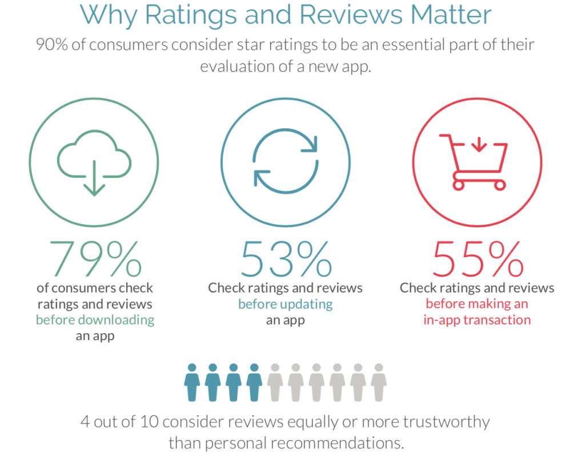
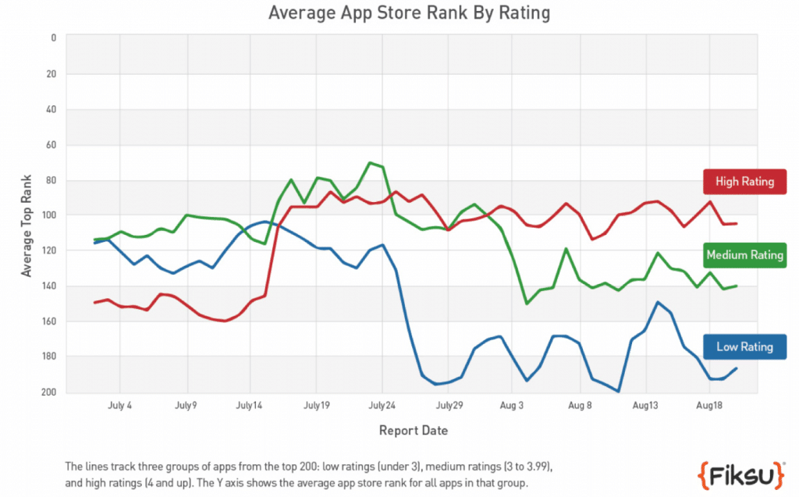
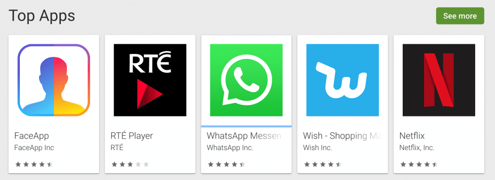
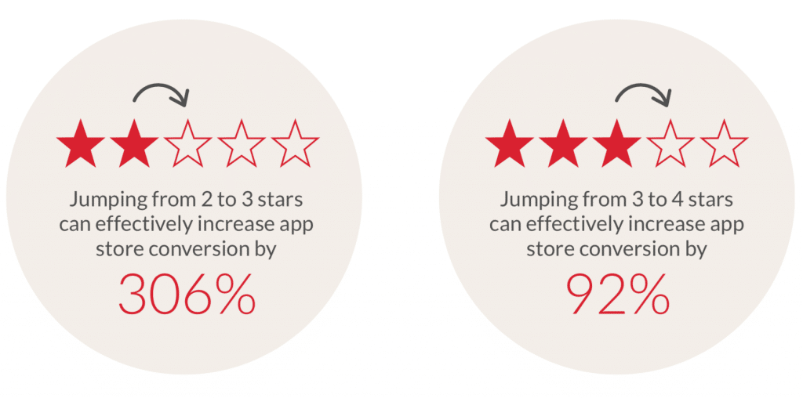

> “Ratings and reviews influence how your app ranks in search results, and can affect whether someone downloads your app. Individual ratings inform your apps summary rating, which is displayed on your product page and in search results.”
> 
> [Apple](https://developer.apple.com/app-store/ratings-and-reviews/)

> “Google Play ratings and reviews are extremely important in helping users decide which apps to install.”
> 
> [Google](https://android-developers.googleblog.com/2018/12/in-reviews-we-trust-making-google-play.html)

Google has taken the issue of ratings and reviews more serious of late. Kobi Glick, product lead of Google Play announced at Google’s [annual I/O developer conference](https://android-developers.googleblog.com/2019/05/whats-new-in-play.html) this year, 

> “Many of you told us that you want a rating that reflects a more current version of your app, not what it was years ago - we agree. So instead of a lifetime cumulative value, your Google Play Store Rating will be recalculated to give more weight to your most recent ratings.” 

### **So Mobile App Ratings and Reviews are important but just how important are they?**

We know that [47% of iOS users](https://tapadoo.wpengine.com/app-store-optimisation%E2%80%8B-guarantee-success/) discover apps through search on the App Store and [53% of Android users](https://tapadoo.wpengine.com/app-store-optimisation%E2%80%8B-guarantee-success/) discover apps through search on the Play Store. If ratings and reviews affect how your app appears in search and just over half the apps discovered are through search, then we’d say ratings and reviews play a pretty significant role in your app discovery.

But there’s more….

Not only will ratings and reviews help your app to be found, they also have a significant impact on your app being downloaded.

Check out this image from Apptentive on exactly why ratings and review matter.

[Apptentive](https://www.apptentive.com/blog/2015/05/05/app-store-ratings-reviews-guide/)

It’s not only the app stores that consider mobile app ratings and reviews to be essential. 90% of consumers consider star ratings to be an essential part of their evaluation of a new app.

This makes sense right?

When you look at an app in one of the app stores you immediately look at the rating and possibly read some of the reviews. Well according to Apptentive 79% of consumers check ratings and reviews before downloading an app.

4 out of 10 consider reviews equally or more trustworthy than personal recommendations. But if you get a personal recommendation doesn’t that mean that you searched specifically for the app you have been recommended? So could it be that all the apps that are found through search are downloaded based on reviews?

Let’s break down the two most crucial reasons why mobile app ratings and reviews are important for your app.

### **App Store Ranking**

There are a number of factors that effect how your app ranks in the app stores. The algorithms look at the number and quality of your app's ratings and reviews. They also look at the number of downloads, number of installs, usage and keywords. While we don’t have the exact formula for how the app stores rank apps we know that ratings and reviews play a significant part.

Both the App Store and Play Store place a greater level of importance on ratings and reviews than ever before. Apps with higher ratings and reviews rank high in search. If an app ranks high then there's a better chance of it being found and downloaded. The more downloads the more it will be kept high in the rankings. 

#### App Store Algorithm Change to Reflect Ratings & Reviews

Here’s a chart from the marketing team at Fiksu that has been floating around since the algorithm change on the App Store in 2013. Apple updated their algorithm to place a greater level of importance on ratings and reviews. From this chart you can see that apps with a 3-star rating and under significantly dropped in rankings after this algorithm change. Those with a 4-star and above rating increased in the rankings.

[Apteligent](https://www.apteligent.com/technical-resource/why-app-store-ratings-really-matter/)

Google followed suit in [2018](https://techcrunch.com/2018/07/27/google-follows-in-apples-footsteps-by-cleaning-up-its-play-store/) by doing a clean up of the Play Store. And their announcement this year regarding ratings and reviews demonstrates their intent when it comes to cleaning up the app store and putting a bigger emphasis on ratings and reviews than before.

According to Apptentive, better and more ratings equals more prominent ranks. And the average rating for the top 100 apps in the App Store is 3.94 and 4.32 in the Play Store. Also, take a look at the number of times the average iOS and Android top 100 app has been rated. These numbers are significant. There are no surprises as to why they are in the top 100 apps on both app stores.

[Apptentive](https://www.apptentive.com/blog/2015/05/05/app-store-ratings-reviews-guide/)

From a common\-sense point of view it’s right that those apps with higher ratings, more quality reviews and downloads should be pushed to the top of the rankings. It’s one of the only ways to effectively clear out the app stores and separate the quality players from problematic and abandoned apps.  

### **App Store Downloads**

So you are looking to increase the number of downloads for your app. You’ve already invested in [app store optimisation](https://tapadoo.wpengine.com/app-store-optimisation%e2%80%8b-guarantee-success/) in the hopes of being found. And now you realise the importance of ratings and reviews to get your app up in the rankings. But not only do ratings and reviews get your app up in the rankings, they give your app a huge chance of being downloaded. Then these downloads go a long way in keeping your app high up in the rankings.

But here's the thing about downloads...

Apptentive has shown that only 15% of users would consider downloading an app with a  2-star rating. Compare this to 96% of users who would consider downloading an app with a 4-star rating. This is a significant jump and highlights the sophistication of users. What’s really striking though is that only 50% of users would consider downloading an app with a 3-star rating. Meaning another 50% flat out refuse to download your app if it has a 3-star rating.

So therefore not only is the rating of your app essential to feature high in the ranks, it's also essential for downloads. And if users aren't downloading your app it's another reason for it not to be ranked high. The correlation between ratings & reviews and downloads is high.

[Apptentive](https://www.apptentive.com/blog/2015/05/05/app-store-ratings-reviews-guide/)

#### A Focus on Velocity

The good new for new apps is that the App Store focuses on [velocity](https://www.mobiloud.com/blog/factors-really-impact-app-store-ranking/). An app released only a month ago might have fewer total downloads than a much older app, but if it’s being downloaded more frequently right now it will rank strongly. 

A perfect example of this is FaceApp. It currently has just over 2 million reviews with a 4.5 rating. It is ahead of WhatsApp Messenger in the app stores which has a similar rating but with 93.5 million reviews.  

[Apptentive](http://cdn2.hubspot.net/hubfs/232559/The_Mobile_Marketers_Guide_To_App_Store_Ratings_and_Reviews.pdf) also found that 70% of people read at least one app review before installing an iPhone or Ipad app. 75% say app ratings are the main motivation for downloading an app.

If you want to see just how significant ratings and reviews are Appentitive’s study says that jumping from 2 to 3 stars can effectively increase app store conversion by 306%. And jumping from 3 to 4 stars can effectively increase app store conversion by 92%.

Ratings and reviews are not only important but just might be the difference between your app appearing at the top or bottom of the ranks and being downloaded or not.

Maria Colgan

Digital Marketing Manager
