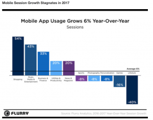
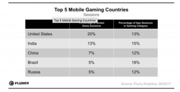
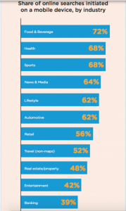
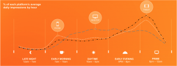
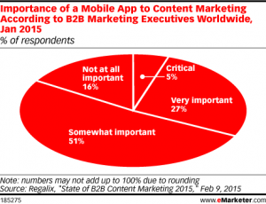
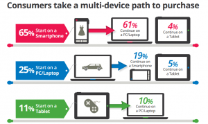

### **Mobile; the pulse of digital transformation**

There has never been a better time for marketers to engage with consumers. We are in an era of digital transformation and mobile is leading the charge.

We can capitalise on this opportunity by giving serious consideration to mobile as part of our overall marketing strategy. If not, we are missing a vital opportunity to engage consumers in a way that is convenient for them. 

#### **Let's take a look at the stats**

- 2.71 billion people in the world own a smartphone. [Leftronic](https://leftronic.com/smartphone-usage-statistics/) 2019
- Mobile owners worldwide will increase to 7.33 billion by 2023. [Leftronic](https://leftronic.com/smartphone-usage-statistics/) 2019
- Smartphones take the largest share of global digital minutes. [Comscore](https://www.comscore.com/Insights/Presentations-and-Whitepapers/2018/Global-Digital-Future-in-Focus-2018) 2018
- 1 in 4 adults checks their smartphone immediately after waking up. [StudyFinds](https://www.studyfinds.org/survey-quarter-checks-phones-less-than-minute-after-waking/) 2018
- Apps account for over 80% of mobile time globally. [Comscore](https://www.comscore.com/Insights/Presentations-and-Whitepapers/2018/Global-Digital-Future-in-Focus-2018) 2018
- In the fourth quarter of 2019, mobile devices (excluding tablets) generated 52.6% of global website traffic. [Statista](https://www.statista.com/statistics/277125/share-of-website-traffic-coming-from-mobile-devices/) 2020
- 41.9% of emails are opened on mobile devices. [SupplyGem](https://supplygem.com/email-marketing-statistics/) 2020
- 3 in 10 business professionals check email on mobile. [SupplyGem](https://supplygem.com/email-marketing-statistics/) 2020
- Mobile Opens account for 50% of all email marketing opens. [SupplyGem](https://supplygem.com/email-marketing-statistics/) 2020
- Mobile users check their email three times more frequently. [SupplyGem](https://supplygem.com/email-marketing-statistics/) 2020
- 73% of companies prioritise mobile for their email marketing campaigns. [SupplyGem](https://supplygem.com/email-marketing-statistics/) 2020
- USA online banking statistics show that 80% of Americans would rather bank digitally than visit a brick-and-mortar branch. [KommandoTech](https://kommandotech.com/statistics/online-banking-statistics/) 2020
- According to 2018 mobile and online banking worldwide statistics, the number of people who use mobile banking exceeded the number of those who bank using computers two years “ahead of schedule.” [KommandoTech](https://kommandotech.com/statistics/online-banking-statistics/) 2020
- 91% of Irish people own a smartphone, they check their phone 50 times a day and 21% will switch to a 5G network as soon as it is available. [Deloitte](https://www2.deloitte.com/ie/en/pages/technology-media-and-telecommunications/articles/global-mobile-consumer-survey-2017.html) 2019
- 78% of Irish people use their phones to bank and make payments. [Irish Tech News](https://irishtechnews.ie/78-of-irish-people-use-their-phones-to-bank-and-make-payments/) 2017

### **Mobile dominating digital minutes**

We are living in a mobile dominated world. Mobile minutes are becoming an integral part of a consumers day. From checking the weather, emails and SMS to organising travel and everything in between.

Mobile usage has skyrocketed over the last number of years. And will continue to do so given the sophistication and development of the smartphone.

### **The rise of the mobile app**

With our most trusted device at our fingertips, it makes sense for businesses to consider how to innovate and communicate with their customers.

An app is one such way.

The rise of the mobile app has enabled consumers to do numerous tasks on their smartphone. And for many, mobile apps have replaced their watch, alarm clock, GPS, calendar, camera, maps and more.

Google is the powerhouse driving digital transformation through their convenient mobile apps. From Google Maps, Drive, Calendar and Photos, to Docs, Sheets and of course the well known Google Chrome.

### **How mobile app usage is affecting industry**

Flurry tracks more than one million applications, across 2.6 billion devices globally. Their 2017 [report](http://flurrymobile.tumblr.com/post/169545749110/state-of-mobile-2017-mobile-stagnates) shows that users spend more than five hours a day on their smartphones, and shift their time between new and old app experiences. 

Their 2018 mobile app usage [report](http://flurrymobile.tumblr.com/post/169545749110/state-of-mobile-2017-mobile-stagnates) shows that mobile app usage is growing 6% year on year.

#### eCommerce

Leading the charge is eCommerce. The shopping category increased by 54% with consumers spending through a mobile app. Retailers can utilise the power of digital transformation with a move from a web browsing based experience to a mobile app.

#### Music, Media and Entertainment

Music, Media and Entertainment had a 43% year on year growth. No surprises here considering how easy the likes of iTunes, Spotify and Netflix make it for customers to pay and consume information.

#### Lifestyle

Lifestyle had a deep incline of -40%. This highlights that businesses need to build in daily usage habits for their consumers to increase usage. We can’t just rely on digital transformation by adopting a new technology. We need to make this technology work for us. That’s the real success of digital transformation.

****

[Source](http://flurrymobile.tumblr.com/post/169545749110/state-of-mobile-2017-mobile-stagnates)

#### Gaming

Gaming is the obvious player in the mobile app space. It has been the top contender for mobile phone usage minutes per consumer. There was a slight decline for 2018 but nothing to be too concerned about.

The table below shows the top five countries that are driving 50% of gaming usage. According to [Electronic Entertainment Design and Research](https://www.eedar.com), users are spending more than 50% a week on mobile games in North America. And they use a smartphone and a tablet in 60% of all cases. But apparently the real gaming enthusiasts are in Europe, with the Netherlands and Sweden spending 31% of all their app sessions on games.

[Hitwise](http://hitwise.connexity.com/rs/371-PLE-119/images/hitwise-mobile-search-report-us.pdf) measure online search queries across multiple devices, including 3.4 million smartphones and tablets. Their graph below illustrates the online searches initiated on a mobile device by industry. Food and beverage topped the chart along with health. Great opportunities for these brands to engage with their target audience on their mobile device.

 

****

[Source](http://hitwise.connexity.com/rs/371-PLE-119/images/hitwise-mobile-search-report-us.pdf)

### **Mobile use through the day**

In the western world, mobile, desktop and tablet are used interchangeably.  Desktop peaks during the working day with phone and tablet peaking in the evening. This chart indicates the need for a multichannel marketing approach.

[Source](https://www.smartinsights.com/mobile-marketing/mobile-marketing-analytics/mobile-marketing-statistics/attachment/2017-mobile-use-through-day/)

### **The importance of mobile apps for content marketing**

83% of B2B marketers said mobile apps were important to content marketing. [eMarketer](https://www.emarketer.com/Article/B2B-Content-Marketers-Miss-Mobile-Mark/1012093) 2015

[Source](https://www.emarketer.com/Article/B2B-Content-Marketers-Miss-Mobile-Mark/1012093)

Marketers may believe mobile apps are a vital part of their marketing efforts but a 2015 report by [Regalix,](https://www.regalix.com) showed that only 33% of respondents used mobile to distribute content. A big contrast compared to website at 95% and what many consider to be intrusive; email at 90%. 

[Source](https://www.emarketer.com/Article/B2B-Content-Marketers-Miss-Mobile-Mark/1012093)

### **Multichannel Marketing Approach**

To maximise the marketing efforts of any business, we need to consider a multichannel marketing approach. This approach sees a marketer apply a single strategy across multiple channels or platforms. Therefore, giving your business the opportunity to engage potential customers in a way that is convenient for them.

A multichannel approach means applying your efforts to all channels and measuring the results to see which are most effective. Mobile is one such channel and as the stats above show, if a business doesn’t have mobile as part of their strategy, they are missing out on this growing opportunity. 

Of course the more traditional routes or channels apply such as website, email, print, media, physical location and promotional events. But any marketer worth their weight will do their research, apply it to their business and make the most of the channels that reach their consumers in a targeted and sustainable way.

### **Driving your consumers through the funnel**

The more visible your brand, the more opportunities to direct your consumers down the funnel. Marketers know the importance of the funnel, from generating awareness to creating your brand advocates. It all starts with your multichannel marketing approach.

According to [SailThru](https://www.sailthru.com/marketing-blog/written-multi-channel-b2c-campaigns-realize-a-24-greater-return-on-investment-2/) 2015, multichannel B2C marketing campaigns realise a 24% greater return on investment using a multichannel marketing approach.

And the image below from SnapApp 2018 proves this point by showing how consumers take a multichannel approach to purchasing. If this is the route that consumers are taking, then it makes sense that businesses adopt this as a strategy.

 ****

[Source](https://www.snapapp.com/blog/multichannel-marketing/)

CJD Digital Marketing provide a very useful [infographic](http://cjgdigitalmarketing.com/the-power-of-multi-channel-digital-marketing-campaign-infographic/) on their website, which shows the power of a multichannel digital marketing campaign. Some key takeaways are:

- Brands moving into a multi-channel digital marketing strategy are achieving up to 300% improvement on ROI from their advertising efforts.
- This resulted from a 24% increase in conversion rates, as more targeted customers see a campaign’s ads from multiple channels.

### **Conclusion**

Mobile is the pulse of digital transformation. But not in isolation. The key to success is a multichannel marketing approach, where a marketer picks the right channels to maximise the potential to market their brand.

How do we do this?

Research. 

Know where our consumers are hanging out and make the most of the latest technologies. Give consideration to the technologies that can lend to our digital transformation.

As marketers, we can sometimes get stuck in how we do things. This stagnant approach can limit our reach. But if innovation is the name of the game and if mobile is leading this, then we need to give it the attention it deserves. 

The figures speak for themselves.

The strategy specific for your business, be it an app or a mobile-first web approach, is based on your consumer behaviour and usability.

But know this; more and more consumers are trusting their mobile devices to make purchases than ever before. If you are in the business of eCommerce and haven’t considered mobile as part of your strategy, then maybe now is the time.

And for businesses with an existing mobile app, the data from this can help execute an effective multichannel marketing campaign. Using the data from your brand's mobile app can provide insights into customers behaviours on their mobile devices. 

Data such as when and where they launch the app can be used to create personalised offers. Other key transactions such as installs and interactions, can provide the foundation for a targeted marketing campaign across all digital platforms.

Mobile can play an important role in your multichannel marketing effort and put your business ahead of the game in this time of digital transformation.

Maria Colgan

Digital Marketing Manager

##### If you have an app idea that you would like to discuss [get in touch](https://tapadoo.wpengine.com/contact/)
