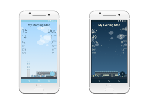

It took its time, but My Dublin Bus for Android is now here. Take that iOS!  Simple and easy to use, the app provides you with information on when the next bus is due for your bus stop in Dublin.  Just open the app and it grabs real time information for your stops and displays it.  This app is for everyday users who just wish to view bus times.  A simple app, for an everyday user.

Features included are:

1. Storing your bus stops so they’re available at a glance just by opening the app.
2. Renaming your stops to something meaningful to you.
3. The ability to filter out buses for only buses that you use.
4. Support for Android Oreo.
5. Themes changing on whether it is Daytime or Nighttime.
6. Simulated weather.
7. Translations - Italian 🇮🇹  &  Portuguese 🇵🇹

 

<iframe src="https://www.youtube.com/embed/WvEGr7F74mU" width="560" height="315" frameborder="0" allowfullscreen="allowfullscreen"></iframe>

 

Thanks for reading.  If you would like to know more, check the app out yourself by heading to [the play store](https://play.google.com/store/apps/details?id=com.tapadoo.mydublinbus)
