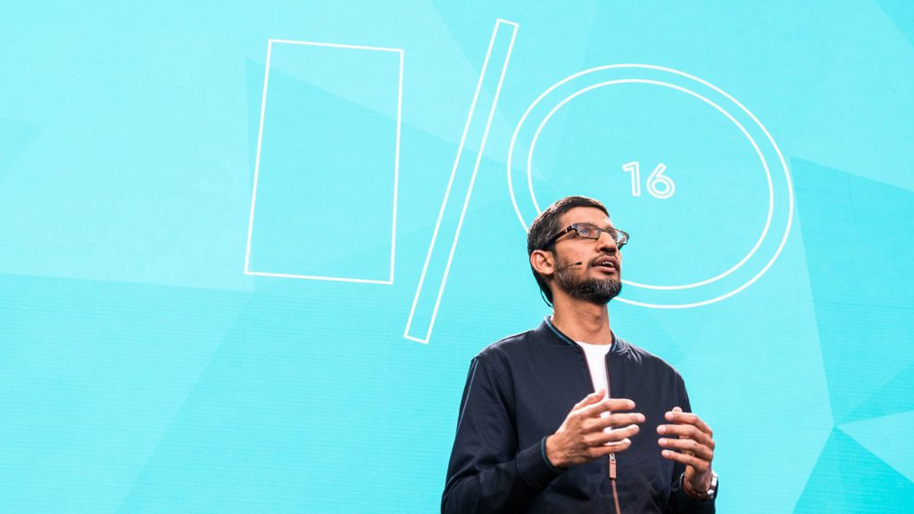
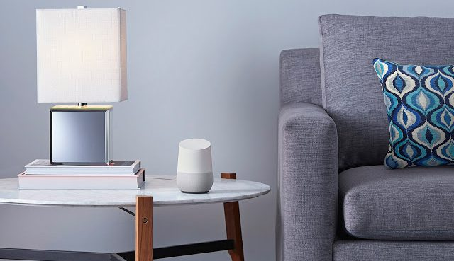
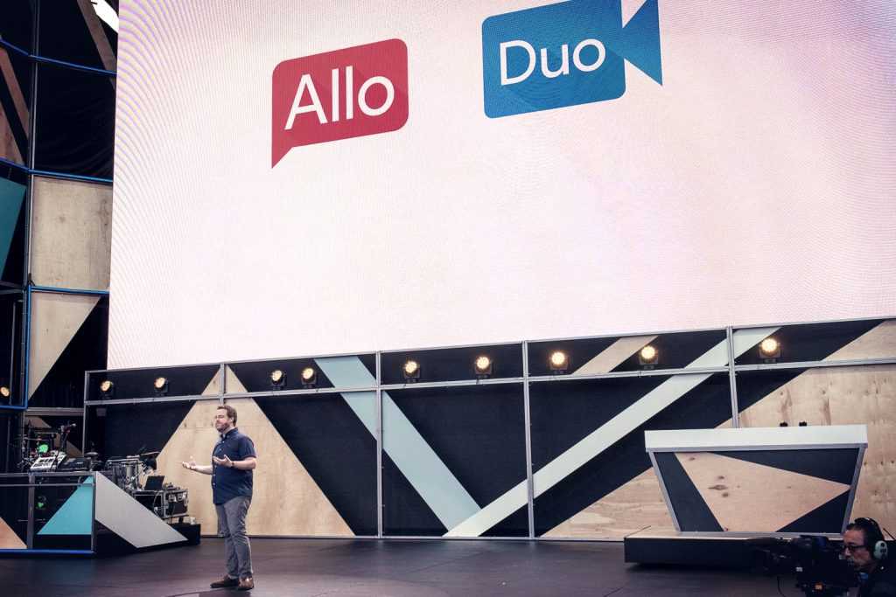
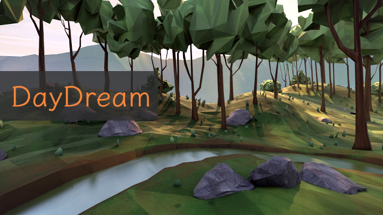
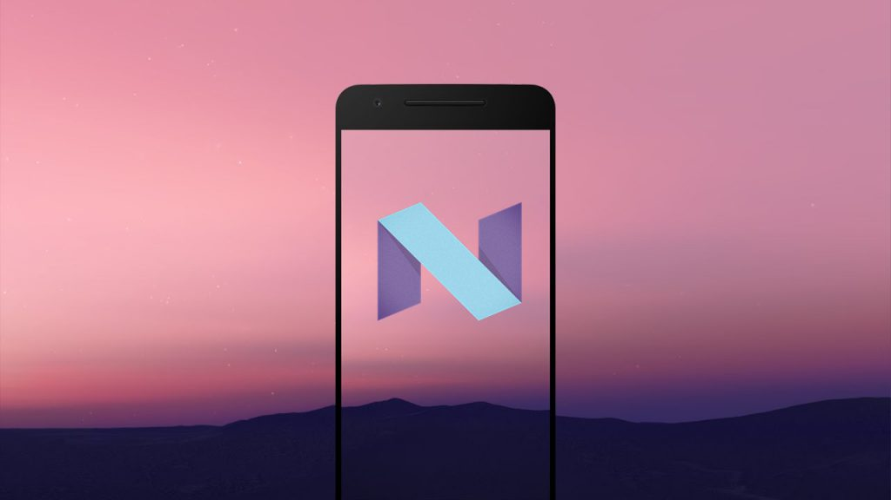

Last week, Google held their ninth ‘Google I/O’ event. For those unfamiliar with this occasion, it’s a gathering for developers and enthusiasts alike to come and listen as Google announces their latest advancements in the world of technology. At Tapadoo HQ, the Android Team grouped around the project for a live stream of the event and Google I/O No.9 didn’t disappoint.

Sundar Pichai at Google I/O 2016

First on stage was the CEO Sundar Pichai who explained that the theme for this years event was AI and Machine Learning. In a recent statement made by Pichai he spoke:

_"Looking to the future, the next big step will be for the very concept of the 'device' to fade away. Over time, the computer itself—whatever its form factor—will be an intelligent assistant helping you through your day. We will move from mobile-first to an AI-first world."_

But what do Pichai’s words actually mean? I sense he is talking about the future growth of Artificial Intelligence - the manner or form in which we interact with the device will evolve to a point where everything becomes seamless. Similar to the romantic science fiction film “Her” - The “intelligent assistant” will act as an extra layer added between the user and device and help us to organise our lives using our collection of apps. Therefore, the device becomes something more real than this object capable of doing our difficult tasks. What this primarily entails for developers is being able to support this layer, however right now, today, this idea is still in the early phases of development thus no need to pull out the ‘AI for Dummies’ just yet.

Google Home

Not surprisingly Google’s first major reveal was “**Google Assistant**” which will answer our queries and handle our everyday tasks. This virtual assistant will reside in the “**Google Home**” which is a wireless voice activated speaker to help us control and better manage our smart home devices. Ask it to play music in the living room, find the recipe of Baked Alaska, and even turn on the heating or stream Netflix on the TV. I’m not sure about you all, but I was amazed to see Iron Man’s “Jarvis” finally come in to existence. However, along with the infinite possibilities of “Google Home” come many concerns like privacy and security. This device will always be listening and already one could only imagine the potential dangers and apprehensions a device could cause. Google must be clear about how they use this data and how to properly secure it; otherwise I would be wary to purchase one immediately.

Allo and Duo App

Next, Google also announced the launch of 2 apps. **Allo**, a messaging app and **Duo**, a video-calling app to compete with the likes of WhatsApp and FaceTime. So what really makes these apps any different?

First, Allo includes a number of interesting features, which sets it apart from its competitors e.g. _Google Assistant integration, smart photo recognition and a focus on Emojis_. Yep, apparently now you can increase the size of emojis to add a sense of volume to your messages, so thankfully we can say goodbye to those who over do the ALL CAP LOCKS FOR EMPHASIS. As well as this, it uses your past conversation history to make predictive responses that will be personalised for the user. As lazy as this sounds, I feel we are all guilty for automated responses so lets not waste anymore time. If that doesn’t do it for you, to add to this and for the more private among us you will be happy to know Allo comes with an Incognito mode with end-to-end encryption and message expiration. A great resort for your best gossip! Unfortunately, the future of Hangouts is not yet known, though, for the meantime it will remain in the Google Ecosystem. As for Duo, a new feature has been introduced called _“Knock Knock’_ which allows you to see a stream of whomever is calling you before you answer. Doesn’t sound like much but the next time you make a video call, at least you will no longer feel some intercontinental switchboard operator is messing things up again.

DayDream - VR Platform

Next is the new **VR platform DayDream** which will arrive in autumn. This platform is a big step forward in the world of VR laying down the foundations for developers to build these new apps on. Google even proposed a possible design for a _headset and handheld controller_, which makes us wonder if Google is currently working on such projects. Virtual Reality is not a new concept but technology has advanced to the point where this form of expression has become a true art. To understand this, I feel Virtual Reality, in a way, is similar to the popular film “Inception” where the dream creator can be compared to a VR developer immersing the user into a new and unforeseen world. For developers who wish to move into the area of VR, it will present a challenge but with the right tools and availability of documentation this will certainly be an interesting transition.

Android N

Finally, the most anticipated début for Android Developers; the not-yet-named OS, “**Android N**”, (on which DayDream will be built) comes with some interesting developments. Besides the usual performance and security updates, _multi-window support_ seen on Samsung and LG phones has now become the norm which is a useful feature for app multitasking on larger phones. As well as this, apps can now incorporate _direct reply notifications_ to increase efficiency and create a more user-friendly experience. Although this is a relatively small feature, its power will be visible in messaging apps allowing users to quickly respond. Furthermore, good news for any game developers, with the introduction of _“Vulkan”_ a new low-level 3D rendering API, developers can now improve graphics by having full control of the GPU.

Google once again has not let us down this year carving a path towards a world of opportunities and possibilities, where man meets both AI and VR. For us developers it is about taking the role of the watchman identifying these changes and incorporating them in the apps we create!

That’s all for now folks, stay tuned and good luck!

Image Credits:  [Google I/O Blog](https://googleblog.blogspot.ie/2016/05/io-building-next-evolution-of-google.html) , [Google I/O Event Photo Gallery](https://photos.google.com/share/AF1QipOdLTJ0m-oapU_mjG2hviqDaf5qv7EjiW9Vl145pugxK5VW4Ja8WnZ43sqL0nH9wQ?key=LUhkdzhZMkZYNFdrOFdKNGozT0Vab2RleEJ0LTFR), [Android N Youtube](https://www.google.ie/url?sa=i&rct=j&q=&esrc=s&source=images&cd=&ved=0ahUKEwj6gvHrq_rMAhWCAcAKHSycBokQjhwIBQ&url=https%3A%2F%2Fwww.youtube.com%2Fwatch%3Fv%3DpgiE80uTdkU&psig=AFQjCNHWHttyxQpp1ob4-BIrPqDDmtm-bw&ust=1464441497338973)
