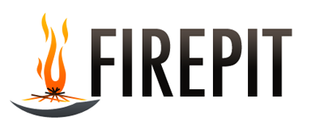

We've had our heads down for a couple of months. This is because we've been working on a project we're very excited about. Now that our initial release is out the door, we're happy to give out some information about it.

That project is **Firepit**.  **What is Firepit**? Firepit is

1. A web based framework
2. For bands going on tour...
3. ..which allows them to produce iPhone applications..
4. ..that are "virtual tour programmes"

We just got out the first Firepit release today: The App is "[Ultravox - Return to Eden II](http://usefirepit.com/ultravox)", and it is on release on the app store worldwide.

We're delighted that Ultravox are on board. They've been an avid supporter of the project for some weeks, getting behind the idea, and supplying some great exclusive content. A quick look over [Midge Ure's Twitter stream](http://twitter.com/midgeure1) shows he's being doing some beta testing, and bigging up the app.

Hope y'all like it.
