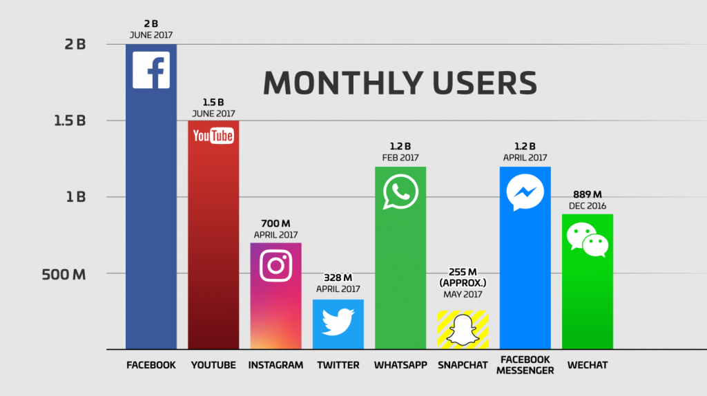
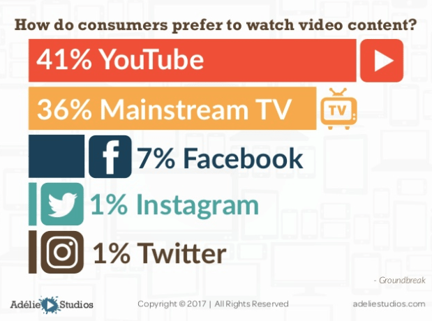

Social media is a great way to promote your app. You can use it to grow the user base of your app and to engage existing users. It brings a global audience and allows specific targeting of your ideal user. It's also cost-effective compared to other [user acquisition strategies](https://tapadoo.wpengine.com/8-user-acquisition-tactics-app-marketing/).

The image below gives an overview of the number of monthly users per social media platform.

[Source](https://techcrunch.com/2017/06/27/facebook-2-billion-users/)

Facebook is the largest social media app with two billion active users. This is followed closely by YouTube at 1.5 billion and significant numbers across all other platforms.

It makes sense to start utilising these platforms to maximise all opportunities to promote your app.

Below are five ways you can use social media to effectively promote your app

#### 1\. Create great social content to ensure engagement

Social posts are a great way to promote your app and the more engaging they are the more effective they will be. The cue to creating great social content is to start with really good visuals for your social postings. This can be a mixture of images and video based content.

Posts with an emotional hook always win. [Psychology Today](https://www.psychologytoday.com/intl/blog/inside-the-consumer-mind/201302/how-emotions-influence-what-we-buy) reports that consumers use emotions to evaluate a brand and not information.

There are a number of emotional hooks you can use with your social posts to promote your app; happiness, surprise, fear of missing out, excitement, curiosity, hope, and many others. Have a look at the chart from [Contently](https://contently.com/2013/12/16/the-emotions-that-trigger-video-sharing/) that shows the emotions that trigger video sharing.

What emotional need does your app satisfy? We spoke about the ‘what’ in a previous blog [post](https://tapadoo.wpengine.com/2018/mobile-app-marketing)? What problem is your app solving? Translate this into an emotion and then use this as the basis for your content marketing across all social platforms.

Don't shy away from using video to promte your app on social media. The image below shows how more people are turning to YouTube as their preferred channel for watching video. An app promotional video is an extremely effective way of engaging users on social media.

[Source](https://www.slideshare.net/AdelieStudios/the-top-17-video-marketing-statistics-for-2017)

#### 2\. Provide incentives for users to download your app

People love a good incentive or competition and it is a great way to promote your app on social media. Incentives create a great buzz around your social media page and drive traffic to your app.

Give your followers real-world incentives such as offers, discounts, freebies, passes, and giveaways. Create polls asking them to engage and offer them an incentive for doing it.

When picking incentives make sure they are in line with your target audience interests. You can find out what these are through your social media stats and through the most liked and commented on posts on your page. Picking incentives and rewards related to your app will lead to more genuine users. And the bigger the incentive, the better the motivation!

According to [The Manifest](https://themanifest.com/app-development/3-effective-ways-incentivize-mobile-app-downloads) 71% of companies offer a discounted item or service for downloading their app. Discounts seem to be the most popular form of incentive for enticing users to use your app. I gave an example in a previous [blog post](https://tapadoo.wpengine.com/user-retention-tactics-mobile-app-marketing/) on how if Amazon offered an incentive for using their app over a web browser it would help users get over the hassle of needing to find their login details.

#### 3\. Share reviews and ratings

[Apptentive](http://cdn2.hubspot.net/hubfs/232559/The_Mobile_Marketers_Guide_To_App_Store_Ratings_and_Reviews.pdf) found that 70% of people read at least one app review before installing an iPhone or Ipad app, and 75% say app rankings are the main motivation for downloading an app.

Reviews lead to a better app experience. [The Manifest](https://themanifest.com/app-development/how-businesses-collect-mobile-app-reviews) interviewed over 300 employees involved in their companies app development and found that 63% read reviews and actively implement changes.

You should actively seek reviews from users and then share them on social media. You can also ask users to post a review of the app and reward them for doing so.

If encouraging users to share reviews make sure to respond to negative ones to help turn detractors into supporters. Incorporate their comments in the next build and tell users when you have done this through your social media channels.

#### 4\. Look for users input and create a loyal user base

If possible, run an early access programme. Both Apple and Google offer the ability for you to release beta versions of your app to users that you qualify. Be careful though; this should be done in good faith. Communicate with those users who give you feedback, and take on board the feedback, showing improvements through the beta cycles. These users may well become your best advocates.

Allowing users to get involved in your app at an early stage means you can bring them along in the process and this creates a sense of loyalty to the app. And it’s only natural that this selection of users will come from your social media following. These people have already expressed interest in your brand.

As your app matures you can release beta versions to this same group of people along with any other active social media followers. Then always update your social media followers with the progress of your app as a way to not only promote your app but to create a loyal user base.

#### 5\. Actively seek recommendations

The early adopters of your app will usually be your most [loyal users](https://tapadoo.wpengine.com/brand-advocates-mobile-app-marketing/). And you will generally find these on your social media channels. You want each of these users to tell everyone about your app.

Mobile App Marketing [Insights](https://think.storage.googleapis.com/docs/mobile-app-marketing-insights.pdf) produced a chart on how apps are discovered. It’s no surprise that 52% are discovered through friends, family, and colleagues. Ask your most loyal users and active social media followers to recruit family, friends, and colleagues. If your app is good enough, they'll recommend it anyway, but don't be afraid to ask.

Maria Colgan

Digital Marketing Manager
