mHealth mobile apps are becoming increasingly important for healthcare providers in carrying out their day to day tasks. There are mHealth mobile apps to support communication and consulting, patient monitoring, clinical research, record maintenance and access, and medical education and training.

### What the Medical Industry is saying about mHealth mobile apps?

Smartphones and tablets are becoming increasingly popular in clinical practice and education. 90% of hospitals surveyed in a 2018 healthcare study by [Spyglass](http://www.spyglass-consulting.com/press_releases/SpyglassPR_CLINICAL_COMM_2018.v1.0.pdf) Consulting Group said they are making significant enterprise-wide investments in Smartphones and secure mobile communications platforms.

The aim is to drive clinical transformation and address the mission and patient-critical communication requirements of clinical and non-clinical mobile workers within the hospital and across the care continuum.

The [Spyglass](http://www.spyglass-consulting.com/press_releases/SpyglassPR_CLINICAL_COMM_2018.v1.0.pdf) study confirmed that:

73% of hospitals surveyed have developed or were developing mobile strategies to address the communications, collaboration, and computing requirements of clinical professionals and other mobile workers across medical departments, standalone hospitals, and ambulatory environments. 

48% of hospitals surveyed have identified or were identifying compelling ROI models to justify mobile investments that provide quantifiable metrics to demonstrate cost reductions, outcome improvements, and staff/patient satisfaction.

68% of hospitals surveyed are using middleware to collect, monitor and manage data, alerts and alarms generated from hospital legacy systems including nurse call, biomedical devices, EHR, pharmacy, and laboratory. 

### What are mHealth mobile apps providing for healthcare providers?

According to [Spyglass](http://www.spyglass-consulting.com/press_releases/SpyglassPR_CLINICAL_COMM_2018.v1.0.pdf), these next-generation communication platforms are providing cross-platform support, unified communication, enterprise-wide directories, event-driven communications and analytics, and reports tools.

Clinicians can use different mobile devices to support anytime, anywhere communications. They can also use different communication modalities including Voice over IP, secure text messaging and video conferencing. Connecting team members with on-call scheduling systems and care assignments is easier.

They can receive critical notifications from hospital legacy systems providing actionable content to close the communications loop. And the analytics and reporting tools enable hospital IT to measure communications tools usage and effectiveness to drive clinical workflow improvements.

The chart below from [Kantar Media](https://www.kantarmedia.com/us/thinking-and-resources/blog/professional-usage-of-smartphones-by-doctors-in-2015) shows the rise of use of smartphones for work reasons by physicians.

[Source](https://www.kantarmedia.com/us/thinking-and-resources/blog/professional-usage-of-smartphones-by-doctors-in-2015)

### Apple's Health Records App

[Apple announced in 2018](https://www.apple.com/newsroom/2018/03/doctors-put-patients-in-charge-with-apples-health-records-feature/) that patients in NYU Langone Health, Stanford Medicine and nearly 40 other health systems representing hundreds of hospitals and clinics can view their medical records on their iPhone.

They updated the [Health Records](https://www.apple.com/newsroom/2018/01/apple-announces-effortless-solution-bringing-health-records-to-iPhone/) section within the Health app. It allows users see the medical information from numerous institutions organised into one view and receive notification when their data is updated. The data is encrypted and password protected with the users iPhone passcode.

Having such information to hand allows patients to understand their health history and have informed conversations with physicians.

[Source](https://www.apple.com/newsroom/2018/01/apple-announces-effortless-solution-bringing-health-records-to-iPhone/)

Apple has reported that Dr. Testa, Chief Medical Officer from NYU Lagone has used Apple Watch's push notifications to implement a new service for ER doctors. The doctors can request notifications of vital lab results through their Apple Watch.

### mHealth Mobile Apps for Clinical Trials

mHealth mobile apps are becoming a big player in [clinical research](https://tapadoo.wpengine.com/?p=4985). There are a number of benefits they offer over traditional studies, such as recruiting new participants and making large scale studies more feasible.

They are particularly useful with rare conditions were researching a large number of participants with the condition is not possible in a small geographic area. The reach of these trials can now be expanded well beyond their geographic location.

Data provided by mHealth mobile apps can sometimes be better than data collected by more traditional methods, particularly self-reporting. Data provided by sensors in an app can be objective, as opposed to subjective with self-reporting.

A common problem with self-reporting is that people often fill in the blanks after the fact. This can lead to incorrect or misremembered data. Whereas with an mHealth mobile app this information can be timestamped and relayed continuously and remotely.

[Clinical Trials](http://www.clinicaltrials.com) is a comprehensive resource for trusted information about medical research studies/clinical trials. You can find articles, podcasts, videos definitions and frequently asked questions.

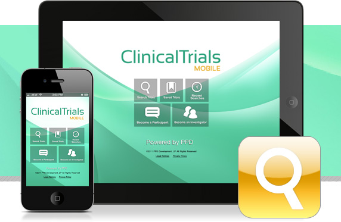

[Source](https://znexxt.blogspot.com/2015/01/10-best-free-recharge-apps-to-get-free.html)

The app is available for iOS and iPad. It provides easy access to search the National Library of Medicine (NLM) database of available clinical trials worldwide. It can be used by clinical trial participants, investigators or students to gather detailed information about specific clinical trials.

- 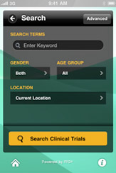
    
- 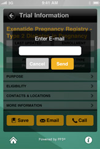
    
- 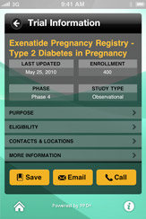
    

## **Pro's of mHealth Mobile Apps**

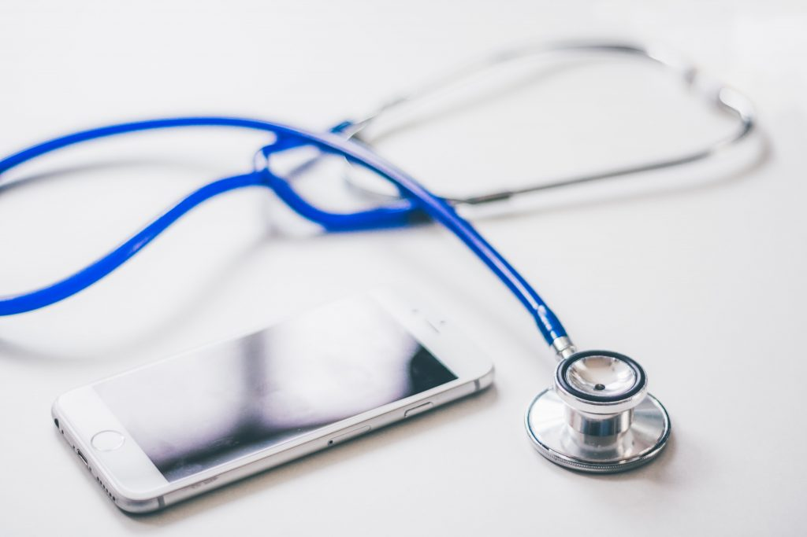

### 1\. Patient Care

It's well known that there is a need for better communication and access to information resources at the patient point of care. Mobile devices and mHealth mobile apps help with these issues. They provide access to point-of-care tools and are changing both the workflow and communication practices of healthcare providers. This has brought many benefits for both healthcare providers and patients.

One of the biggest causes of medical errors is ineffective communication between the patient team. Point of care documentation on devices allows for effective communication between different healthcare providers, leads to better clinical decision-making, and improved patient outcomes.

It also allows healthcare providers to move seamlessly between patients without having to go back to a work station or office.

According to a [journal](https://www.ncbi.nlm.nih.gov/pmc/articles/PMC4029126/#b2-ptj3905356) on the US National Library of Medicine, healthcare providers require access to many types of resources in a clinical setting, including:

- Communication capabilities—voice calling, video conferencing, text, and e-mail [7](https://www.ncbi.nlm.nih.gov/pmc/articles/PMC4029126/#b7-ptj3905356)
- Hospital information systems (HISs)—electronic health records (EHRs), electronic medical records (EMRs), clinical decision support systems (CDSSs), picture archiving and communication systems (PACSs), and laboratory information systems (LISs)[7](https://www.ncbi.nlm.nih.gov/pmc/articles/PMC4029126/#b7-ptj3905356)
- Informational resources—textbooks, guidelines, medical literature, drug references[7](https://www.ncbi.nlm.nih.gov/pmc/articles/PMC4029126/#b7-ptj3905356)
- Clinical software applications—disease diagnosis aids, medical calculators[7](https://www.ncbi.nlm.nih.gov/pmc/articles/PMC4029126/#b7-ptj3905356)

Prior to the introduction of smartphones and mHealth mobile apps, the resources required for point of care meetings were stored in a stationary computer. This required the healthcare provider to return to this stationary desk and access when available.

### 2\. Improved Patient Monitoring

Smartphones and mHealth mobile apps connect patients and healthcare providers. This allows healthcare providers to correctly monitor their patients and provide the necessary support.

As well as providing real-time information and improving communication and support of patients, they allow for patient monitoring, particularly around medication and prescriptions.

According to the [National Centre for Biotechnology Information (NCBI)](https://www.ncbi.nlm.nih.gov/pmc/articles/PMC2723200/) prescription errors are responsible for 70% of medication errors. This has a knock-on effect on patient recovery and leads to a high increase in hosptial readmissions.

A [study](https://www.researchgate.net/publication/288791970_A_comparative_study_on_the_benefits_and_challenges_of_the_application_of_mobile_technology_in_health) showed that medication therapy changes at the time of discharge for 98% of inpatients with at least 5 changes registered for 60% of them.

Healthcare providers can now better inform patients of their diagnosis, medication and followup process through their device. This is helping to streamline the entire point of care process.

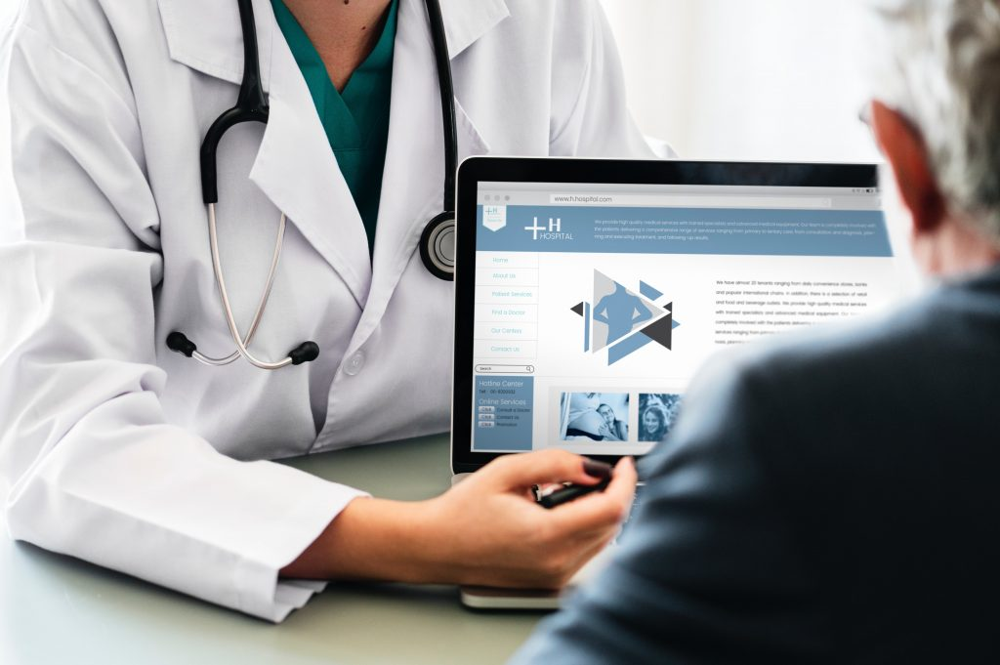

### 3\. Ease of Access

[Teamviewer](https://www.teamviewer.com/en/) is a general-purpose record maintenance and access app. Its purpose is to allow access to a desktop PC from a mobile phone. This allows healthcare providers access patient history, which is particularly useful in ER cases. The healthcare provider can access information such as medical history, lab results, scan, consultation, and discharge notes.

[Mobile MIM](https://www.ncbi.nlm.nih.gov/pmc/articles/PMC4029126/) is a free mHealth mobile app for iPad and iPhone, approved by the Food and Drug Administration, that allows remote viewing of x-rays and imaging scans when users cannot access imaging workstations.

This software works with a paid subscription or pay-per-use plan using MIMCloud, a HIPAA-compliant server that allows users to store and share medical images.

Images can be downloaded from the cloud and viewed with the MIMViewer paid app in any setting, whether during discussions with team members or patients.

- 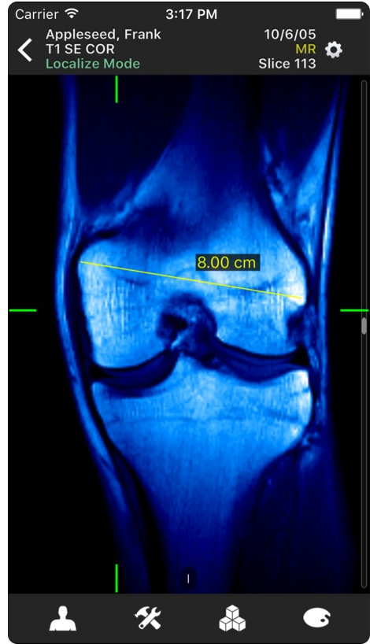
    
- 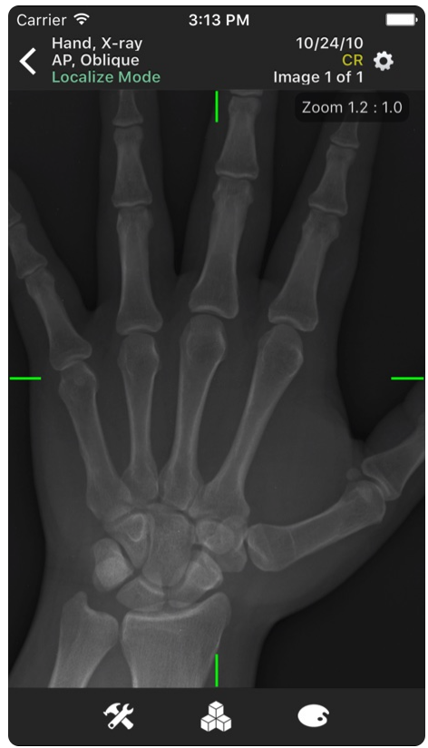
    

### 4\. Appointment Scheduling

It's estimated that missed appointments cost the US healthcare system [$150bn per year](https://blog.capterra.com/top-7-free-medical-scheduling-software-systems/). With one clinic losing close to one million dollars because of 14,000 no-shows over the course of a year. Each open, unused time slot costs a physician [60 minutes and $200](https://www.hcinnovationgroup.com/clinical-it/article/13008175/missed-appointments-cost-the-us-healthcare-system-150b-each-year) on average.

The no-show [rates per industry](https://www.solutionreach.com/blog/which-wins-the-national-average-no-show-rate-or-yours):

- Dentistry: 15%
- Optometry: 25%
- Primary Care: 19%
- OB/GYN: 18%
- Pediatrics: 30%
- Dermatology: 30%
- Ophthalmology: 22%

[77% of patients](https://www.accenture.com/t20170412t073547z__w__/us-en/_acnmedia/pdf-6/accenture-patient-engagement-digital-self-scheduling-explode.pdf) think the ability to book, change, or cancel appointments is important.

[Digital self-scheduling](https://www.accenture.com/t20170412t073547z__w__/us-en/_acnmedia/pdf-6/accenture-patient-engagement-digital-self-scheduling-explode.pdf) is set to explode in healthcare over the next few years. By the end of 2019, [66%](https://www.accenture.com/t20170412t073547z__w__/us-en/_acnmedia/pdf-6/accenture-patient-engagement-digital-self-scheduling-explode.pdf) of US health systems will offer digital self-scheduling and [64%](https://www.accenture.com/t20170412t073547z__w__/us-en/_acnmedia/pdf-6/accenture-patient-engagement-digital-self-scheduling-explode.pdf) of patients will book appointments digitally, delivering [$3.2 billion](https://www.accenture.com/t20170412t073547z__w__/us-en/_acnmedia/pdf-6/accenture-patient-engagement-digital-self-scheduling-explode.pdf) in value and a competitive boost for health systems.

Below is an image from Accenture on digital patient appointment self-scheduling in 2014 and what's estimated by end of 2019.

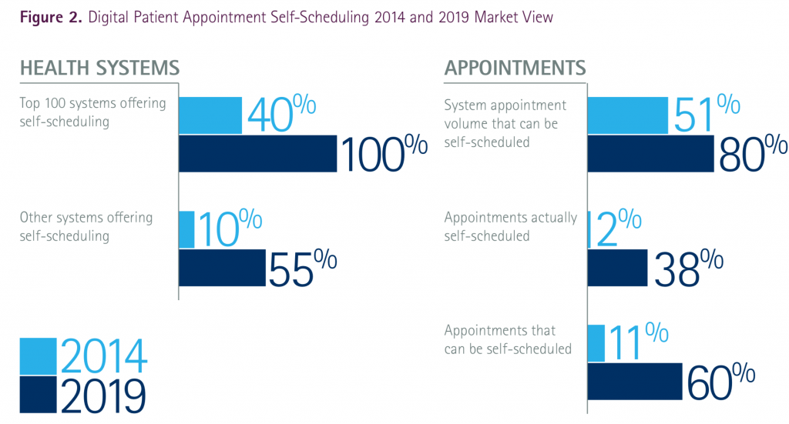

[Source](https://www.accenture.com/t20170412t073547z__w__/us-en/_acnmedia/pdf-6/accenture-patient-engagement-digital-self-scheduling-explode.pdf)

Accenture estimates that 986 million appointments will be booked using self-scheduling tools in 2019. They say this will enable health systems to reallocate $3.2bn in scheduler capacity in that year alone. By making general appointment scheduling available online, health systems can reduce excess capacity, expand scheduling hours and better allow for last-minute appointments.

### 5\. Education

A survey of medical school faculty, residents and students found that 85% of faculty members, 90% of residents and 85% of students use mobile devices in a wide variety of settings ranging from classrooms to hospitals.

[80% of medical students](https://www.ncbi.nlm.nih.gov/pmc/articles/PMC4029126/) use smartphones to communicate with one another.

Medical students are using mobile devices to access information about medical conditions an drug treatment. The [resources frequently accessed](https://www.ncbi.nlm.nih.gov/pmc/articles/PMC4029126/) on mobile devices are online textbooks and lectures, medical podcasts, medical calculators and search engines to look up unfamiliar terms.

Students are also accessing [case study quizzes or tests](https://www.ncbi.nlm.nih.gov/pmc/articles/PMC4029126/) to help prepare for board examinations. [QuantiaMD](https://www.univadis.com) has a [mobile CME app](https://www.ncbi.nlm.nih.gov/pmc/articles/PMC4029126/) that provides interactive case studies that can be shared with colleagues.

A [study](https://www.ncbi.nlm.nih.gov/pmc/articles/PMC4029126/) showed that 75% of medical school faculty, 95% of residents and 55% of students agreed that using a mobile device for rapid access to educational resources while on the go had a positive effect.

- 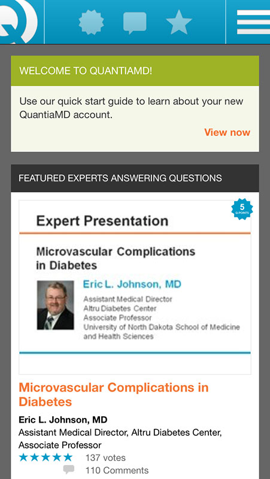
    
- 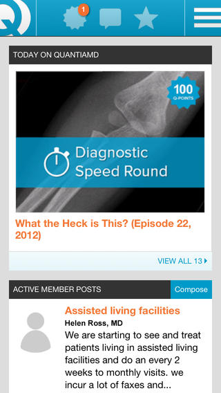
    
- 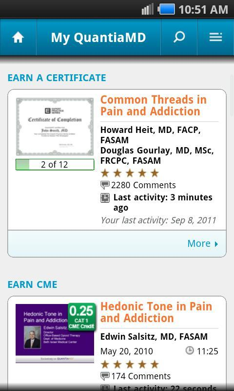
    

### 6\. Paperless Information

The obvious benefit of having a paperless system is the effects on the environment. It also has massive cost savings for the medical industry. Having an mHealth mobile app reduces waste and storage requirements, and allows for a seamless flow of data. The downside of this is the cost of moving to an mHealth app in the first place.

When the UK tried to initiate a country-wide electronic medical record for every patient it ran into some difficulties. The project began in 2002 until it was dismantled in 2011 costing the UK government [£12.7 billion.](https://www.centreforpublicimpact.org/case-study/electronic-health-records-system-uk/)

#### Some stats on the success of mHealth mobile apps on patients

[40% increase](https://www.researchgate.net/publication/288791970_A_comparative_study_on_the_benefits_and_challenges_of_the_application_of_mobile_technology_in_health) in the number of visitors for an aids test in Uganda after sending a short message about the Aids virus.

[90% of patients](https://www.researchgate.net/publication/288791970_A_comparative_study_on_the_benefits_and_challenges_of_the_application_of_mobile_technology_in_health) in the Philippines, Thailand and South Africa with pneumonia used their drugs based on technology after being sent daily reminders.

For patients who didn't receive these types of message the rate of drug use dropped to between 3[0 and 68%.](https://www.researchgate.net/publication/288791970_A_comparative_study_on_the_benefits_and_challenges_of_the_application_of_mobile_technology_in_health)

The rates of [visits increased and costs reduced](https://www.researchgate.net/publication/288791970_A_comparative_study_on_the_benefits_and_challenges_of_the_application_of_mobile_technology_in_health) by one third in China when messages were sent to patients reminding them of their visiting time.

A [study in the UK](https://www.researchgate.net/publication/288791970_A_comparative_study_on_the_benefits_and_challenges_of_the_application_of_mobile_technology_in_health) found that the reduction in the visits to the hospitals due to meeting health service requirements through mHealth technology is accompanied by an annual saving of £575m in health expenditure.

## **Issues Associated with mHealth Mobile Apps**

### 1\. Changing Technologies

mHealth is a rapidly changing discipline where technologies can change under your feet. Apps and services may need to be updated regularly to keep pace with technologies and security.

There's also concern from doctors on the advancement of AI and how it's been used to diagnose medical conditions. According to [CNBC](https://www.cnbc.com/2018/08/17/healthcare-and-ai-doctors-warn-on-the-pace-of-technological-change.html), some doctors worry that those in the tech world think AI can not only help clinicians, but even do a better job.

This comes about as AI firm DeepMind gave its technology to London's Moorfields hospital. It's machine learning technology made correct diagnoses of detecting eye disease in 94% of patients.

Similar happened with Babylon Health where it's AI chatbot passed 82% of test questions versus the human mark of 72%.

Do doctors have a right to be concerned or is technology the way forward? The answer remains to be seen. The market is too young to call out, but doctors and patients have a right to be concerned about the fast-paced change in technology and how it impacts them and their data.

### 2\. Security

Security and privacy of user information is paramount for any organisation that processes personal information. There's heightened sensitivity with mHealth mobile apps due to the sheer volume of medical information available on them.

MyFitnessPal app, one of the world's top-rated wellness and prevention apps had 150 million users details hacked in the last year. This was one of the biggest hacks in history. Users names, email addresses, and passwords were among the data stolen.

According to [2018 Global Study on Application Security, conducted by the Ponemon Institute,](https://www.arxan.com/resources/downloads/2018-global-study-application-security) the majority of companies take the reactive approach and don’t invest in protecting their products up until the actual breach occurs. The healthcare market doesn't have the luxury of waiting on something like this to happen.

[Cybersecurity Ventures forecasts](https://cybersecurityventures.com/healthcare-cybersecurity-report-2017/) global healthcare spending more than $65bn on cybersecurity between 2017 and 2020.

### 3\. Lack of Regulation

Of the hundreds and thousands of mHealth mobile apps on the market, only [22](https://insiderinc.auth0.com/login?state=g6Fo2SB2Z09qbGF1ak5BLVdhU0lORVp1T09vM1dZdzVFQjFiN6N0aWTZIGJvaEx0UURvR0t5YXBZNmx6enc1MFRiaUJwcW5qc1Yxo2NpZNkganAyb2NadEFNT01YNWlud2c2Q2RWeUtaZTBQQ3ppZXM&client=jp2ocZtAMOMX5inwg6CdVyKZe0PCzies&protocol=oauth2&response_type=code&scope=openid%20profile%20email&redirect_uri=https%3A%2F%2Fintelligence.businessinsider.com%2Fauth0%2Fcallback&audience=https%3A%2F%2Finsiderinc.auth0.com%2Fuserinfo) have been evaluated in the last decade. According to research2guidance, as of 2017, there were approximately [325,000 mHealth mobile apps](https://www.uzelf.org/wp-content/uploads/2017/12/R2G-mHealth-Developer-Economics-2017-Status-And-Trends.pdf) available. The FDA have so far only approved [a fraction](https://www.fda.gov/MedicalDevices/DigitalHealth/MobileMedicalApplications/ucm368784.htm) of them.

The FDA sent a [warning](https://www.fda.gov/news-events/press-announcements/fda-warns-public-not-use-unapproved-or-uncleared-medical-devices-help-assess-or-diagnose-concussion) recently advising the public not to use unapproved or uncleared medical devices to help assess or diagnose a concussion. These smartphone apps are being marketed to coaches and parents for use during sporting events.

According to the FDA “….have not been reviewed by the FDA for safety and efficacy and could result in an incorrect diagnosis, potentially leading to a person with a serious head injury returning to their normal activities instead of getting medical care”.

### 4\. Clinical Trial Issues

Although medical research studies via mHealth mobile apps offer many advantages over existing study types, there are also issues that should be considered when choosing to do a study in this way.

As much as mHealth can increase the scope and reach of studies to greater populations, drop out rates can be high.

One study may need to support multiple technology platforms. For example, if you wish to conduct a study via an app you will need to decide whether to choose Android, iOS or both. This decision will impact recruitment, speed, etc. It may also affect your results. For example, it may be the case that iPhone owners generally have a higher disposable income. So do findings among iPhone owners apply to the general population?

Certain platforms allow for different capabilities. For example, Android allows for background data collection while iOS does not (at least not as expansively). This may mean that you have no choice but to use one platform or another depending on what you are studying.

Participants may have varying levels of familiarity with mobile technology. It may be the case that participants will have to be trained to use the technology.

HIThub has identified four key challenges in the infographic below for mHealth mobile apps into the future.

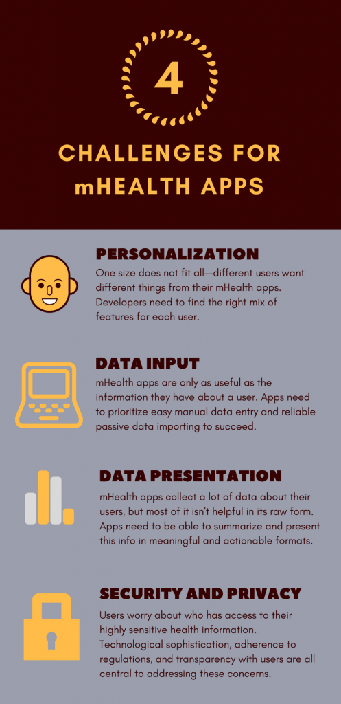

[Source](http://www.hithub.org/wp-content/uploads/2017/08/Challenges-for-mHealth-Apps2-1-1.png)

### Conclusion

The [mHealth mobile app market](https://tapadoo.wpengine.com/mhealth-apps-market-potential-ireland-globally/) is still relatively young. There may be further unforeseen issues that we'll only see in time. There are also many benefits of moving this way and there's no doubt that the pros outway the cons. Along with a bigger need for regulation of the entire market, the main issues facing the mHealth mobile apps market are security, privacy, and efficiency.

Maria Colgan
