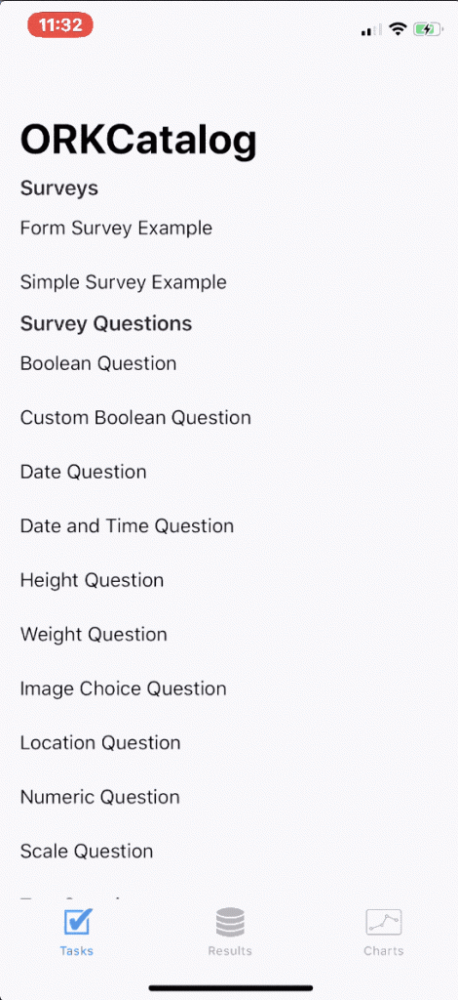
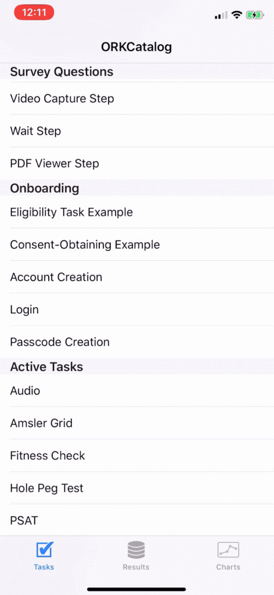
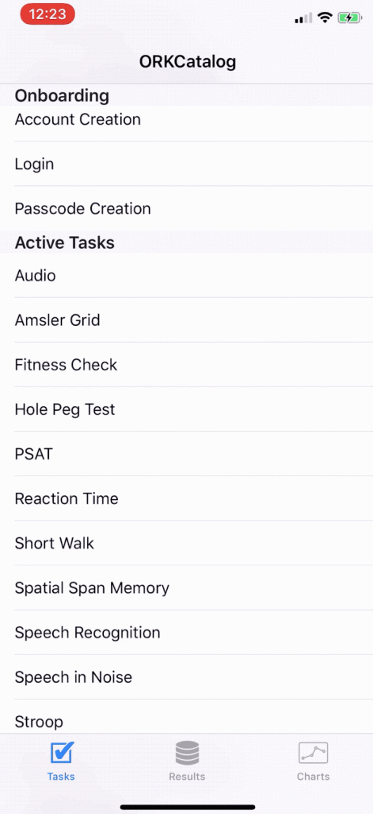
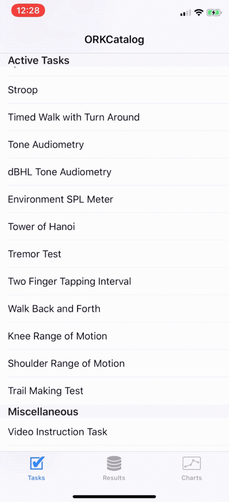
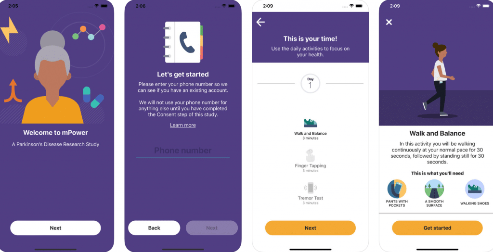
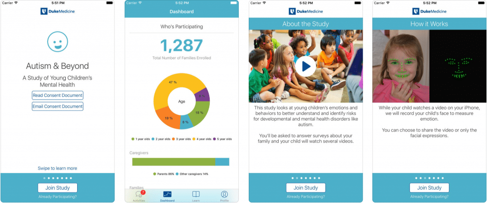
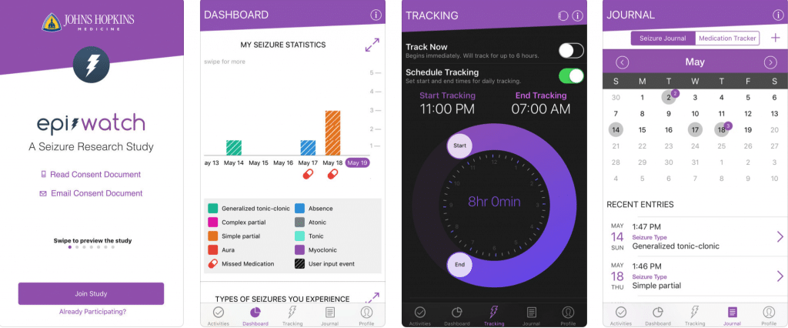

Apple's [ResearchKit](https://www.apple.com/ie/researchkit/) is a way for the healthcare industry to innovate.

In 2015 Apple extended its [healthcare](https://tapadoo.wpengine.com/?p=5058) portfolio with [ResearchKit](https://www.apple.com/ie/researchkit/). ResearchKit is different from what Apple has done before in the [healthcare](https://tapadoo.wpengine.com/?p=5058) space. While previous efforts such as [HealthKit](https://developer.apple.com/healthkit/) was a very natural extension of the iPhone’s capability, ResearchKit revealed Apple’s deep intent in creating health technology for the [healthcare](https://tapadoo.wpengine.com/?p=5058) market.

### **What is ResearchKit?**

ResearchKit is a framework designed by Apple to help researchers and developers create powerful apps for medical research. Apple has removed a lot of the boiler-plate work associated with research studies. Common research study tasks such as gathering consent, providing the user with information and testing to ensure they know what they are signing up to is made easier with ResearchKit.  

There are a variety of customisable modules provided by Apple and the ResearchKit community. These can be mixed and matched or built upon. As Apple has open sourced ResearchKit anyone can contribute to its development, and many people have. Improvements and new features are steadily added to ResearchKit, meaning it will continue to improve into the future.

### **Advantages of ResearchKit for the medical company**

Apple has included useful UI modules such as graphs, charts and other components that are commonly used in clinical trials such as question and answer sheets, motion activity recording, ordered tasks and many other useful components.

For those companies trying to build medical apps for clinical trials, it makes it much easier, cheaper and safer to build research apps. By leveraging what is provided in ResearchKit, much of the common tasks that would otherwise be expensive and time consuming to build on your own is made easier. Those tasks such as consent capturing, signature capturing and graph UI.

### **Components of ResearchKit**

#### 1\. Survey Engine

A common aspect of studies is the need to collect information from participants. ResearchKit provides components to simplfy this. ResearchKit makes it easy to display survey questions in a variety of forms including true or false questions, multiple choice, dates and times, sliding scales and free text entry.

With ResearchKit there is no need to reinvent the wheel and create custom UI and screens to collect simple question-based information.

- 
    

#### 2\. Visual Consent Flow

A key aspect of most research studies is consent gathering. Vital to this process is ensuring clarity so that the participant knows what they are signing up for. ResearchKit provides a visual flow that can be customised for your study. The benefit is that an effective and straight forward consent flow can be put together using this out of the box component. Customisation is still required, but ResearchKit should reduce the time and effort to build a consent flow greatly.

- 
    

#### 3\. Active Tasks

ResearchKit also provides a library of “active tasks”. These are common medical research assessments that can be done via a smart phone interface. Of course, the options are not exhaustive. However, the ability to include these with relative ease if they make sense in the context of your study is very impressive.

- 
    
- 
    

#### **List of Active Tasks currently included in ResearchKit**

**Motor Activities:**

1. Range of motion
2. Gait and balance
3. Tapping speed

**Fitness:**

1. Fitness
2. Timed walk

**Cognition:**

1. Spatial memory
2. Stroop test
3. Trail making test
4. Paced serial addition test
5. Tower of Hanoi
6. Reaction time

**Speech**

1. Sustained phonation
2. Speech recognition
3. Speech-in-Noise

**Hearing**

1. Environment SPL
2. Tone audiometry
3. dBHL tone audiometry

**Hand dexterity**

1. 9-hole peg

**Vision**

1. Amsler grid

### **What ResearchKit doesn’t do**

It’s important to note that ResearchKit is just a collection of building blocks to help others build research study apps. Those looking to create an app with ResearchKit still need to mix and match the relevant components, customise and combine them, and build out the various unique parts of the research app.

Some particular things to note:

- ResearchKit does not provide any server component. Data collection and storage remain your responsibility. As too does secure communication mechanisms between your app and your sever.
- ResearchKit does not offer background sensor data collection. Although similar data can be fetched from other Apple provided frameworks like HealthKit and CoreMotion.
- Complying with applicable laws for each territory in which the app is made available remains your responsibility.

### **Examples of apps using ResearchKit**

### mPower 2.0

The [mPower](https://parkinsonmpower.org/your-story) app allows those living with Parkinson's Disease track their medication and other factors such as stress and exercise. The app gives users an insight into how their day to day health and lifestyle may lead to a better understanding of the effect of Parkinson Disease on their life.

The app allows users understand their symptoms and other factors, and how these relate to their medication. They get to see changes of their physical and cognitive activities over time allowing them to talk about it with their doctors and caregivers.

[Source](https://apps.apple.com/us/app/parkinson-mpower-2/id1375781575)

#### Autism and Beyond

[Autism and Beyond](https://autismandbeyond.researchkit.duke.edu/ch) is a study of young children's mental health that seeks to better understand and identify risks for development. It's powerd by Apple's ResearchKit. The study aims to test new video technology that can analyse a child's emotion and behaviour. It is hoped that the technology may one day be used to screen young children in their homes for autism and mental health challenges, such as anxiety or tantrums.

[Source](https://apps.apple.com/us/app/autism-beyond/id1025327516)

#### EpiWatch

John Hopkins [EpiWatch](https://www.hopkinsmedicine.org/epiwatch/index.html) is an app for Apple Watch and research study. EpiWatch helps users manage their epilepsy by tracking their seizures and possible triggers, medications and side effects. The information can be viewed at any time and a dashboard lets users share a summary of the data with a doctor or caregiver.

The EpiWatch also allows users to send a message to family members or caregiver to let them know if the user is tracking a seizure. EpiWatch gives users a chance to help epilepsy research by sharing information about seizures. The researchers conducting this study are exploring whether a future app could potentially detect seizures, estimate the duration and contact caregivers, all using Apple Watch.

[Source](https://apps.apple.com/us/app/epiwatch/id1047757228)

### **Best Practices with ResearchKit**

Developers have contributed to the best practices using ResearchKit from the lessons they have learned in developing and testing applications using the ResearchKit framework. Consent being the biggest factor. They also look at participant control, privacy, security, accessibility and software development.

#### Consent

It may be a requirement by law to have your research study independently reviewed, even so, the development community who work with ResearchKit for clinical trials recommend you have it independently reviewed by an IRB or Ethics Committee.

Both the iOS Developer Program License Agreement and the [FDA](https://www.fda.gov/regulatory-information/search-fda-guidance-documents/use-electronic-informed-consent-clinical-investigations-questions-and-answers) have released guidance on gathering consent. However, as the consent functionality in ResearchKit is only intended as a tool, specific guidance around consent for the information you gather in your app would be required from an IRB or Ethics Committee.

#### Participant Control

Never has there been a more prominent discussion around personal data than now. With Europe changing its GDPR rules in 2018 to focus heavily on the data stored by organisations and consumers knowing their rights.

The development community recommends that participants should have granular control over what data they choose to share with the study. They say that if you intend to share the data you have collected with other researchers then participants should be able to decide if their data is included in this.

And finally, research participants should be able to leave a research study at any time.

#### Privacy

Privacy of data is paramount and it's your responsibility to ensure your research app has the highest level of security in place. The development community doesn't recommend using iCloud to store health information.

They recommend having an explicit Privacy Policy in place so that participants know exactly what they are signing up to. A Privacy Policy is a GDPR requirement for Europe and also a requirement for ResearchKit apps on the iOS App Store.

If your app records or displays personal data they recommend using Touch ID or PIN access to control access to your app.

#### Security

The development community doesn't recommend keeping personal data for any longer than is necessary for your app to function. They recommend having files stored by your app encrypted automatically whenever the device is locked. And for transmitting data via networks that terminate SSL early they recommend an extra cryptographic wrapper such as Cryptographic Message Syntax (CMS).

#### Accessibility

Apple builds products that are accessible. That's why they recommend that your research apps UI should allow for VoiceOver. VoiceOver is Apple's built-in screen reader for the blind. All actions that you require from participants should be able to be done through VoiceOver.

The development community also recommend adding accessibility hints and traits to describe UI elements that might be difficult to describe with just a white label.

#### Software Development

The development community recommend you embed the ResearchKit framework as an embedded dynamic framework within your app. They also recommend giving ResearchKit tasks instruction steps at the beginning of the task and if your tasks and questions are maintained in a database that you have unique keys for them.

You can see the complete list [here](https://github.com/ResearchKit/ResearchKit/wiki/best-practices).

### **Conclusion**

While there are many pros and cons to using mobile-based technology for clinical trials, there's no doubt that ResearchKit has made it easier for medical companies looking to gather information in this way. ResearchKit not only provides a framework for digitalising clinical trials, it also allows for the data to be collected with minimal intrusion to the user.

Maria Colgan
