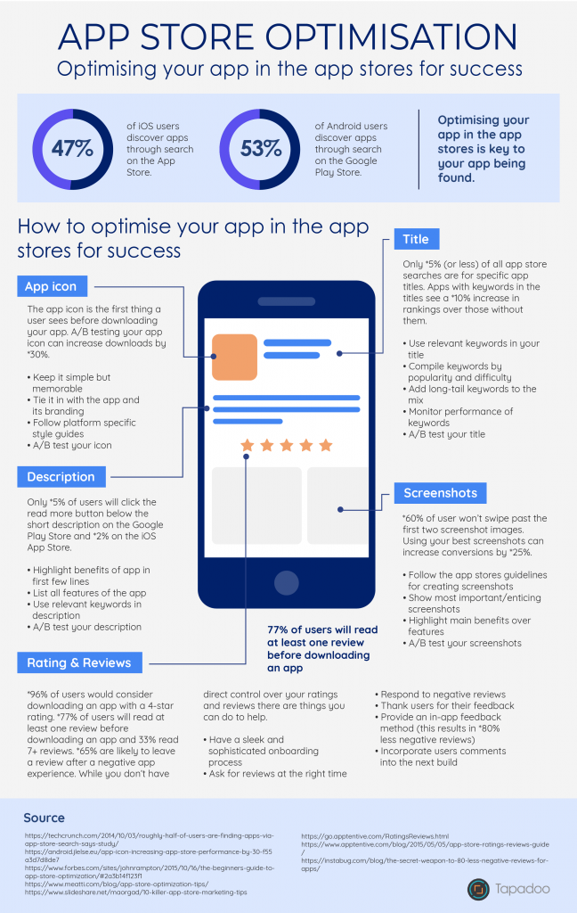

SEO for apps is known as [ASO](https://tapadoo.wpengine.com/app-store-optimisation%e2%80%8b-guarantee-success/) or [App Store Optimisation](https://tapadoo.wpengine.com/app-store-optimisation%e2%80%8b-guarantee-success/).

#### How important is SEO for apps?

[47% of iOS users](https://tapadoo.wpengine.com/app-store-optimisation%E2%80%8B-guarantee-success/) discover apps through search on the App Store and [53% of Android](https://tapadoo.wpengine.com/app-store-optimisation%E2%80%8B-guarantee-success/) users discover apps through search on the Google Play Store. These figures surprised us. We knew search played an important part in apps being discovered but these figures highlight just how important.

[App Store Optimisation](https://tapadoo.wpengine.com/app-store-optimisation%e2%80%8b-guarantee-success/) or SEO for apps plays a vital role in your app being discovered and something that you need to focus on for your apps success.

#### The Facts

You probably have a good understanding of the main areas to [focus on](https://tapadoo.wpengine.com/app-store-optimisation%e2%80%8b-guarantee-success/) with [app store optimisation](https://tapadoo.wpengine.com/app-store-optimisation%e2%80%8b-guarantee-success/) but what you may not have been aware of is the stats around each of these elements.

Did you know that A/B testing your app icon can increase downloads by 30%?

Or that 60% of users won't swipe past the first two screenshots?

And what's more surprising is that only 5% of users will click the read more button below the short description on the Google Play Store and 2% on the iOS App Store.

Do these figures alarm you?

Maybe they should!

It's one way to get you really focused on optimising your app in the app stores.

With so many apps being discovered through search your job is to make sure you've given your app the best chance of being found.

#### How do you achieve this?

Take a look at the attached infographic for some interesting stats and areas to focus on for success.

Key takeaways:

- Test your app icon.
- Highlight the main benefits of your app in the first couple of lines i.e. before the read more section.
- Use keywords in the title.
- Have your best two screenshots or videos first.
- Pay attention to [ratings and reviews](https://tapadoo.wpengine.com/?p=5201), they're important.

For a more in-depth view on app store optimisation you can read a more detailed post [here](https://tapadoo.wpengine.com/app-store-optimisation%e2%80%8b-guarantee-success/).

Maria Colgan

Digital Marketing Manager
