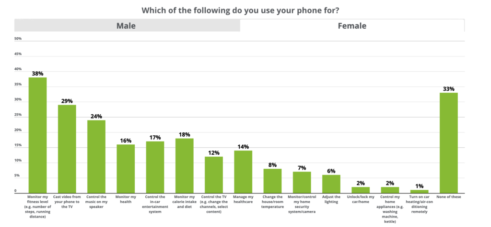
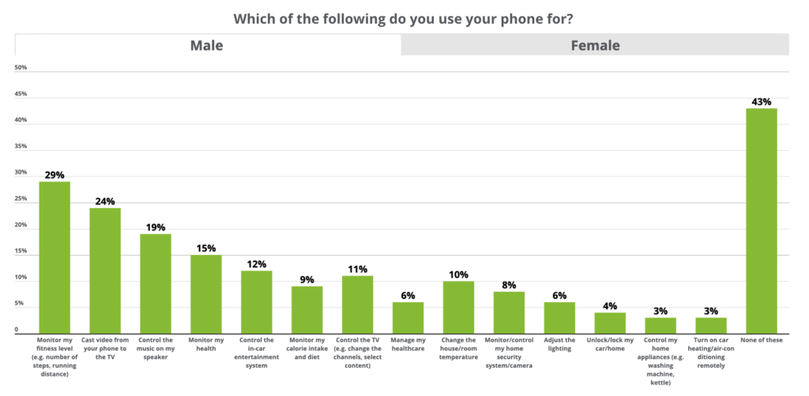
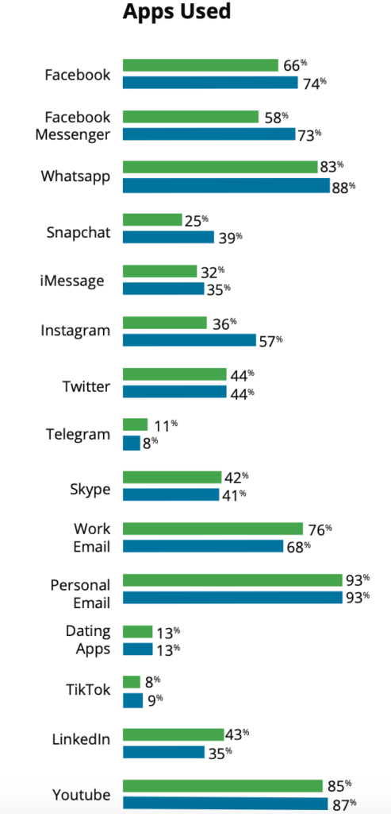
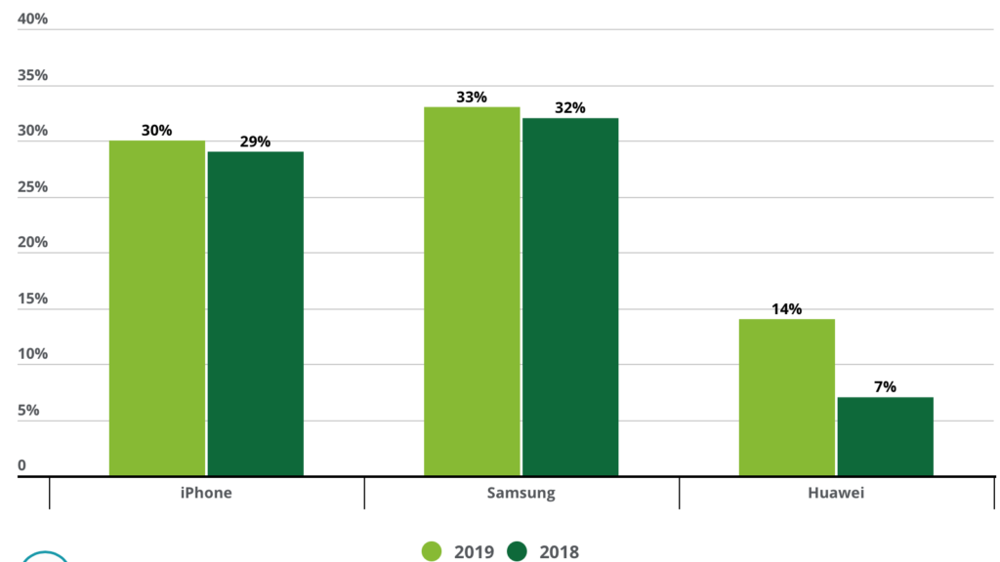
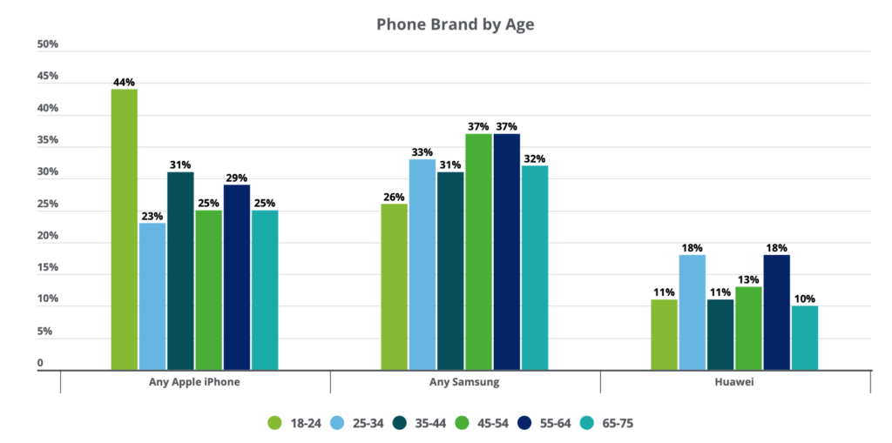
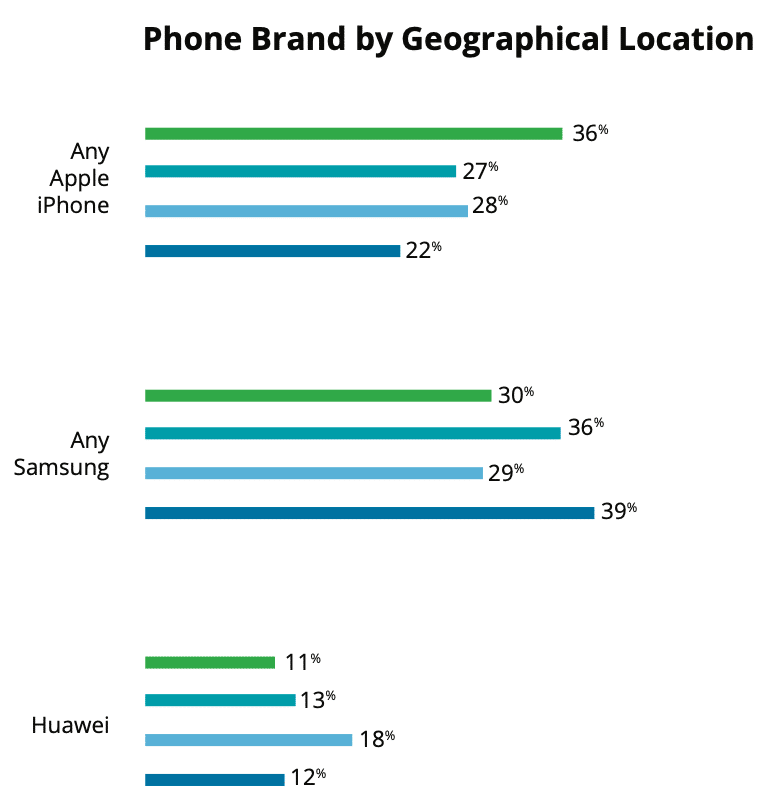
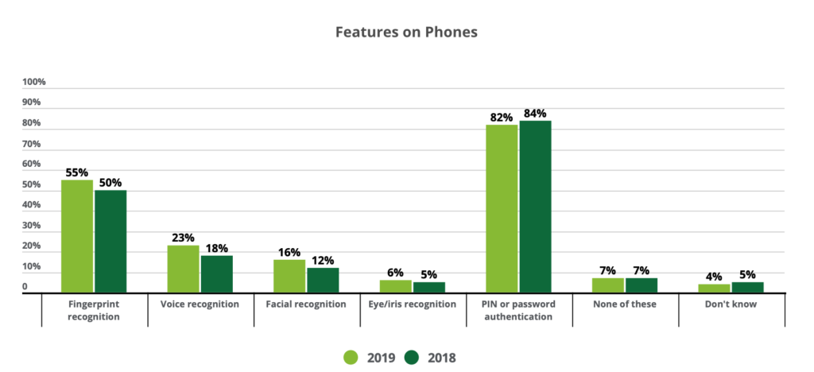
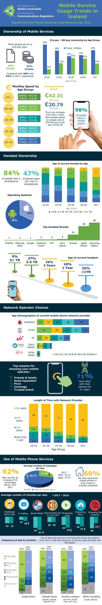

19 out of 20 Irish adults own a smartphone.

> While ownership rates may be approaching a ceiling, the smartphone economy is just getting started and the smartphone industry is brimming with potential.
> 
> Richard Howard, Partner, Technology, Media and Telecommunications, Deloitte

Mobile devices have impacted the lives of everyone across the globe including the Irish. We spend more time on our mobile device than many other countries including the US. According to ComReg's 2019 Mobile Phone Consumer Experience [Survey](https://www.comreg.ie/comreg-issues-results-from-2019-mobile-phone-consumer-experience-survey/), we spend four and a half hours on our mobile phones daily. Whereas in the US, consumers spend on average [3 hours and 10 minutes](https://www.emarketer.com/content/us-time-spent-with-mobile-2019) on their smartphone daily.

Of the 4½ hours spent on our mobiles each day only 10% of this time is for making calls. Social media dominates our time with an average of 64 minutes spent scrolling our news feeds. This is followed by streaming videos, where we spend an average of 53 minutes. We spend a further 47 minutes streaming music, followed by 32 minutes browsing the internet and 20 minutes sending and receiving emails. 

#### Mobile Consumer Report Ireland 2019

According to Deloitte's [Global Mobile Consumer Report 2019](https://www2.deloitte.com/ie/en/pages/technology-media-and-telecommunications/articles/global-mobile-consumer-survey.html) 96% of Irish people have a mobile phone of which 91% are smartphones. We check our phones 50 times a day, although some admit to checking their phone over 200 times a day! And 21% will switch to a 5G network as soon as it is available.

On the usage of our phone, 85% use WhatsApp, 72% check work emails, 60% make calls at least daily and 33% monitor their fitness levels. While 66% of those surveyed are trying to limit their phone usage, 3 out of 10 indicated that the overuse of mobile phones has meant increased levels of distraction, not getting to bed on time and feeling like they constantly have to check their phone.

The most popular phone in Ireland is Samsung, followed by Apple but Huawei is the fastest growing.

#### Females Get More Value from their Mobile Phone

In Deloitte's [2019 Report](https://www.comreg.ie/media/2019/09/ComReg-Mobile-Consumer-Experience-Survey-Infographic05092019.pdf) females use their mobile phones more in almost every category. From monitoring their fitness to casting videos from their phone to the TV to controlling the music on their speaker, monitoring their health, controlling their in-car entertainment system and managing their healthcare, females surpassed males in all of these categories. Males had only slightly more usage in categories such as unlocking/locking their car or home, controlling home appliances and turning car heating and air-conditioning on/off remotely.

#### **Mobile Phone Usage Females, Ireland 2019**

[Source](https://www2.deloitte.com/ie/en/pages/technology-media-and-telecommunications/articles/global-mobile-consumer-survey.html#)

#### **Mobile Phone Usage Males, Ireland 2019**

[Source](https://www2.deloitte.com/ie/en/pages/technology-media-and-telecommunications/articles/global-mobile-consumer-survey.html#)

#### Apps Used by Irish People

Below is the breakdown of the apps used between males and females. The trend is pointing towards females using more social apps than males but males using work emails and LinkedIn more. It has also been noted on the report that 38% of females play online games compared to 22% of males but 27% of males use their phones for online gambling compared to 16% of females. Both male and females use dating apps in similar proportions with 12% for males and 13% for females.

[Source](https://www2.deloitte.com/ie/en/pages/technology-media-and-telecommunications/articles/global-mobile-consumer-survey.html#)

#### Market Share of the Big Brands

Below is the market share split between the big brands, iPhone, Samsung and Huawei. While Samsung and iPhone had minimal growth Huawei's growth doubled in the last year from 7% to 14%. According to the report no other brand in Ireland has a market share greater than 3%.

[Source](https://www2.deloitte.com/ie/en/pages/technology-media-and-telecommunications/articles/global-mobile-consumer-survey.html#)

A person's age and geographic location have a bearing on the type of phone they own. The younger generation, 18-24 year olds, and those who live in Dublin are more likely to own an iPhone.

[Source](https://www2.deloitte.com/ie/en/pages/technology-media-and-telecommunications/articles/global-mobile-consumer-survey.html#)

[Source](https://www2.deloitte.com/ie/en/pages/technology-media-and-telecommunications/articles/global-mobile-consumer-survey.html#)

According to the report 13% of respondents are using a refurbished phone with the majority of these being iPhones.

#### Increase in Use of Biometrics

Although PIN or password authentication is still the most used form of authentication for accessing phones there has been an increase in other methods of biometric authentication. Fingerprint recognition has jumped from 30% in 2017 to 44% in 2019 and facial recognition has jumped from 1% in 2017 to 8% in 2019. There has also been a 3% decrease in PIN/password authentication from 2017 to 2019.

The [infographic](https://www.comreg.ie/media/2019/09/ComReg-Mobile-Consumer-Experience-Survey-Infographic05092019.pdf) below from ComReg shows some further mobile phone trends in Ireland.

[Source](https://www.comreg.ie/media/2019/09/ComReg-Mobile-Consumer-Experience-Survey-Infographic05092019.pdf)

Maria Colgan

Digital Marketing Manager
