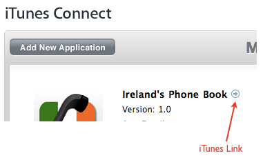
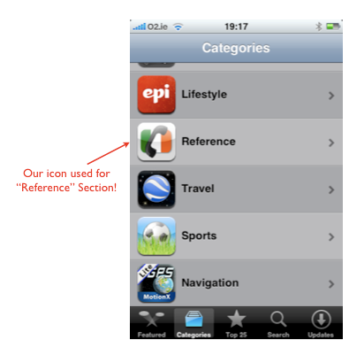

OK. So you've made it through the ADC signup process. You've managed to get an itunesconnect account. You've even managed to get some contracts into place, submitted and had your app approved, and now it is on sale!

Well done. This post is to give you some ideas about things to expect from release onwards. I went through all of these questions, and either helpful xcakers, or patience got me the answers. Hopefully, you'll read this, and be able to relax.

**Question 1: Where is my app ? I can't see it.** When you app goes on sale, it will be available on itunes via the direct link. So firstly, lets see if it is available on its own link. You can find this in itunesconnect. When your app is ready for sale, itunes connect has a little arrow link next to the icon.  This is the direct itunes link. Click on this, and itunes should open up on your apps page. Phew!

**Question 2 - But are some of my users complaining that they can't follow the link?** The itunesconnect link you copied for your landing page may have begun itms:// If you installed itunes after your browser, it will have installed a protocol handler such that the browser knows to launch itunes. If however the browser was installed after itunes, it is not going to know how to open itunes links. Actually, the fix is simple: Change the url scheme from itms:// to http:// - the link should work everywhere now.

**Question 3: Great - But how are people going to find it?** Relax. You app will be indexed and searchable soon. It takes a few hours after going on sale, but it will be searchable based on the description you have given it. This means you may need to think about the words you use in your description. For example; my app "Ireland's Phone Book" did not show up in searches for "Ireland" but it did for "Irelands". This was fed back to me, so I updated the description to ensure that the word "Ireland" was in the description. Now it is found for this search term. Of course, your application will also be available in the "recent releases" section, provided you followed my advice on [this post](https://tapadoo.wpengine.com/2009/if-theres-one-tip-id-give-you-when-submitting-your-app-this-is-it/). Thirdly, your app will be searchable within the category in which you've submitted it. If you can't find your app after a few hours, relax. Have a cup of tea. Come back a few hours later, check again. Incidentally, searches take into account popularity, so the more popular your app is, the higher it will appear in search results.

**Question 4: When will my downloads/sales info be available ?** Download and sales figures will show up on itunes connect typically by mid morning of each day. So, check around 11am the day after you go live and see if there's some data in there. There's a nugget of information on sales figures at the end of this post, stay tuned. Sometimes, this is later, so again...relax if its not there...give it a couple of hours.

**Question 5: When can I read my reviews? It says there's some present, but I don't see them.** Don't get me started on the reviews. Ok. Here's the deal as far as I can see.

1. They appear to be somewhat moderated, so may take some time to get through. Don't expect to read reviews for a few days (my first ones showed though after about 5 days I think).
2. The number of review seems to be incorrect most of the time. Perhaps the number of reviews is in fact the number of ratings + the number of reviews. Example: It says today the iePhoneBook has 128 reviews. If I drill in, there are 57 reviews that I can read. You'll learn to ignore the figures, and just read the reviews.

**Question 6: What can I do about unfair reviews?** Not a lot I'm afraid. You can report a concern about a review, but I don't know how much this helps. For example, 1 review of my apps was more like a personal ad in "In Dublin". Its actually inappropriate, so I won't reproduce it here. I have reported a concern about this by marking it as "not a review" and it went away after about 10 days.

**Question 7. How can I promote my app?** Well there's lots of things you can do. You've just released a piece of software like any other. If you've budget, hire the mansion house, buy a load of champagne, and get someone famous to talk about it. I'm guessing you don't, so here's what I did:

1. I ensured I had a [dedicated landing page](https://tapadoo.wpengine.com/iephonebook) for details about my app. This page includes an itunes store link, an iPhone graphic with my screen shots, and the "Available on the App Store" badge. As previously mentioned, you need to sign a license agreement to use these graphics.
2. I twittered about my release, including my landing page. Some xcakers where kind enough to Retweet, which meant that there was a couple of thousand people made aware of its existence on day 1. This definitely helped.
3. I sent a note to friends who have iPhones. I asked them for reviews. What I basically asked was: If you like this, please give it a 4 or 5 star review. If you don't think its worth of this, please don't review, but get in touch to tell me why it doesn't deserve the rating. I think this is fair - You're not asking people to lie on your behalf, and you are asking them for feedback if they think it is rubbish.

I've got to say however, that the best form of marketing for your app is getting a prominent place in the various itunes charts:

1. If you get to number 1 free app in any category, your icon gets used as the icon for the category when browsing the app store in the phone. Very nice. This gives you prominent positioning on the store. I would suspect that this could potentially be another reason why free apps are good publicity for pro editions.
2. If you get to number 1 overall in any country, your app will be on the front page of itunes. Exposure like this is very hard to get, and worth its weight in gold.

 I know this is a chicken-and-egg scenario, but basically, doing well will bring more sales/downloads.

**Question 8. How can I get feedback and engage my users** That's the holy grail for iPhone developers. Im still learning that one. I hope to blog on this in the future.

**Other Good Stuff** You'd be surprised to see who uses your app and feedback that you may get. These two took me pleasantly by surprise. I got the following review a couple of days after launch:

> **5 Star** **PaoloTullio** If you're fed up paying 11811 every time you need a number, here's the answer. A really well designed app that does exactly what it says on the tin. Only one question arises - why is it free? I would happily have paid for this.

Who? _Paolo Tullio_? The well-known restaurant critic? Dagnammit, I shoudda opened a restaurant. Getting 5 Stars from Paolo Tullio would do my restaurant no end of good. (I got in touch with Paolo's website, and got a very nice mail explaining that it was him who left the review).

Then, a couple of nights later, whilst on twitter, I got a [tweet from "TheBlizzards"](http://twitter.com/theblizzards/statuses/1839897258)

> Wicked PhoneApp man !

Oh. How cool is that.

I didn't expect feedback from people in the public eye, but it was nice.

OK. I promised a nugget. Fellow Xcaker,Padraig pointed me at [The App Sales application](http://code.google.com/p/appsales-mobile/). Download it, install it on your phone. You might also want to get [Review Scraper application](http://code.google.com/p/reviewscraper/) Both of these do the grunt work of getting information out of itunes. Run the app sales one once a day - remember after 11 am or so!

Hope you find this useful. If you're an iphone dev and you've other useful pointers, feel free to add them to the comments section.
