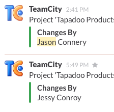
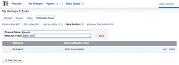

We love [TeamCity](http://www.jetbrains.com/teamcity/ "TeamCity") here at Tapadoo. We use it to automatically build and deploy new iOS & Android app betas both internally for testing and to externally to clients. We've been using [Slack](https://slack.com/ "Slack") lately as a replacement for Jabber and Mail for internal comms which don’t scale well, and its been awesome.

Slack has many cool integrations with other tools like bug trackers, Github, bitbucket and even some for CI servers like Travis, but none (yet) for our favourite, TeamCity. I liked the idea of automated posts arriving in the general channel as new betas went live. It could be a fun way to let everyone know progress was being made as the day went on. It's easy to forget the little Mac Mini is playing an important role. Sure, developers would get their own personal success and fail messages via email if they wished, but unless you told someone, know one else had a sense of activity unless they loved checking out the TeamCity dashboard.

TeamCity has a plugin API apparently - Java based, and slack supports incoming webhooks allowing to to post anything you'd like, so with a little bit of free time between tasks, I decided to give it a go. I read some examples, hacked up a custom notifier class, zipped it up with some meta data, and a plugin was born:

\[caption id="attachment\_1015" align="aligncenter" width="224"\] Builds arriving in slack\[/caption\]

 

Success! The messages started to trickle in. successes only, by design. Let the rest of the team feel happy some bugs where fixed. Just the name of the build, and who did it. I spared people the public humiliation of a failure (for now).

Sure, a few shortcuts were taken. I probably hard coded a few more strings and URLs than I should have. I may have used string concatenation instead of proper JSON classes to construct a payload, but it didn't matter. Our little build server found its voice and started contributing to the teams banter.

It's not without it's flaws, please forgive the occasional naughty shortcut, but if you want to get in on the action we've stuck it up on Github : [TCSlackNotifierPlugin](https://github.com/Tapadoo/TCSlackNotifierPlugin) , and of course, pull requests are welcome.

In the mean time, check out [Slack](https://slack.com). They even have a free plan with limited storage and integrations to get you properly hooked. I'm already scheming to see what other tools I can integrate.

 

\[caption id="attachment\_1016" align="aligncenter" width="300"\] current notification setup\[/caption\]
