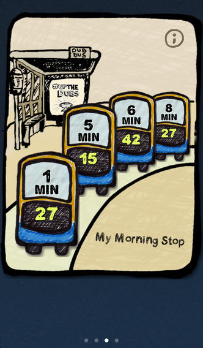
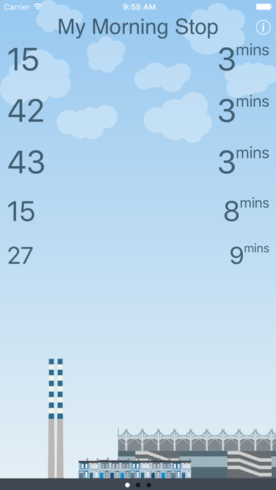

TL;DR: My Dublin Bus 2 is now compatible with iOS 11 and is also made free.

A long time ago, we tasked ourselves to do an app to make it easy to get real time information for busses in Dublin. Essentially, though there was an official app, we always felt it tried to satisfy the needs of many different types of users; everything from occasional users, tourists and regular users.

And we wanted an app for the everyday commuter. The argument was that it should be as simple as the weather app on the phone.

So we released, "My Dublin Bus"

People seemed to like it. It still has many, many loyal users. (We love our loyal users!)

Then iOS 7 came along, and Jony Ive said "There's a new look to Apps. Content is King". And we thought, hey, what would a new look My Dublin Bus look like?

So we did that too. We gave it a different name, because we knew not everyone wanted the new, plainer look app.

And while we were at it, we did an experiment.  We charged for it to see if people would put a value on this. (Some did, but for some reason, the free one was way more popular). We even [gave a talk about it](https://www.youtube.com/watch?v=RLY_dqOZnVg).

And we left it at that. Frankly, it can be difficult to spend time on internal projects, when you're busy on client projects.

But now iOS 11 is coming soon, and none of these apps work on iOS 11. They are old enough that they had some out of date calls in there, that would be deprecated by iOS 11. And they were 32 bit projects.

So, this week, we rolled up our sleeves and gave the newer app some love. We've released "My Dublin Bus 2" back into the store, fully updated, but with no new features. It works well on iOS 10, and so far on the iOS 11 betas too.

And we've removed the price tag. It's now free. Zero. Zilch. If you wanna know more, head to [its microsite](http://mydublinbus.com)
