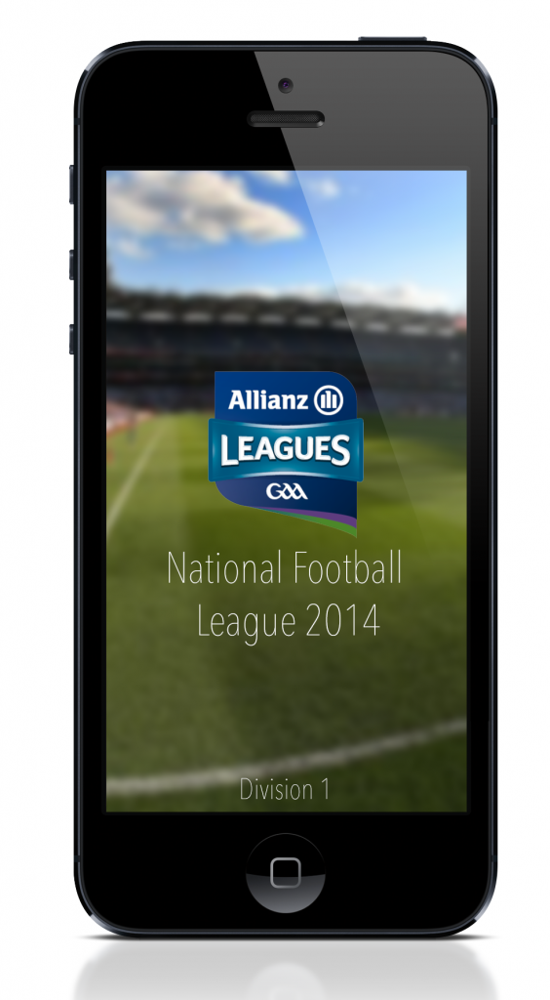
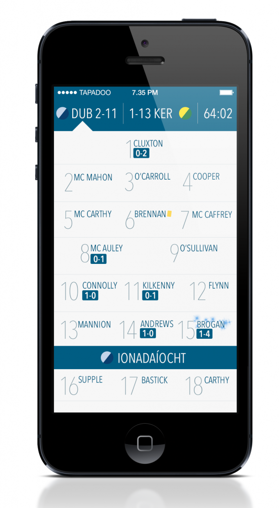
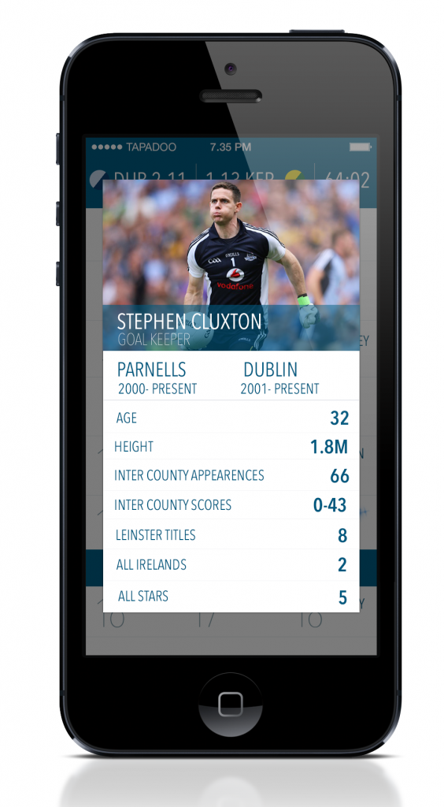
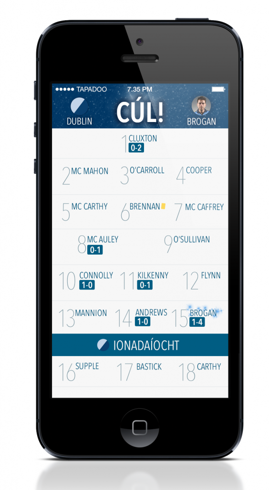
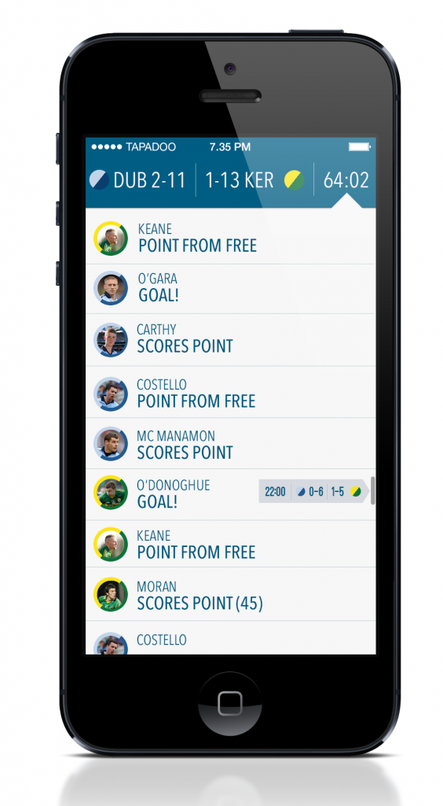
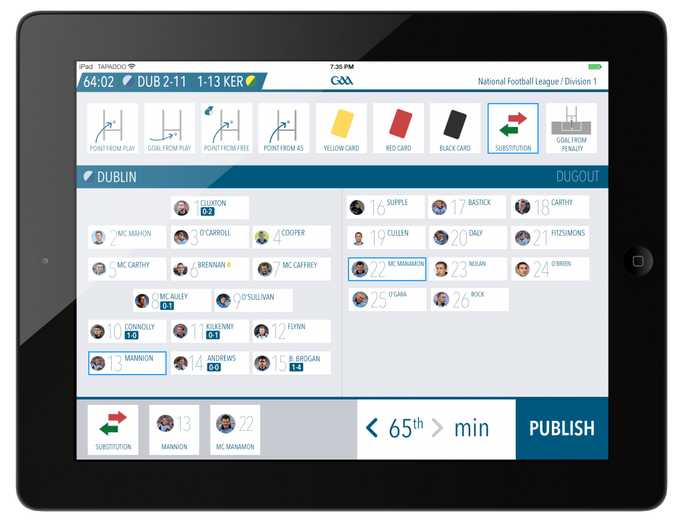

The GAA Season is upon us. We're fans of the GAA at Tapadoo. We go to the early season games, and suffer through the cold conditions all for the love of the game.

There's a common sight you see at every game: The diehard fan. Studying the match programme, ear piece in ear and pencil in hand. Ready to mark down every free, score and substitution.

When a point occurs at the other end of the field we hear "who scored that?", "was it Brogan?", "I think it was Mannion". The diehard knows. He heard on AM radio, but the rest of us will have to make do with watching it on Sky+ when we get home.

As mobile app developers we got to thinking:

**Surely there must be a better way.**

There's been some attempts at digitising the programme into mobile apps. They tend to be little more than PDF readers where the thinking centred around the existing product: The paper programme. The static, can't change, went to print 2 days ago paper programme.

**Surely we can do better.**

How would we approach it? Well, we've put together some concepts.

Our vision is for the "Live match programme". A match programme in your pocket, that lives with the game. It updates along with the game, giving you what happened, when it happened and by whom. A place where at a glance you can see who scored that last point, and what their tally is.

\[caption id="attachment\_985" align="aligncenter" width="406"\] The GAA app of our dreams\[/caption\]

The main screen of the app shows the teams, score and current time. When you tap on a team name we see the team as currently lined out (kept up to date of course). Beside each player we see their score tally, and any cards they've received. In the example below, we're also highlighting who scored last (in this case, Brogan)

\[caption id="attachment\_986" align="aligncenter" width="451"\] A view of the team as it is playing right now.\[/caption\]

Tapping on a player, gives us the statistics about that player

\[caption id="attachment\_987" align="aligncenter" width="451"\] The player profile screen\[/caption\]

When a major event occurs, a top banner will show not just happened, but who was responsible

Tapping on the clock allows you to see the "as it happened timeline"

\[caption id="attachment\_989" align="aligncenter" width="451"\] The timeline, as it happened.\[/caption\]

So how would this information get into the app? We've thought of that too. We call this "The commentators companion". This allows a sideline staff member to report on the game as it happens, feeding the data to the Live Programme app.

With just 2 or three taps, sideline staff member can report on every event as it happens. Here we show how to report a substitution he taps "substitution", the player being substituted, and the player coming on, and hits "Publish".

\[caption id="attachment\_990" align="aligncenter" width="640"\] A couple of taps, and you're done\[/caption\]

This is all conceptual. We'd love to hear what think. Feel free to leave a comment, or get [in touch with us.](https://tapadoo.wpengine.com/#contact "Contact us")
