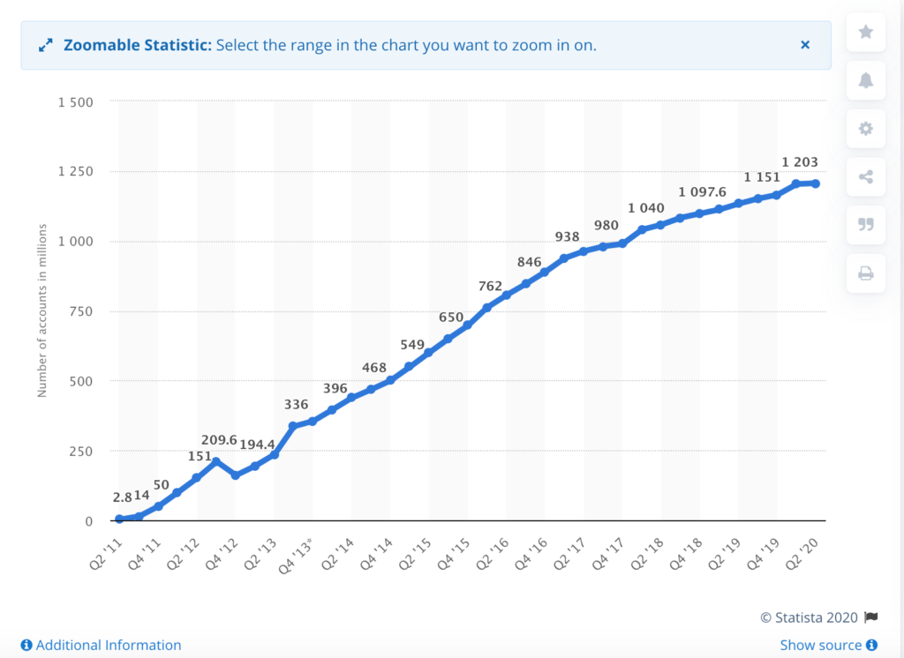
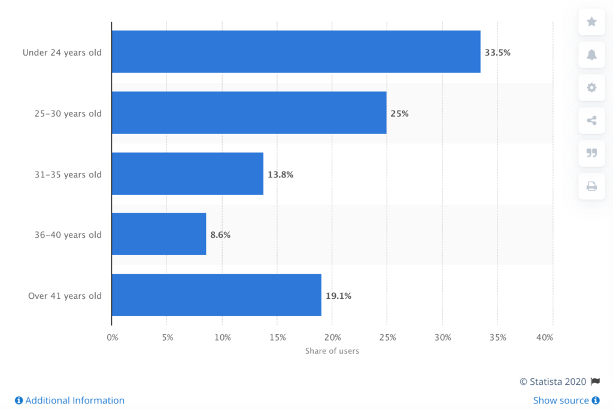
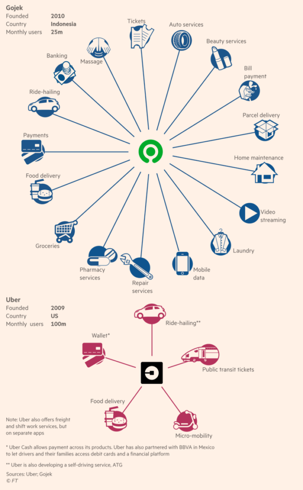

Imagine being able to chat with your friend through instant messaging, then book dinner, a movie or a gig and pay for everything all from one single app.

That’s the power of a super app. 

Mobile users worldwide have dedicated apps for specific tasks. This is not the case in the Asia-Pacific region where mobile users have grown accustomed to doing multiple unrelated functions in a single super app.

Super apps act as a single portal to a range of products and services such a messaging, social media, marketplaces and services. Think WhatsApp meets Facebook, meets eBay and Uber. Their rise in popularity is due to it being one app with one sign-in and one user experience, yet you have access to many products or services. 

Super apps start out as a single purpose app to encourage uptake, but then branch out to cover a number of verticals within this single super app. The most popular super app is China’s WeChat. It started out as a messaging app, then expanded into payments, food ordering, shopping, gaming, social networking, cab services and many more offerings.

In the second quarter of 2020 WeChat had over 1.2 billion monthly active users from a wide range of age groups.  The graph below shows WeChats growth from launch in the second quarter of 2011. 

[Source](https://www.statista.com/statistics/255778/number-of-active-wechat-messenger-accounts/)

WeChat has a diverse user base. The age profile of WeChat users is spread across all age categories. More than 26% of its mobile users in China spend over 30 minutes per day on the app. Its user profile is made up of businesspeople looking to generate leads, to teenagers interacting with their friends and restaurant owners processing digital payments and gathering reviews. 

[Source](https://www.statista.com/statistics/387658/wechat-china-user-age/)

#### **Mini Program Model within Super Apps**

WeChat started out as a messaging app but branched into a number of different and diverse services, not because founding company Tencent offered these services, but because it allows third-party service providers to create apps within WeChat. These apps within a single-use app are called mini-programs in China. They provide users with the opportunity to access these services without having to download a separate app.

The mini apps are a paired down version of an app being offered within a super app. They don’t have the same functionality as their iOS and Android counterparts, but they offer the features that users need to operate successfully within the super app. The benefit of offering them through the super app is that they can be used instantly without the need for downloading a separate app. 

As of 2020, there are more than [one million mini-programs](https://chozan.co/all-you-need-know-wechat-mini-programs/#:~:text=After%20three%20years%20of%20WeChat,media,%20and%20travel%20&%20recreation.) in WeChat covering over 200 different verticals from e-commerce, food & lifestyle, gaming, entertainment & media, travel, recreation and many more. Considering there are [2.2 million](https://buildfire.com/app-statistics/#:~:text=The%20Apple%20App%20Store%20has,on%20the%20Google%20Play%20Store.) apps on the App Store and [2.8 million](https://buildfire.com/app-statistics/#:~:text=The%20Apple%20App%20Store%20has,on%20the%20Google%20Play%20Store.) on the Play Store, WeChat is definitely a powerhouse within the app market. WeChat’s closest competitor, Alipay, currently has [160,000](https://kr-asia.com/alipay-now-counts-more-than-160000-mini-apps-as-the-race-between-platforms-intensifies) mini-programs.

#### **A Key Ingredient for Super Apps**

The success of super apps is their native mobile payments system. It was the introduction of the payments system that allowed these once single-purpose apps to partner with various businesses to offer a number of products and services within the app.

WeChat started off as a messaging service in 2011 before adding a payment system in 2013. Line and KakaoTalk both started out as messaging apps before adding their payment service in 2014. Indonesia’s GO-JEK and Singapore’s Grab both started out as ride-hailing apps before adding their payment systems Go-Pay and GrabPay, thus allowing them to branch out to a number of branded services; Go-Send, Go-Massage, Grab Food and Grab Pet.

The African focused payments services firm Cellulant announced its plan for a super app for Africa called Tingg. Tingg will be the new hub for the digital financial services it offers its customers, including bill payments, remittances, lending, group investments, food and gas orders.  The goal with Tingg is to create Africa’s first super app that will go live across eight African markets. 

#### How likely is a Super App for the West?

Will [Uber](https://www.uber.com/ie/en/) be the next super app of the West? 

The company’s chief product officer, Manik Gupta, said at the Web Summit in 2018, “We really want to be the operating system for everyday life. What that really means is being the one-stop-shop for transportation and daily commerce needs.”

This certainly seems to be the direction Uber is moving in. They have extended beyond their black-car service into Uber Eats, Freight, Bike & Scoot, Business, Transit, and Elevate. In October of last year, Uber introduced a boat service in Lagos and acquired grocery delivery service Cornershop. Cornershop currently operates in Latin America but Uber say they intend to expand this service beyond this region.

If Uber is looking to become the next super app it has some way to go, but the image below may act as a roadmap for what Uber needs to do to become a super app and compete with the likes of [Gojek](https://www.gojek.com). Gojek offers 20 services to 25 million users.

With it's 100 million strong user base across 60 countries, Uber is in a good position to become the West's first super app.

[Source](https://www.ft.com/content/c5241924-f421-11e9-b018-3ef8794b17c6)

Maria Colgan

Digital Marketing Manager
