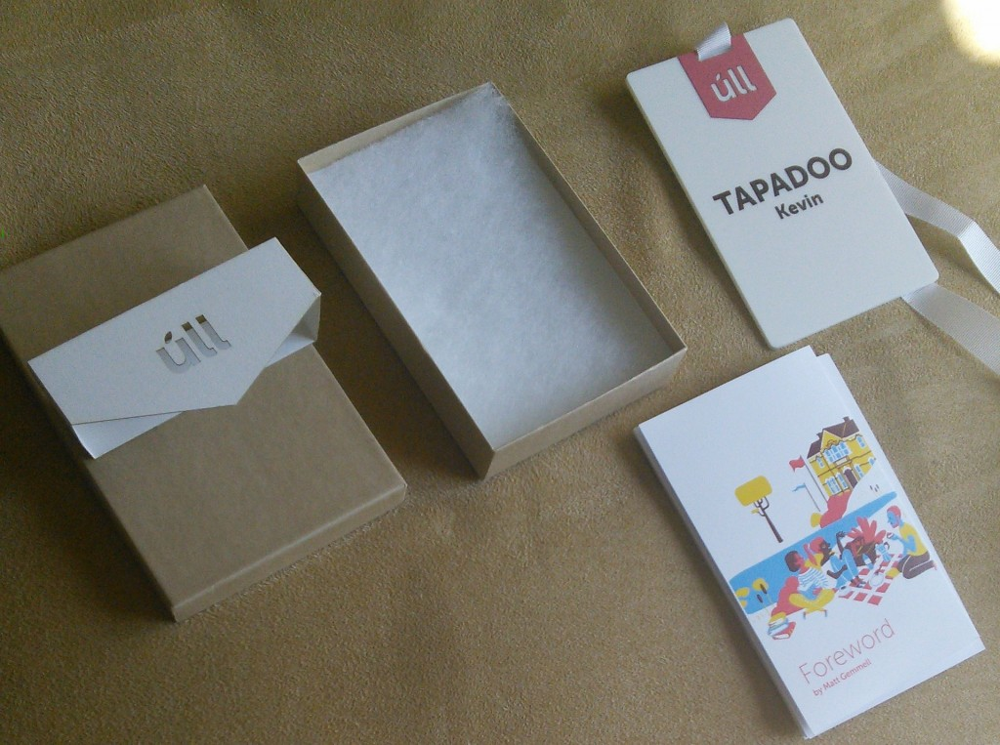
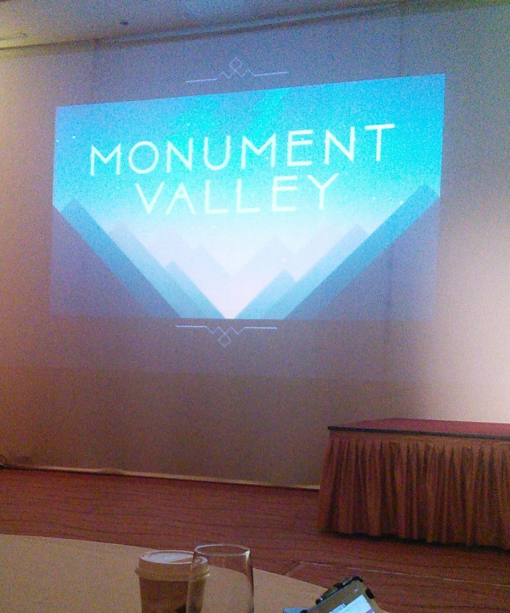

Work has grown ever more challenging over the past few weeks, and equally as enjoyable. Heading to [Úll](http://2014.ull.ie/) this past week, a conference for developers and designers held in Kilkenny's Lyrath Estate Hotel, was a great way to take a step back from work, and experience the broader spectrum that is the world of development and design.

Ironically, only a month ago myself and Aidan were staying in a hostel, in a room with 10 other people, and one toilet. So in contrast, Lyrath was a palace.

Úll Welcome Box

 

The format of the conference was very open. Talks on the Tuesday afternoon took the form of short presentations, running continuously until early evening, in set rooms all throughout the hotel. This gave everyone the freedom to move at their own pace.

The Contents of the Úll Welcome Box

 

I got the chance to meet some really incredible people. I enjoyed a game of pool with [Andy O'Donoghue](https://twitter.com/RedCert) and [Anluan](https://twitter.com/auibrian), two very charismatic characters. The game went on for an absurd amount of time, and ended up being abandoned after only a small number of balls were potted (I will not divulge how few). Great fun all the same!

I got to see some really cutting edge technology first hand from [Machina](http://www.machina.cc/)'s [Linda Franco](https://twitter.com/LindaLFranco), a company specialising in wearables, who demoed a jacket which had inbuilt sensors allowing it to function as a midi controller for making digital music.

Monument Valley!

 

Dan Gray from the Monument Valley Team

 

A talk I really enjoyed came from [Dan Gray](https://twitter.com/Dan_Gray), Executive Producer for Monument Valley, pictured above. Hearing about his process of producing and management was very interesting, and I can't wait for it to be released on Android in the coming weeks!

Thai Buffet

 As you can see from above, the food was glorious , and everyone was well catered for.

A talk given by [John Gruber](https://twitter.com/gruber) of [Vesper](http://vesperapp.co/) and [Daring Fireball](http://daringfireball.net/), entitled "Your Ideas are Worthless" finished off the event. It detailed how ideas are nothing without implementation, and much of what John mentioned really stuck in my mind. His talk really wrapped up the conference as a whole in my opinion, and was a fitting conclusion to what had previously been presented.

On the final night, everyone relaxed and socialised. I had the pleasure of hearing [Liam Dunne](https://twitter.com/liamdunne) play a couple of songs to a select few, in the early hours of Wednesday morning. He finished up on Hey Joe by Jimi Hendrix, to much applause!

I left the conference with a renewed sense of openness to ideas and the creative process. Hopefully I'll get to go back some year soon, and catch up with all the great people I had the opportunity of speaking with.

I'm sure there's a lot I neglected to mention, so watch out for Aidan's account next week!

Until next time.

[Kevin.](https://twitter.com/kpmmmurphy)
