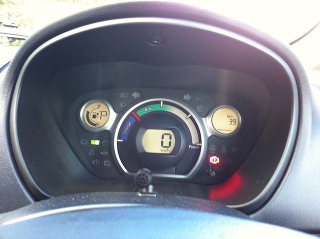
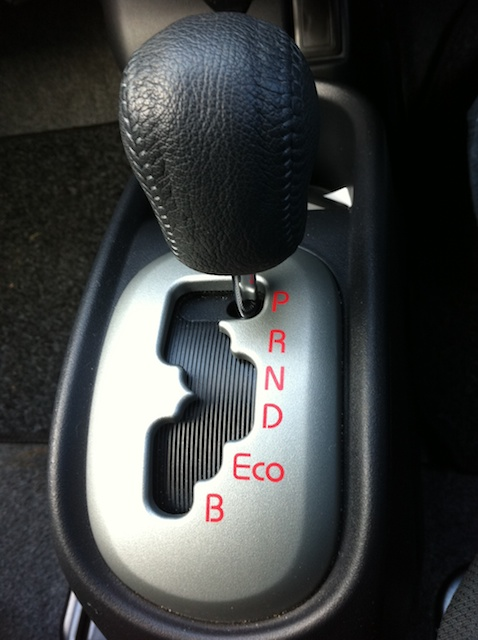

This is another blog post about the electric car I'm currently trying out. Today, I'm going to talk about the various driving modes. To start, lets take a look at the dashboard: 

The important dials are

1. The round one on the left, which shows the charge gauge, and what gear the car is currently in ('P' is for Park)
2. The round one on the right, which gives an indication of the range left at current power usage (here, its showing 39km)
3. The central dial consisting of a digital speedometer, and a power usage guage (that's the red needle)

As you accelerate in the car, the needle will travel from the position shown in the picture through the green and white areas, depending on how much you depress the accelerator. In that sense, it acts a lot like a rev counter in a conventional car. As you apply the brakes, the needle drops into the blue zone, indicating that the braking action is actually charging the batteries (think of it like a dynamo being applied to the wheels. Obviously, the more you can drive in the green zone, and the more time spent in the blue zone means the care will go further on its current charge. No you know the basics, I can explain the 3 modes the car can be driven in. 

The car is like an automatic, but it has 3 driving modes. **Drive (D).** In drive mode, it acts like any other car in drive mode. If you put your foot to the floor, the car accelerates quickly. As you let off the accelerator, the cars slows slowly, as it isn't trying to pull a large engine along with it. Typically, as you ease off, the needle drops to the zero position, and when you brake, the needle drops to the charge zone. **Eco (E).** In Eco mode, the car is configured to maximise range. The car limits acceleration, so even when you floor the accelerator, it feels somewhat sluggish, and the car will also limit the maximum speed. As soon as you let off the accelerator, the needle drops to the charge zone, and the car will slow quicker. The feeling is like being in third gear in a car, and easing off the accelerator. Of course the upside is being able to travel further. **Brake (B).** In Brake mode, the car gives a good balance between Drive and Eco modes. It accelerates quickly, using a lot of power, but as soon as you ease off, the generators get applied, the needle drops to the charge zone.

What mode have I been using? By and large I've been using 'B'. It means the car is nippy, but theres little compromise on range. As I see it, as you ease of the accelerator, you are typically stopping, so you may as well harness the momentum of the car to charge the batteries.

A lot of people have been asking me what the car is like to drive. The assumption is that it will be sluggish, or slow. Neither is the case. Acceleration is surprisingly quick; I'd wager it accelerates quicker than cars of a similar size (i.e 1.0 litre petrol cars). I can also confirm that the car has a reasonable top speed. I was able to comfortably travel at the speed limit of 110km/h on the motorway. The pedal was not maxed, so I can only assume it can go beyond the speed limit allowed in Ireland.
