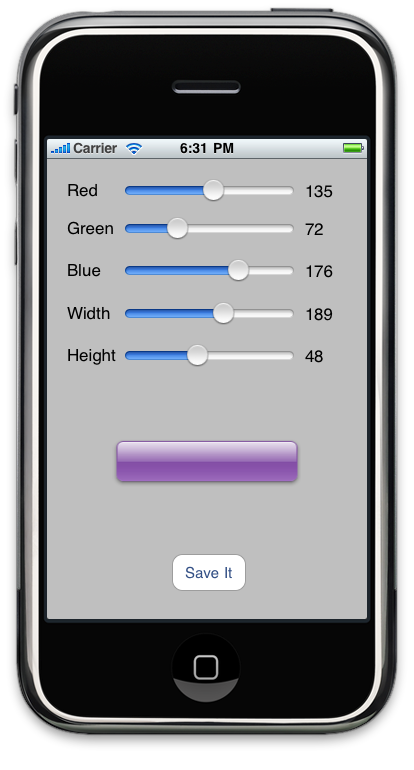

**Flat iPhone buttons as offered in Interface builder suck**. They don't look nice.

There's the option of using Three20 to get good looking buttons. Its an option, but frankly, it feels a bit like using a sledgehammer to crack a nut. You end up with a large addition to your code, just for nice buttons. OK, you could go to the trouble of stripping out what you don't need, but that again is more work.

All iPhone developers know about UIGlassButton - Its an undocumented API for making nice looking buttons, that exists only on the simulator and not on the iPhone itself. Why couldn't we just have that for iPhone OS? I dunno, but its not there.

At some point in the past, I came across a nice snippet of code that used undocumented techniques for creating a glass button, and then saving the image to disk. This could then be used as a background to a "custom button", producing the nice glass buttons I've been looking for. I think it was [schwa](http://twitter.com/schwa) on twitter; Nice. Full credit where it's due.

So, building upon this, I've thrown together a simple single-screen app for creating the images for glass buttons using that technique. Basically, it allows you set the RGB values, and the size. Hitting "Save" writes the pngs to the application's documents directory. Now, you'll have two png files, which you can use as images in custom buttons. Hey presto. Very simple UIGlassButtons. Here's a screen shot:

\[caption id="attachment\_422" align="aligncenter" width="414" caption="Our very simple button maker"\]\[/caption\]

Full source is [available on github](http://github.com/dermdaly/ButtonMaker). Comments welcome.

* * *

You're reading the tapadoo blog. Did you know that as well as publishing our own applications, we offer iPhone development services and consultancy? If you have an idea, project or something you think we can help you with, please get in touch through [our contact page](https://tapadoo.wpengine.com/contact/).
