At Tapadoo, we create beautiful mobile apps. For me, as a designer, the process begins quite fluid; sketches, drawings, conversations, and then leads on to pixel perfect mockups and guides. But the majority of the work, especially for our developers, is very detail-orientated. From guides, to constraints, from dynamic type, to requests, errors and APIs. Everything must be specified. There’s not a lot of room to be untidy. Actually there’s none.

However there is value in allowing yourself to break the rules. By challenging ourselves to see things differently promotes creative thinking and problem solving in other areas of our work. With this is in mind, I decided to give all our staff an hour to get messy and creative to kick start our brains, starting on a Monday morning.

Introducing “Type Faces”. The idea? Simple: make faces out of type. The letters, from a range of different typefaces, were cut out and mixed up, this was to encourage the participants to see past the letters and see shapes and angles instead. I encouraged people not to go for the safe "emoji" expressions that we're all used to, or not to use the letter "o" or number "0" for eyes all of the time.

[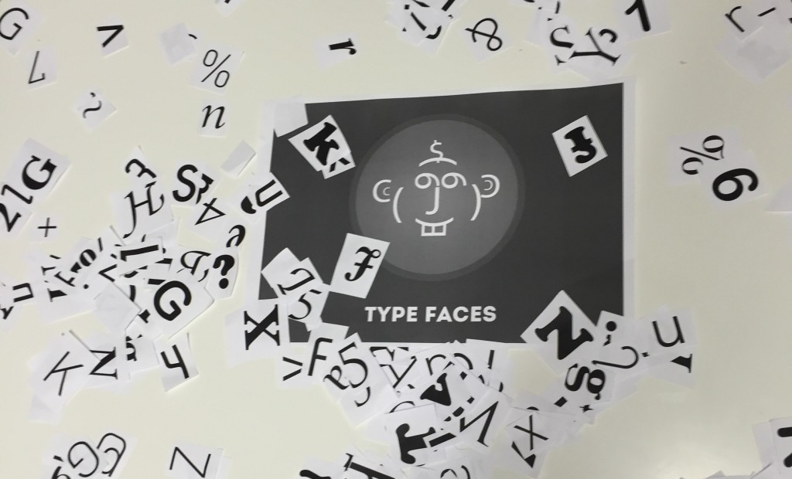](https://tapadoo.wpengine.com/wp-content/uploads/2015/05/2015-05-11-11.05.23-e1431358029869.jpg)

## Phase 1. Make any face.

This allowed the participants to make their first face without any pressure of being right or wrong.

[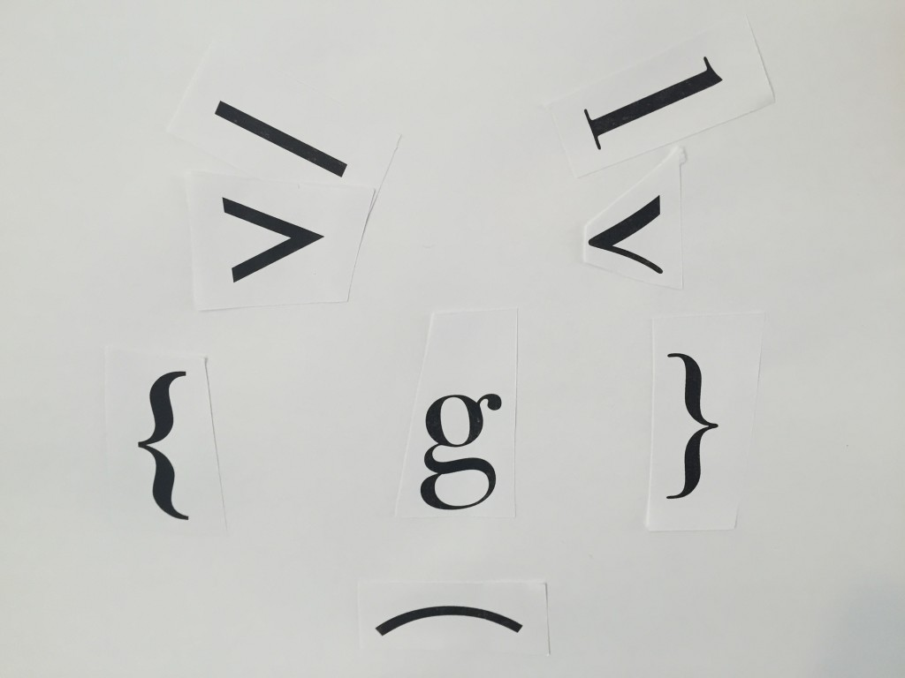](https://tapadoo.wpengine.com/wp-content/uploads/2015/05/2015-05-11-10.29.28.jpg)

[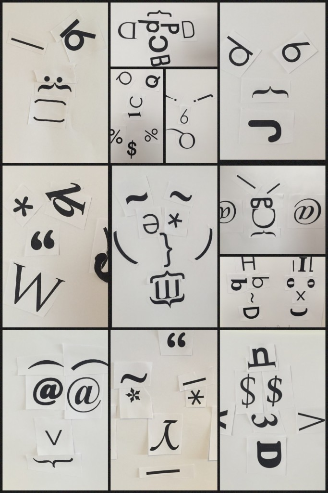](https://tapadoo.wpengine.com/wp-content/uploads/2015/05/2015-05-11-12.04.08.jpg)

We then went on to make a face with an emotion i.e happy, sad, angry, scared etc. This upped the thinking process ever so slightly. For example, somebody making their first face may have placed the eyebrows just above the eyes, but on their second face with emotion the eyebrows may have been slanted to create an “angry” look.

[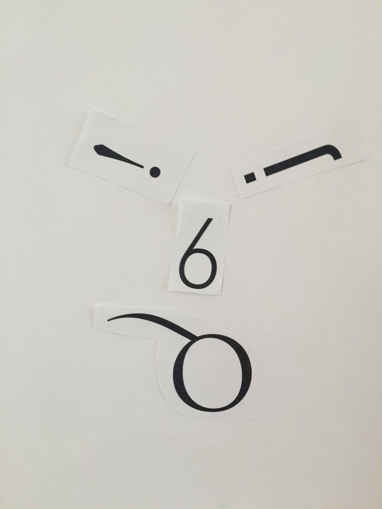](https://tapadoo.wpengine.com/wp-content/uploads/2015/05/2015-05-11-10.29.30.jpg)

## Phase 2. Make a well known face.

I chose some well known faces which people could choose from, or if someone wanted to make another they did that too.

\[caption id="attachment\_1450" align="aligncenter" width="681"\][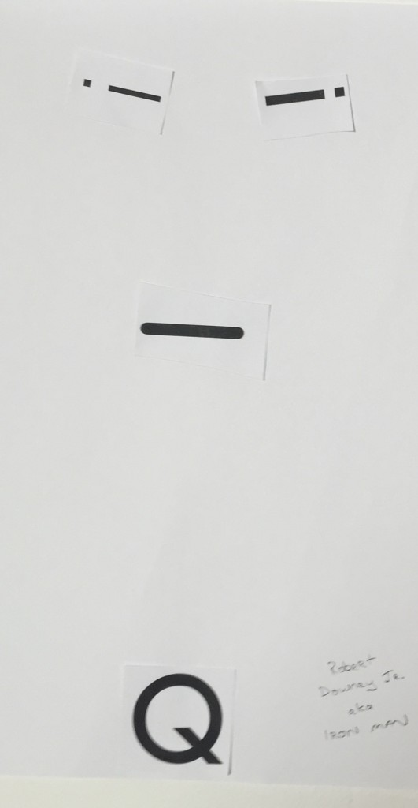](https://tapadoo.wpengine.com/wp-content/uploads/2015/05/2015-05-11-15.42.141-e1431357645281.jpg) Iron Man by Mike\[/caption\]

\[caption id="attachment\_1445" align="aligncenter" width="688"\][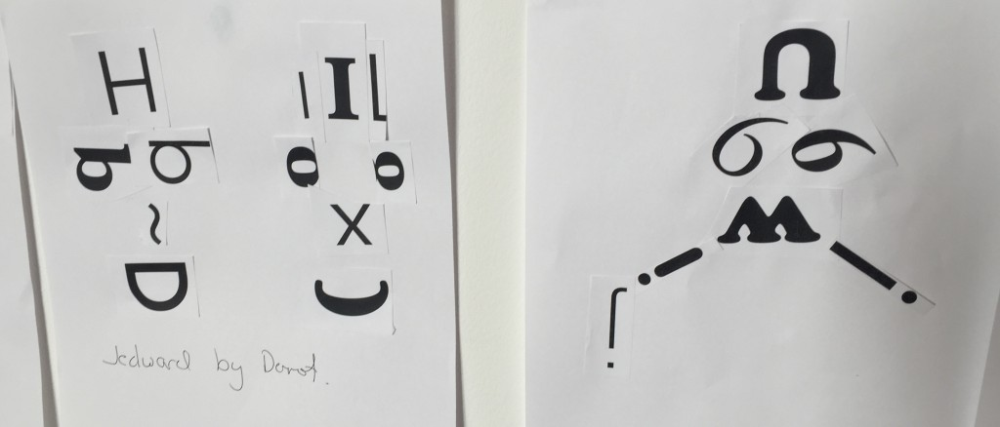](https://tapadoo.wpengine.com/wp-content/uploads/2015/05/2015-05-11-15.42.22-e1431357451995.jpg) Jedward by Dermot & Chaplin by Jessy\[/caption\]

\[caption id="attachment\_1443" align="aligncenter" width="698"\][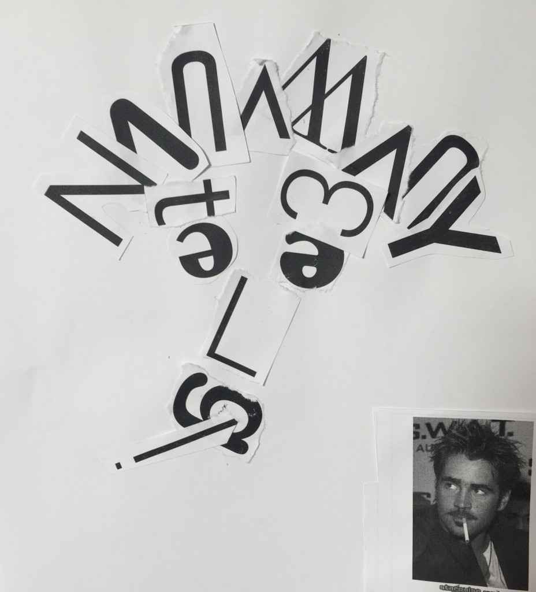](https://tapadoo.wpengine.com/wp-content/uploads/2015/05/2015-05-11-15.40.44-e1431357517436.jpg) Colin Farrell by Sona\[/caption\]

\[caption id="attachment\_1442" align="aligncenter" width="696"\][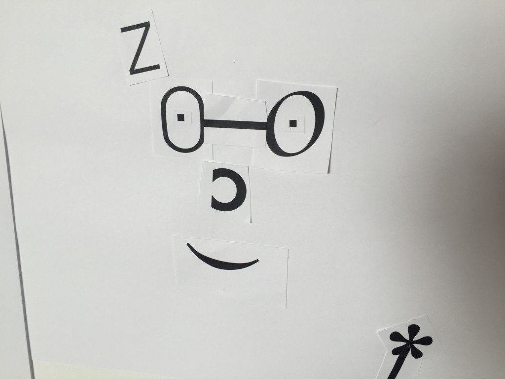](https://tapadoo.wpengine.com/wp-content/uploads/2015/05/2015-05-11-15.41.01.jpg) Harry Potter by Rafa\[/caption\]

\[caption id="attachment\_1439" align="aligncenter" width="697"\][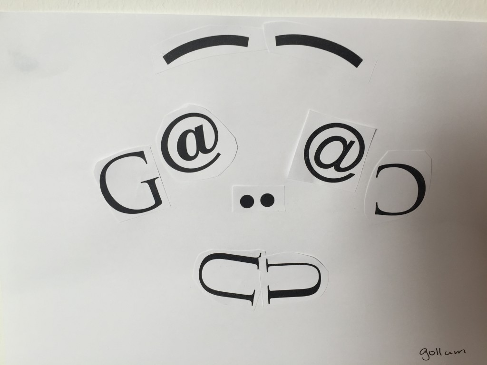](https://tapadoo.wpengine.com/wp-content/uploads/2015/05/2015-05-11-15.40.53.jpg) Gollum by Sasha\[/caption\]

## Phase 3. Make another staff member's face.

At this stage there were fewer letters left, which meant the participants had to think harder and be more creative. Still, some managed to capture their chosen colleague's personality down to a tee.

 [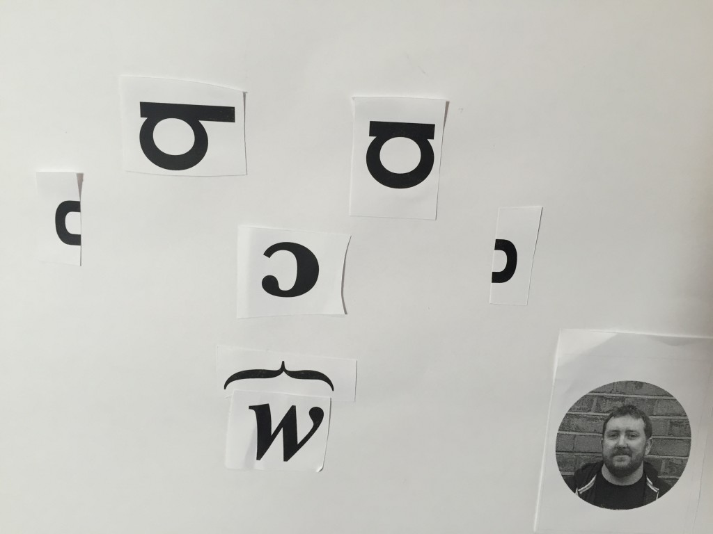](https://tapadoo.wpengine.com/wp-content/uploads/2015/05/2015-05-11-15.41.23.jpg)

## Phase 4. Enjoy with some cake.

Turns out Monday was also cake day. Lee made some delicious chocolate orange cheesecake, so we sat back and enjoyed our exhibition with some yummy treats.

[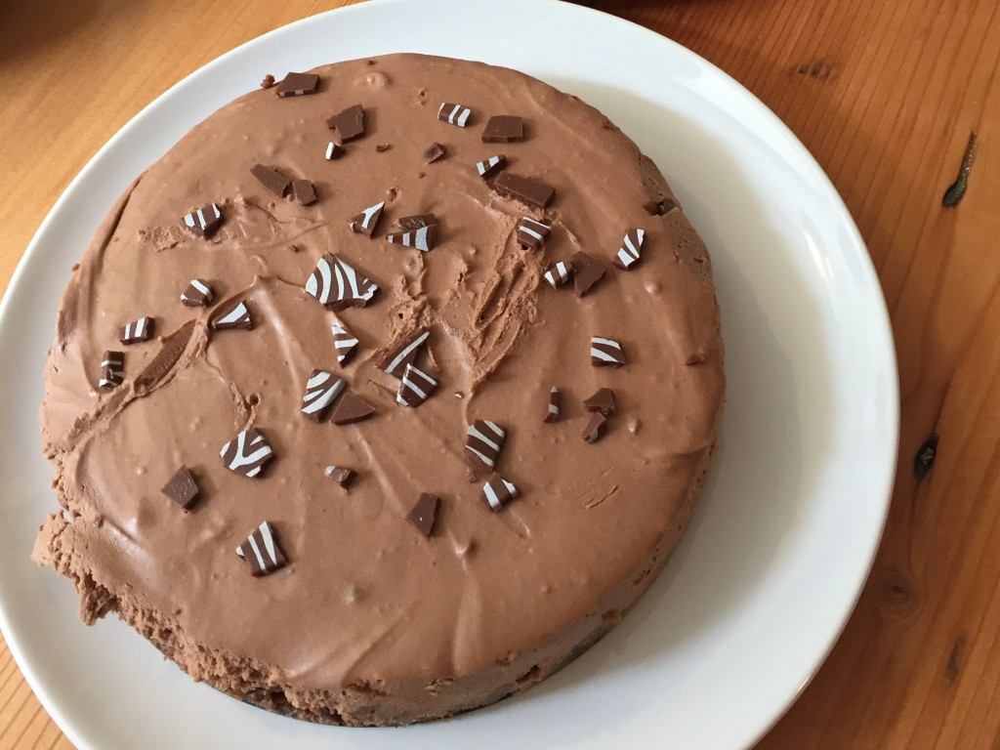](https://tapadoo.wpengine.com/wp-content/uploads/2015/05/2015-05-11-11.08.14.jpg)

[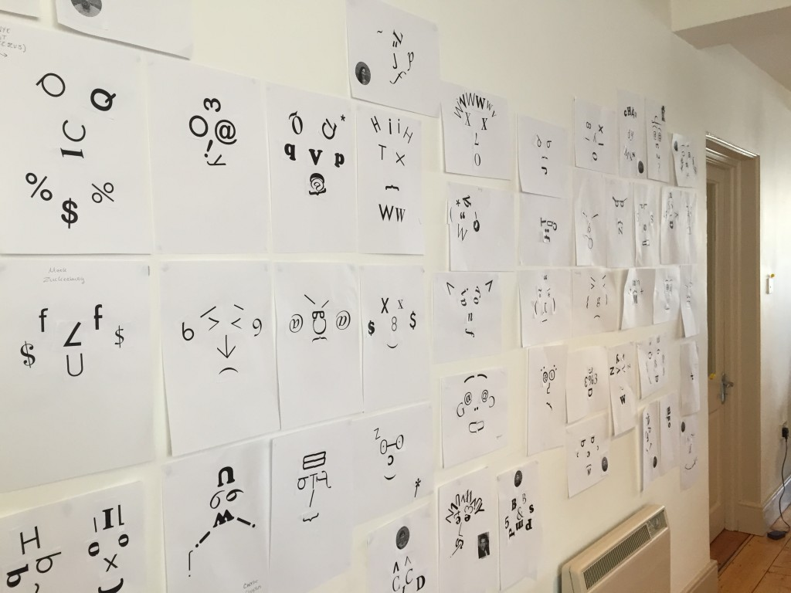](https://tapadoo.wpengine.com/wp-content/uploads/2015/05/2015-05-11-10.52.32.jpg)If you're in the area, pop by and see the entire collection.
