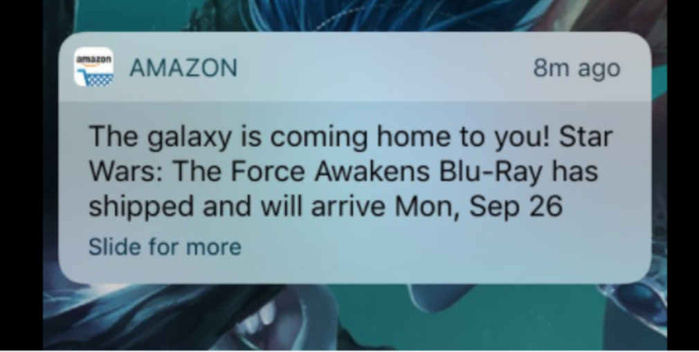
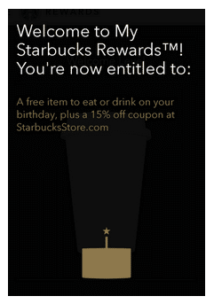
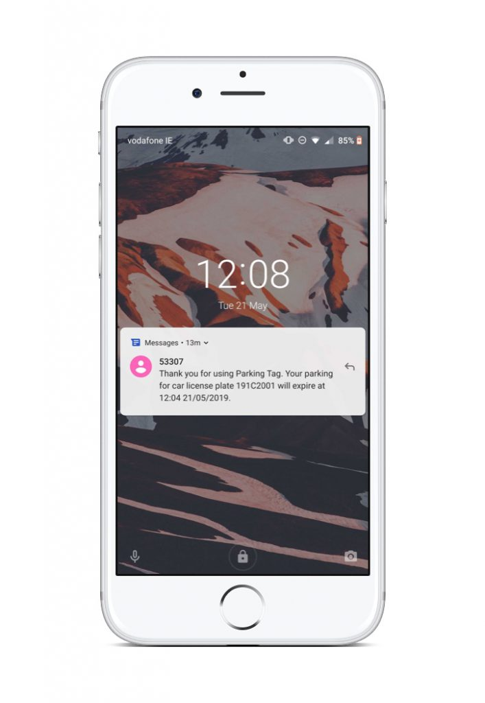
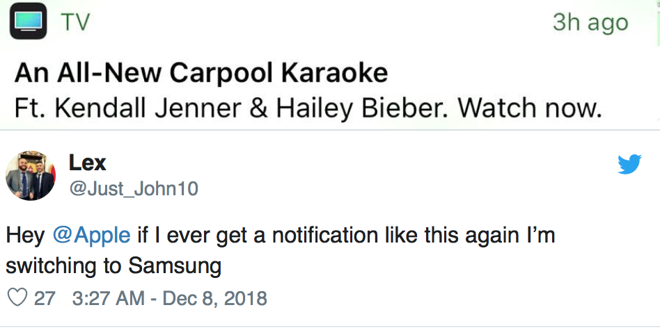

We got into a discussion in the office this morning about the use of push notifications, and in particular, how we advise clients on the best use of push.

You see, marketing people like the idea of push. They see it as a “channel” to get in touch with their users. But this is not what it is for.

Probably the most abused rule of the Apple App Store Guidelines is 4.5.4. It states:

> “4.5.4 Push Notifications must not be required for the app to function, and should not be used for **advertising, promotions, or direct marketing** purposes or to send sensitive personal or confidential information. Abuse of these services may result in revocation of your privileges.”

(emphasis: Mine)

Even though we all receive marketing push notifications regularly, I’ve yet to hear of a situation of an app being removed for mis-use of push. In saying that, push notifications shouldn’t be abused.

Here are some push notification guidelines that we tell customers when they are considering push.

#### **Push Notifications Guidelines**

#### **1\. Push was designed for timely "at some point in the future" communication.**

Push is designed to allow an app inform the user that there’s a change they may need to be aware of. They were originally designed when apps couldn’t work in the background, so instead the server issued a push notification. 

For example; imagine your app allowed users to place an order, which will subsequently be shipped. In the past when a user placed an order and quit the app, the app didn’t work in the background, so it was terminated.

Without push, the developer didn’t have a way of informing the user in a timely manner about the shipment. With Push, as soon as the shipment occurred, the server could issue a push notification, and the app could inform the user that their product had shipped. This is the kind of scenario that push was designed for.

[Source](https://www.leanplum.com/blog/7-most-creative-push-notifications/)

#### **2\. Push should deliver a reward**

If you’re sending a push, it should be in the user’s best interest. Knowing that a product I bought has now shipped, is a “reward”; it’s useful to me. Knowing that you have a sale starting next week, is less likely to be a reward.

So before you consider push as a channel, question why you are sending one. Is it because you want your user to know you have a 50% off sale, or is it because you believe your users would like to know about your 50% sale? This is subtle, but important.

[Source](https://www.evergage.com/blog/7-great-in-app-messaging-tactics-that-boost-user-engagement/)

#### **3\. Push is best when its personalised**

If you’re sending a bulk push, that’s often a clue that you are sending marketing communications, rather than something truly useful. Many push vendors will suggest audience segregation, but I think this still sounds like marketing comms to me. “Tell all users who have shopped with us 5 times that we have a sale next week” is only a slight jump from “Tell all users…”. 

Alternatively, if you are sending to a single device in response to a business event, that’s more likely to be something of benefit to that user. _**My**_ Product has shipped, _**I’ve**_ received a new message, _**My**_ Parking has expired; All of these are useful.

#### **4\. Push shouldn’t be abused**

Mis-use of a push notification can be disastrous. If you don’t respect your users and continue to send them marketing comms that they don’t find relevant, this will backfire. At a minimum, they’ll turn off push for your app, but we’ve often heard people say “Oh, that push notification reminded me of how little I use that app, so I deleted it.”

Even the rule makers get push wrong. Apple received a major backlash when they sent out this push notification.

[Source](https://www.theverge.com/2018/12/18/18145289/apple-iphone-ios-push-notifications-carpool-karaoke)

#### Conclusion

When you read a push notification, consider how it makes you feel. If it annoys you and makes you want to turn off notifications then think about how your end user would feel. They too will do the same if they receive such notifications.

Users will think more favourably on your brand if you are of service to them, rather than trying to get something from them.

Dermot Daly
