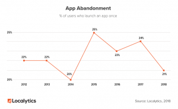
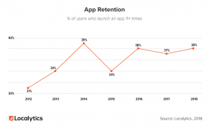

User retention is probably the most important part of your mobile app marketing strategy. However, most app owners focus the majority of their attention on [acquiring new users](https://tapadoo.wpengine.com/8-user-acquisition-tactics-app-marketing/).

While [user acquisition](https://tapadoo.wpengine.com/8-user-acquisition-tactics-app-marketing/) is important, it won’t account for anything if app abandonment is high and user retention is low. 

#### **So what is app abandonment and user retention?**

According to [Localytics](http://info.localytics.com/blog/21-percent-of-users-abandon-apps-after-one-use), app abandonment is the percentage of users who abandon an app after one session and user retention is the percentage of users who return to an app more than 10 times.

The graphs below show that 21% of users abandon an app after first use. While retention rates are currently at 38%.

 

[Source](http://info.localytics.com/blog/21-percent-of-users-abandon-apps-after-one-use)

Our focus with this blog is to look at ways to keep app abandonment low and user retention high. 

But before we do that, let’s take a look at the necessity and frequency of use of your app.

#### **App Necessity and Frequency**

It's fair to say that not all apps are created equally and a one size fits all marketing approach won’t work for user retention.

In considering your app retention strategy, you should look at the necessity and frequency of your app.

Is your app a must have or a nice to have app?

Is it a frequently used app or an occasionally used app?

There are no right or wrong answers here. But the answers will form a specific user retention marketing strategy.

So, let’s take a look at some tactics you can utilise to help with your user retention strategy.

#### **6 User Retention Tactics**

#### **1.** **3X3 Rule**

According to [Localytics](http://info.localytics.com/blog/how-to-keep-your-app-users-with-the-3x3-rule), 58% of apps will churn in the first 30 days. And then a whopping 75% after three months. To combat this, they have come up with a formula that has helped with app churn. It also takes into account the necessity and frequency of your app. They say that regardless of how often a user will use your app if you can get them to have three sessions within the first three days, you can see app churn drop to as low as 29%. Definitely worth considering with your user journey.

#### **2\. Create Habits**

The number one way to get users to use your app is to create a habit. If you can create a habit with your app, you can keep it in the mind of your users. This ensures they won’t forget about it, as they do many of the apps on their phone.

How can you create habits within your app based on the necessity and frequency of use of the app? 

#### **Frequently used apps**

If your app is a frequently used app you can come up with all sorts of motivations to get users to continuously use your app.

The Toyota [FaceItDownApp](https://tapadoo.wpengine.com/portfolio/toyota-app/) uses the incentive of a hot drink for drivers who drive with their mobile phone facing down for the entire journey. The tracking system within the phone knows that the user hasn’t touched their mobile for the journey and so rewards them at the end of it. The habit, in this case, has been reinforced by a reward.

The retention rate for this app is 30%. This is quite good considering the industry average is 38% and this app is confined to Ireland.

Creating habits for frequently used apps can be a bit easier than for occasional use apps. With frequently used apps you can send daily reminders as part of the user experience.

But what do you do about occasional use apps?

#### **Occasionally used apps**

Well, you can take the lead from Amazon or Google.

When ordering anything through Amazon on a mobile browser they prompt you to use the app.

I purchase a lot of books from Amazon however, I only do this occasionally. So it seems more hassle than it's worth to locate my username and password in order to switch over to the app.

However, if Amazon offered a reward for moving to the app, like

> ‘hey, why don’t you try out our app and get a 20% discount on your next order’.

Then I would be inclined to find these details and login to the app.

Google offers a similar prompt when using Google maps in a browser on your mobile phone. A message pops up which says,

> “You’re missing out. The Google Maps app isn’t on your phone”.

Then they highlight the button ‘Use the App’. This is an obvious prompt. You can either click on it or click on the unhighlighted button ‘no thanks’.

If they make it that easy, why wouldn’t a user click on ‘Use the App’ button and be brought to a much better user experience?

#### The power of incentives

In the examples above one offered an incentive, while the other didn’t. The incentive with Google Maps was subtle. It was suggested in the words, ‘you are missing out’. You’d naturally interpret this as a better user experience within the app. Then they make it easy for you to access the app with one click.

Amazon didn’t offer an incentive or reason for moving. In fact, their suggestion was met with a barrier,

> ‘I have to find my username and password to log into the app’.

If this is a possible barrier with your app, then offer a real-world incentive. This type of incentive can make the hassle of trying to find their login details worth it. 

#### **3\. Personalise Notifications** 

If users opt-in to receive push notifications during the activation stage, then you need to personalise these notifications. Personalised push notifications have a massive impact on user retention. They also make the entire user experience feel like an enhanced and satisfying one.

With personalisation you tailor content to the user experience. The content you send through notifications will be relevant to the user's journey within the app and displayed at a time that doesn’t interrupt the user experience. Otherwise, it is considered spam.

#### The importance of personalised push notifications

> Leanplum examined 1.57 billion push notifications sent to users around the world. They discovered that brands that personalised their push notifications can increase opens rates by 800%. [Source](https://www.leanplum.com/blog/personalize-or-bust/)
> 
> Apps that campaigns are broadcast see a 31% abandonment rate after first use. While apps that segment and personalise their campaigns have a much lower abandonment rate of 20%. [Source](http://info.localytics.com/blog/21-percent-of-users-abandon-apps-after-one-use)
> 
> Apps that send a personalised targeted campaign have a 39% retention rate. Apps that send broadcast messages see their retention rate drops to 21%. [Source](http://info.localytics.com/blog/21-percent-of-users-abandon-apps-after-one-use)
> 
> A survey by Epilson found that 80% of respondents indicated that they are more likely to do business with a company if it offers a personalised service and 90% indicated that personalisation is appealing. [Source](http://pressroom.epsilon.com/new-epsilon-research-indicates-80-of-consumers-are-more-likely-to-make-a-purchase-when-brands-offer-personalized-experiences/)

#### **4\. Research the User Experience**

One of the quickest ways to carry out user experience research is through in-app analytics. There are plenty of analytics tools to help monitor in-app behaviour. You can get free versions or paid subscriptions.

If you have an iOS app you can use Apple Analytics. This is a powerful tool to track in-app data. There’s also Google Analytics, which is free, Appsflyer and then Appsee provides visual data, so you can see an actual user experience within an app.

While the data may not give you the reason why people do what they do, you can always look to the ratings in the app stores. Users generally don’t hold back when completing reviews. 

If you implement the changes from the reviews, you should release a new version of your app to the app stores. Then give users an opportunity to review once more. Otherwise, you will be left with reviews from a previous version that doesn't reflect the new user experience.

You can also research the user experience through an online questionnaire and in direct conversation with your users through social media.

The point is to constantly research the user experience and find ways to improve it. By doing this, you will keep bringing users back for more, in the hope of creating a habit.

Also, users needs change over the life cycle of a product. If you keep in contact with your users you can discover new ways to improve the app, retain users and ensure the longevity of your app.

#### **5\. Regularly improve the app**

Researching the user experience on a regular basis can provide you with information to regularly improve your app.

Apps are an iterative process and need to be managed in this way. If you keep this in mind from the outset, then you will actively look for ways to improve the user experience.

You can regularly improve your app by managing the sign in process, fixing bugs, limiting crash times, explaining errors messages, adding new features and animation.

You can also find ways to improve your app by monitoring the data. But that doesn’t mean it’s only about finding fault. It’s about finding what you do well and reinforcing that message. Finding what you do well can help with targeted campaigns across social media.

#### **6\. Retarget users**

If creating habits is a great way for users to keep returning to your app, then you need to find ways to keep your app in the minds of users. You can do this through retargeting.

Take the Couch to 5k app. It’s a great app to get newbie runners from their couch to running 5k in a matter of weeks. It’s a great hook and seems like a no brainer. But if like me, and I suspect many people are, you have a high level of motivation at the beginning. You begin running a few times a week with the support of the app and you're happy with the experience. Then after so many weeks, things happen and you give up running and abandon the app.

But you haven’t given up completely. The thoughts of running are in the back of your mind. You are just waiting on the right time to start again.

The Couch to 5K app can do a retargeting campaign to reengage these types of users in the app. This effectively means that they can target people who have downloaded and used their app.

This targeted campaign can be done across social media channels, prompting users to use the app again or continue to use it.

It’s about reinforcing the message of why they downloaded the app in the first place. And hopefully, when they use it again, the user can form that habit. 

Dormant users will be receptive to retargeting campaigns. And reactivating users is much quicker and cheaper than acquiring new ones. 

#### Conclusion

We have covered a number of areas of mobile app marketing over the last few weeks. Week [one](https://tapadoo.wpengine.com/mobile-app-marketing-planning/) we looked at the planning phase of our mobile app marketing strategy. Week [two](https://tapadoo.wpengine.com/8-user-acquisition-tactics-app-marketing/) covered acquiring new users, week [three](https://tapadoo.wpengine.com/user-activation-mobile-app-marketing/); activating new users and now we have looked at user retention. Next week we will look at designing a brand advocate campaign.

Maria Colgan

Digital Marketing Manager
