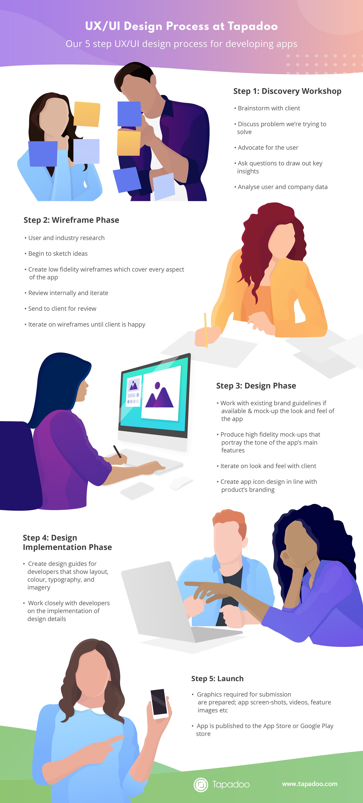

We follow a 5-step UX/UI Design Process here at Tapadoo. It all begins with our discovery workshop where we brainstorm with our clients.

We discuss in detail what our client wants to achieve with their app, all the while thinking about the user. Most sessions start with an [ambitious statement](https://tapadoo.wpengine.com/focused-engagement-through-ux-design-strategy/) and a [big goal](https://tapadoo.wpengine.com/focused-engagement-through-ux-design-strategy/). But this ambitious statement and big goal normally started out as a [smaller need](https://tapadoo.wpengine.com/focused-engagement-through-ux-design-strategy/). And it's generally this need where the focus of the app is.

Our goal with app development is not to develop an app that delivers '[everything but the kitchen sink](https://tapadoo.wpengine.com/focused-engagement-through-ux-design-strategy/)'. Rather it's to develop an app that delivers on the business requirements but focuses on the specific needs of the user.

We are champions for the user. It is our goal to direct the business in this way too. An app's success is only as good as the use people derive from it. More often than not, this use comes from a focused objective rather than an [ambitious statement](https://tapadoo.wpengine.com/focused-engagement-through-ux-design-strategy/) or [big goal](https://tapadoo.wpengine.com/focused-engagement-through-ux-design-strategy/).

Check out our UX/UI design process infographic to get an idea of how we work here in Tapadoo.

