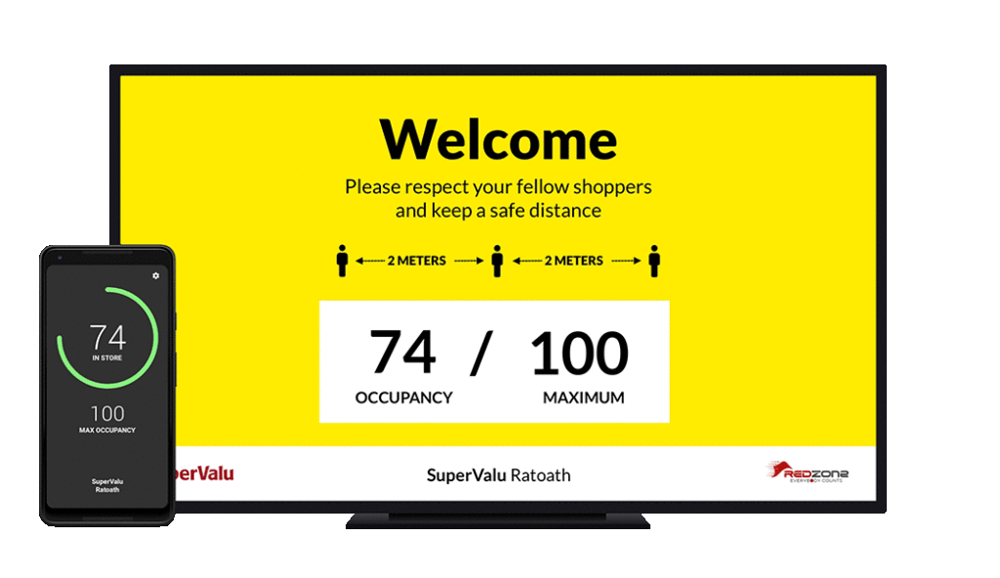
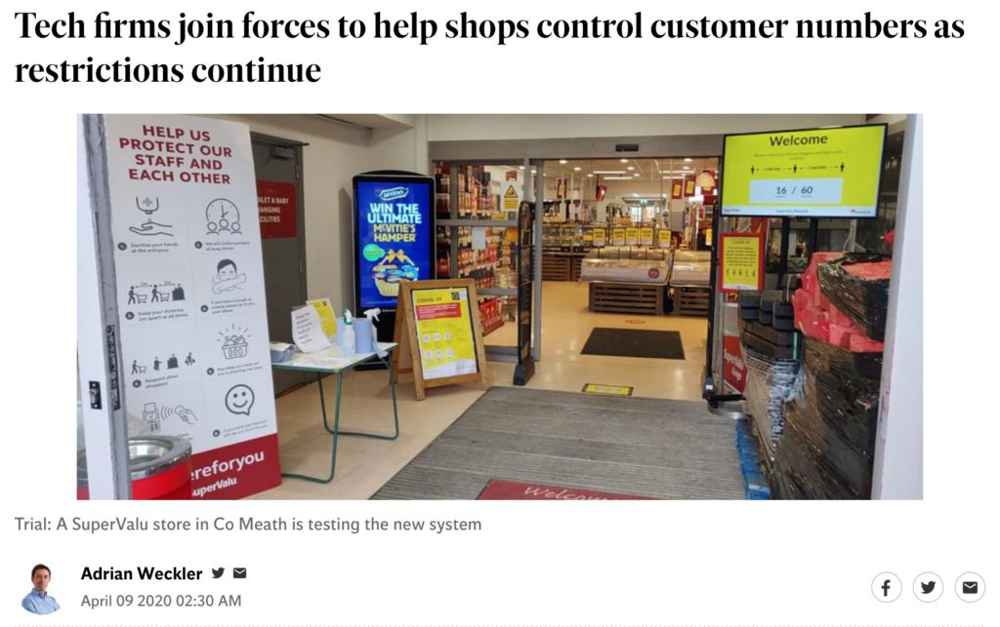

At the start of the lockdown, around March last year, I have to admit a case of the jitters. I was prospecting on five different projects. Some with existing clients, some with new clients. Our order book was good - but we always have to have an eye on up coming projects.

In one week, all five of those prospects went away. I received a number of calls, all along the lines of "we're not going to make a decision on this at this time." When you employ a full team, this is not a good message to hear.

The latest on this is all five of them came back. We won four of them. I still feel bad about the one that got away; this is my lot. You don't always celebrate the wins, but you feel the losses.

I digress. During this time, a new opportunity presented itself. I was introduced to [RedZone](https://redzone.ie), a company who specialise in "people counting". Ron, their CEO was looking for someone to help build a thing. He had all he needed on the hardware front, but wasn't a software person. He needed someone to do the software side of the thing. And with that, the concept behind [TRUCount](https://tapadoo.com/trucount-people-counting-app/) was born.

The concept sounded pretty simple: RedZone could provide and install sensors that count entrances and exits from a doorway. They could network them, and relay their information to a server. We needed a way to correlate all of the data, and some UI to display the results. The idea was to offer an Occupancy Management system for use in retail outlets. The need was well defined:

1. Shops have to limit the number of people allowed into a store for social distancing purposes.
2. This meant dedicating a person to the door, and the use of manual counting, or worse eye balling the store to form an opinion of if it was too crowded or not.
3. This wasn't a great use of a person's time - it either meant hiring dedicated security staff, or taking a shop assistant away from the duties of stocking shelves, checking out, etc. and instead putting them on the door.

We could see other advantages of something that could count and display the number of people in store:

1. It takes emotion out of the discussion. Anecdotally, we were told that people manning the doors were occasionally getting into discussions with shoppers; shoppers who believed they were letting too many into the store, and shoppers who believed the store could take more people, and wanted to be let in. Having a display of the store's current occupancy meant the store could operate a "traffic light" system that would be clear to all.
2. The door could now be unmanned, or at the worst, manned only at very busy times.
3. Which would lead to cost reduction.

Over a weekend, we got the basics working: we had a counting sensor communicating with a server, and relaying its information. It was a start. Once we knew we could get the components communicating, it was time to get stuck into a version 1. We quickly assembled a small internal team.

We started working on the server. We'd need a way to retrieve the data from the sensors, store the data, and publish the live counts. Our designer started the designs for a digital display - we elected to use browser technology to display a live count, and a needed designs to be clear, and manage a traffic light system. One of our developers began work on an app for use by store managers.

We chose LG smart TVs for the first displays. We needed something large, easy to source, and mountable, with a good quality built-in web browser. This is harder to find that you might think when it comes to a TV. We had considered a computer + monitor set up; we even produced a Raspberry PI connected via HDMI at one point, but we wanted less potential of failure for customer equipment.

After about a week, we had a first prototype: a sensor to be installed, along with networking equipment, and a large-screen to be mounted on the entrance. Ron worked with a local shop, and we went live in SuperValu Ratoath.

The independent [picked up on it](https://www.independent.ie/business/technology/news/tech-firms-join-forces-to-help-shops-control-customer-numbers-as-restrictions-continue-39114846.html). Covid stories were all the rage you know.

A prototype is not a product. As soon as you unleash your prototype, any yet-to-be-provided features will surface and surface quickly. We iterated over the following weeks. Here's some of the first things we had to add:

1. Audio prompts. The screen was working well enough, but we observed the store (from a distance!), and noticed some people were oblivious to the big screen. We worked to add a feature where every 30 seconds the screen would state "Welcome, please enter the store and observer social distancing" or "The store is currently full, please wait here". This worked well, but wasn't without technical challenges.
2. Managing staff counts. After a couple of days live we realised that we need to take into account the fact that some staff enter and leave through a staff entrance. They should be counted, but won't be _automatically_ counted. For this we added a feature called "staff offset" which allows a manager to change the number of staff in the building to correct the actual count.
3. Managing drift. On rare occurrences, a miscount could occur. For example, if a delivery was brought in though the front door, which was of similar dimensions and height to a person it could be counted as a person. Whilst rare, it meant the count could "drift" over time. We added a feature to zero the count at a specific time (e.g. 4 am) when we know the store is empty.
4. An android app. We produced an iPhone app to allow a store manager manage counts. This way, they could send someone to man the door if the store was near capacity. Of course, there was a need for an Android app too.
5. Handling outages. These counters are accurate and robust, but we did have a cellular outage on site early in the trial. We built  
    a monitoring system into the server – if a site was not heard of within a given period, a message is sent to Slack. And we added more robust calculations – essentially a way to recover and get an accurate count once the system came back online.

And there was the submission to Apple. We submitted the app, but the mere mention of the term "Covid" piqued the interest of the App Review team. First it was rejected. Then we were put through a series of questions as we were been mistaken for a contact-tracing app. In the end, we removed all mention of the scenarios in which occupancy management would be useful, and described it as an occupancy monitoring tool. It was then accepted.

This system is now adopted by Musgrave. But something else interesting happened. We're a member of [IRDG](http://www.irdg.ie), so we asked them to tell their membership about our occupancy management product. We figured, that there are other applications of this technology. We were thinking about factories, where shared facilities such as canteens must now manage the number of people present to ensure safety of their staff. We got our first factory install from that.

The system is now live being used by Johnson & Johnson, Mallinckrodt, Boston Scientific, Depuy, Gilead and Grifols; All pharma companies, whose staff are essential workers.

There's a number of reasons why these companies like TRUCount:

1. It is GDPR compliant. The counting works off laser sensors, not imagery. No personally identifying data is recorded or stored; it simply counts entrances and exits.
2. It can run independent of their networks. We typically install with dedicated dual-sim broadband routers, on a managed VPN. The system does not need access to a local WiFi or local area network (although it can!)
3. Installation occurs in a couple of hours.
4. The system is robust. Once calibrated, the system "just works".

We're still deploying. If you have a need, [get in touch](https://tapadoo.com/contact/).
