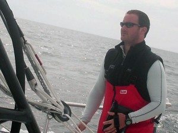

I'm stoked about this. This morning, I'm welcoming Adam McCarthy into tapadoo. I'd already known Adam though twitter as the guy who was giving Mac keyboard shortcut advice, and later got to meet him an XCake meeting. I was delighted when he responded to my tweet looking for iPhone developers. You may know him as [@adamkmccarthy](http://twitter.com/adamkmccarthy) \[caption id="attachment\_388" align="alignleft" width="300" caption="@adamkmccarthy"\]\[/caption\] Adam has written iPhone apps when working for Apple and Google, and is now bringing this experience to bear at tapadoo.

When not writing iPhone apps, tinkering with his mac, and babysitting the [mac mini](http://mini.adammccarthy.ie) Adam is a keen sailor who has [steered some very famous boats indeed](http://www.alinghi.com/en/). He also races mountain bikes, and is a staunch Munster supporter.

Adam is a Cork man, so I for one am looking forward to the O2 jersey meeting the Vodafone Jersey in the Summer! Do join me in wishing Adam all the best for his new role. Dermot.
