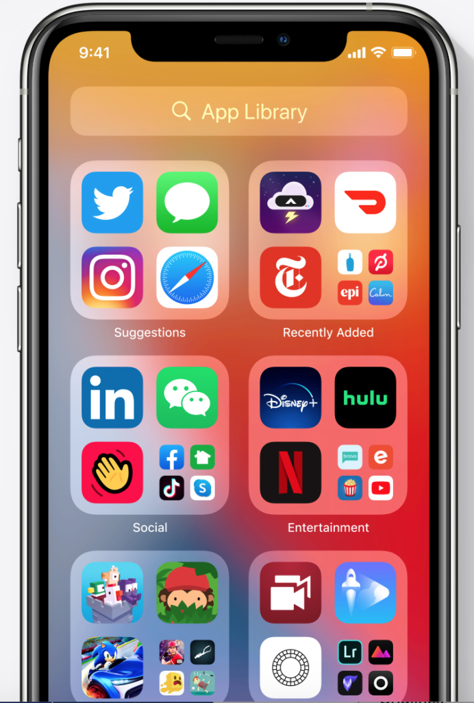
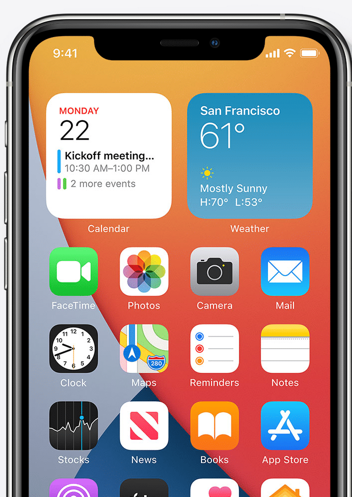
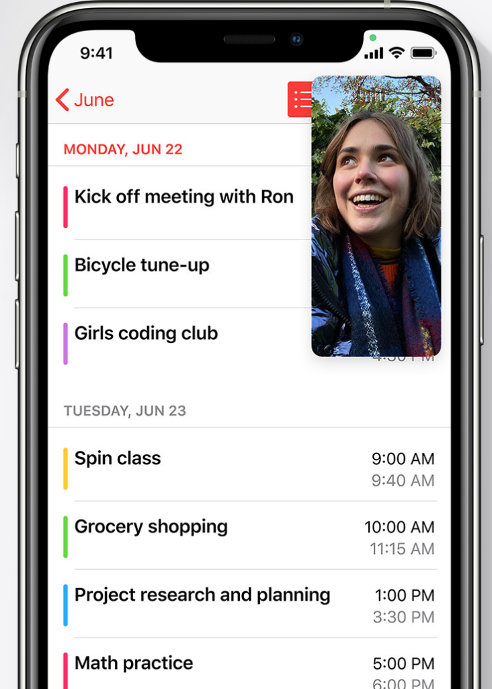
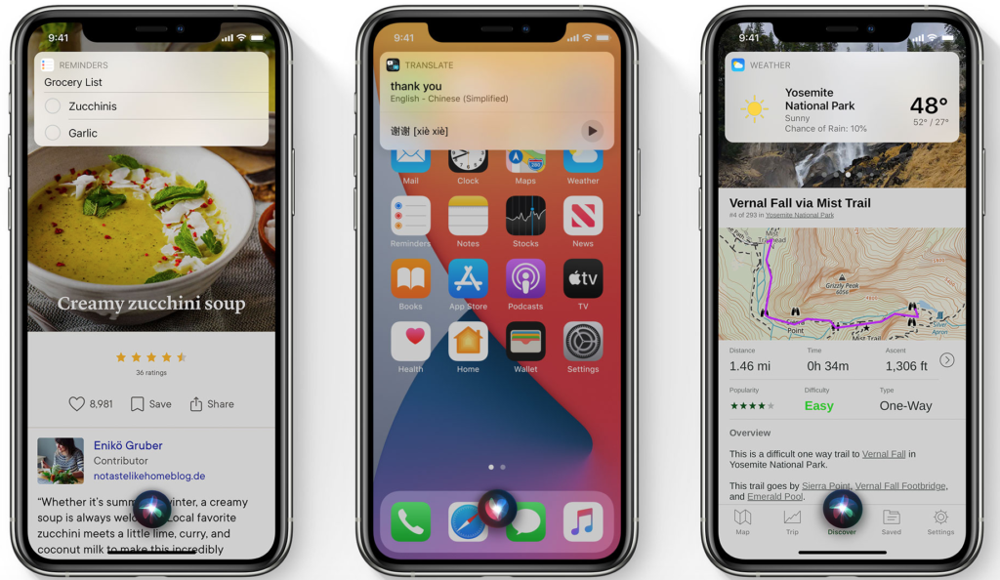
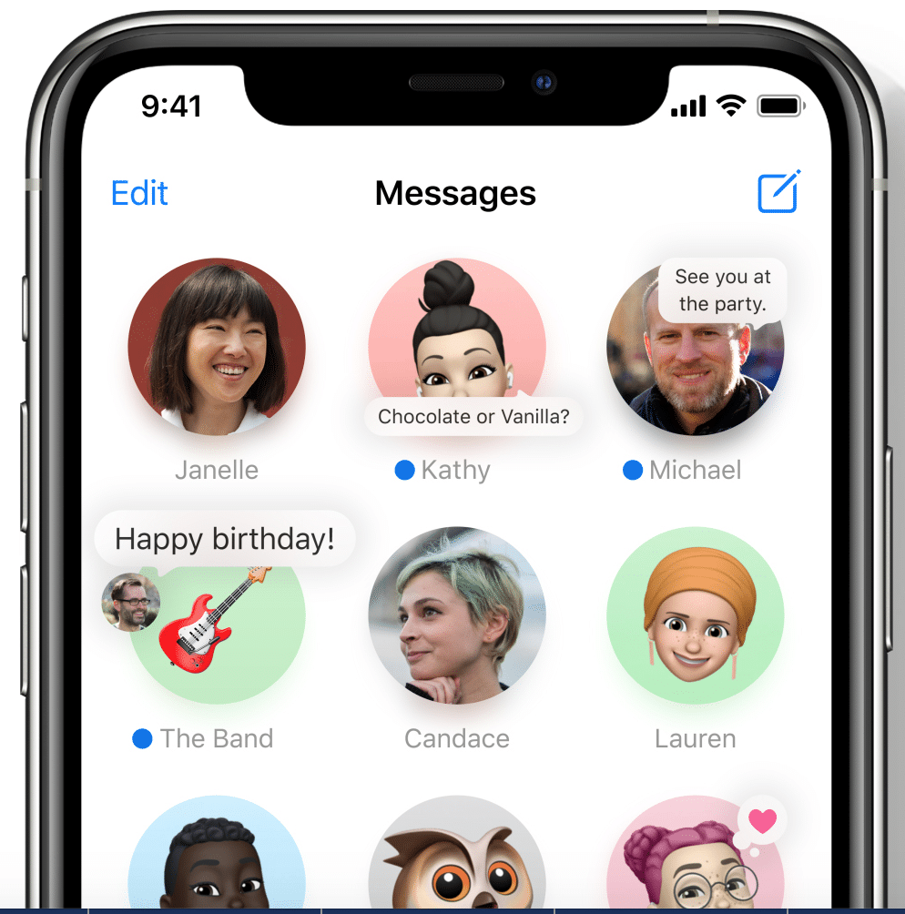
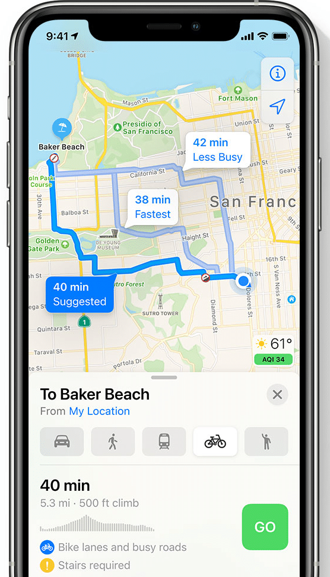
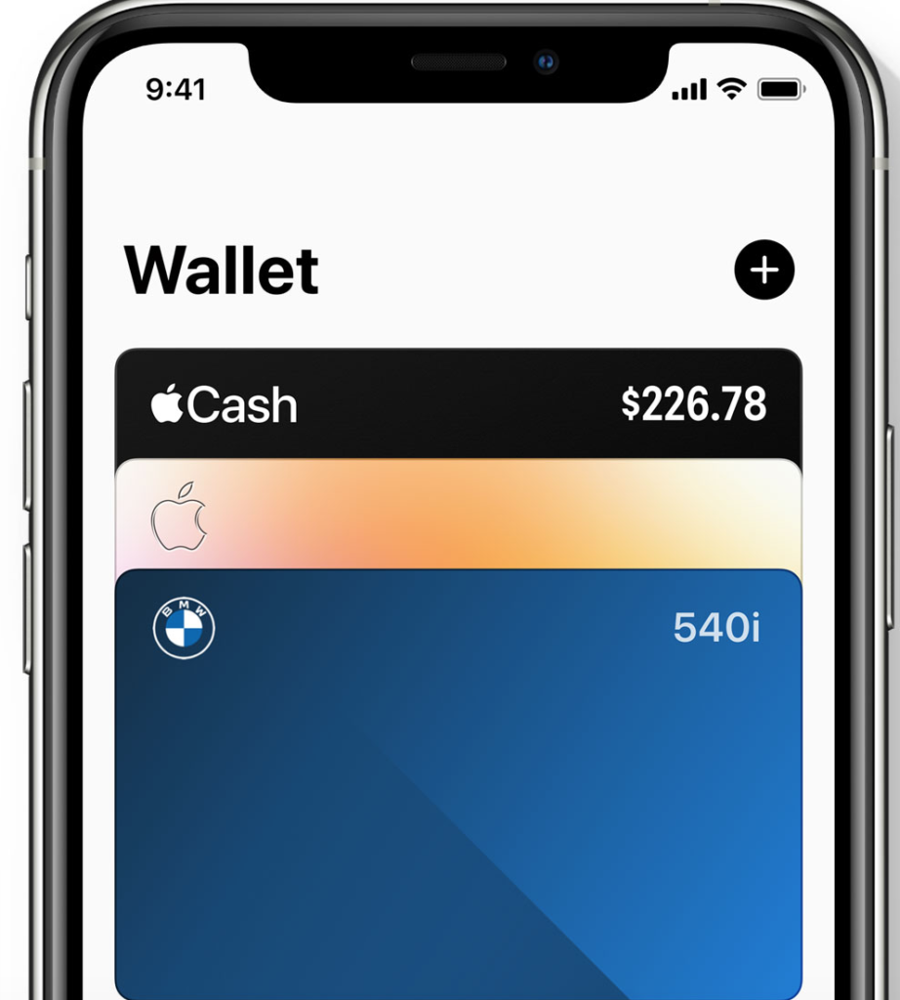
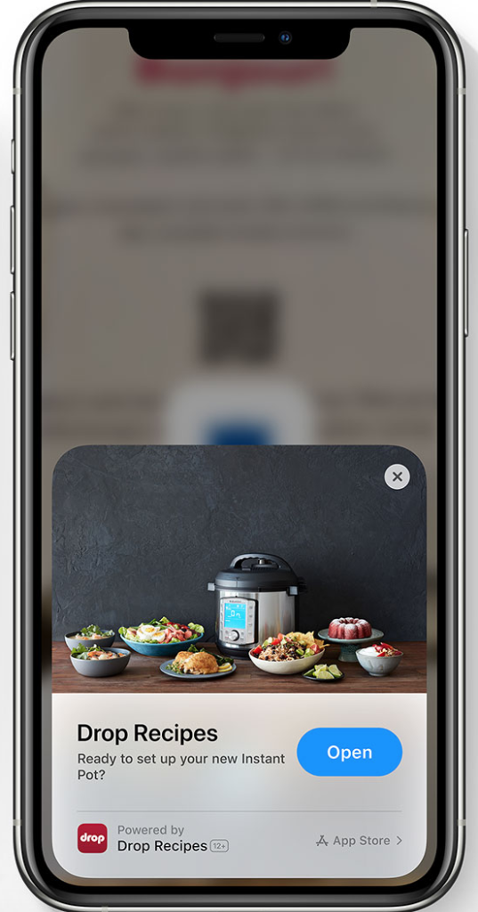

Apple just had their [WWDC](https://developer.apple.com/wwdc20/) conference, which was streamed completely online. This is the first time since WWDC began in 2005 that it has been streamlined exclusively online with no in-person event.

The video below from [The Verge](https://www.theverge.com) pulls together the Keynote speech in 18 minutes.

https://www.youtube.com/watch?v=\_Q8AKghK44M

### Here are the highlights from the release of iOS 14

#### App Library

If you are looking for a way to organise all the apps on your phone without doing a thing then look no further. Apple is working on a way to automatically organise all the apps in one simple and easy to navigate view. It's called the App Library and will be released with iOS 14.

Getting to an app is really easy. You can search for one in the search bar at the top where all the apps are organised in alphabetical order from A-Z. Below the search bar is a suggestions box of apps that you will potentially need. The suggestion box is based on on-device intelligence and makes it easy or you to choose the apps you are most likely to need next. Beside the suggestion box is the recently added box, which has apps that have been recently added. After this, all other apps are sorted into intuitive boxes for you to easily navigate to.

[App Library](https://www.apple.com/ios/ios-14-preview/)

#### Widgets

Widgets have been totally redesigned giving more information at a glance. They will be data-rich and come in different sizes so you can pick the size that suits you. You can see all the widget sizes in the gallery and you simply drag and drop the size you want onto the homepage. The Smart Stack allows you to swipe through widgets and choose the ones most appropriate for you. It can also do it for you automatically and the right widget will show up at the right time during the day.

[Widgets](https://www.apple.com/ios/ios-14-preview/)

#### Picture in Picture

Picture in Picture allows you to access apps on your iPhone while watching videos or on a FaceTime call. When you swipe to go home from a video or FaceTime it will automatically go into picture in picture, meaning you can access all your apps while the video is still playing. If you swipe it off the screen the audio will still play. You can drag the video to move to another part of the screen and make it bigger.

[Picture in Picture](https://www.apple.com/ios/ios-14-preview/)

#### Siri

Siri is being completely relaunched. It will pop up at the bottom of the screen and instantly launch the app. If you ask for information like the weather the results will appear at the top of the screen in a notification. It has over 20k more facts than it did three years ago and you can ask it to send an audio message. Siri can help with translations when communicating with a person in another language and a number of new languages are being added this year. The new app Translate can work completely offline and keep your conversations private. It supports 11 languages.

[Siri](https://www.apple.com/ios/ios-14-preview/)

#### Messages

You can stay connected to your most important conversations by pinning them to the top of your list. As those messages come in you can see an animation on the pin. If you like memojis you'll love all the new features. There will be 20 new hair and headwear styles to help create your personalised look. There'll be facemasks, professions and age categories to choose from. You'll soon be able to add an inline reply within a group message. You can then view replies within the full message or within their own thread. You can use mentions to message someone directly and choose the option of only being notified within the group if you have been specifically mentioned.

[Messages](https://www.apple.com/ios/ios-14-preview/)

#### Maps

The new map will be brought to the UK, Ireland and Canada this year. It will include a new feature called guides, that show you great places to eat, shop and meet friends. There'll be a dedicated cycling section within maps that shows the best cycling routes. The map will show if there's a steep passage coming up or if the big needs to be carried up stairs. Cycling is being brought to New York City, Los Angeles, San Francisco Bay Area, Shanghai and Beijing. EV Routing will show charging points along your cycle track and congestion zones will show you alternative cycle routes.

[Maps](https://www.apple.com/ios/ios-14-preview/)

#### Car Play

There will be some new categories added to the car play apps including parking, EV charging and quick food ordering. If you invest in the new 2021 BMW 5 series you can leave your car keys at home and use your iPhone to unlock and start your car!

[Car Play](https://www.apple.com/ios/ios-14-preview/)

#### App Clips

With App Clips, you don't need to download a full version or an app to gain access to it. App clips are light and fast and easy to discover. You can discover app clips with a new Apple Design App Clip Code. You'll see one of these codes when there's an app clip waiting to be discovered. After viewing the app clip you can download the full app with just a tap. App Clips are designed with the same security and privacy features as apps. When an app clip needs access to your location, camera, or sensitive data, it requires the same consent as a full app.

[App Clips](https://www.apple.com/ios/ios-14-preview/)

You can read the full set of features within iOS 14 [here](https://www.apple.com/ios/ios-14-preview/features/).

Maria Colgan

Digital Marketing Manager
