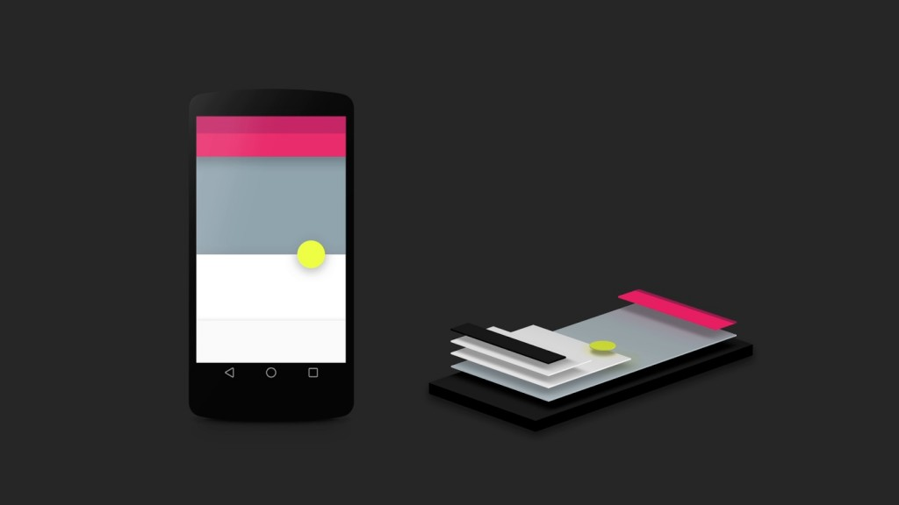
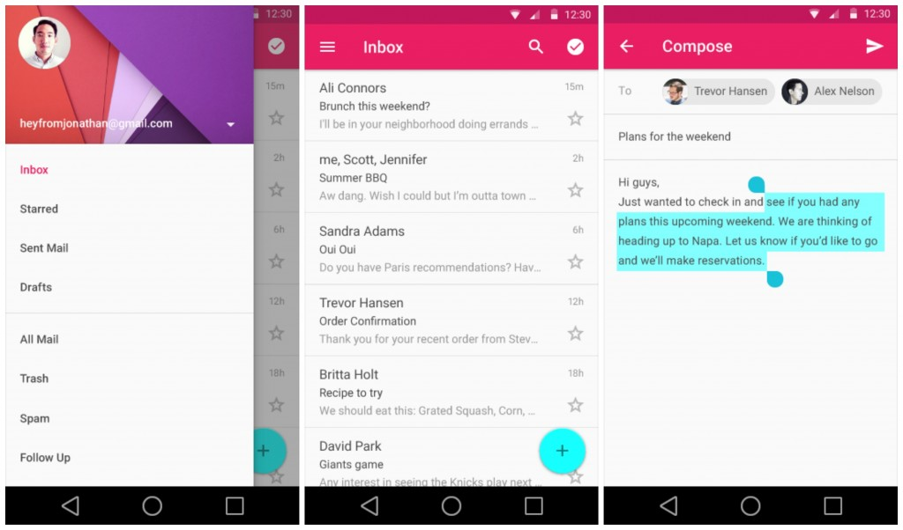
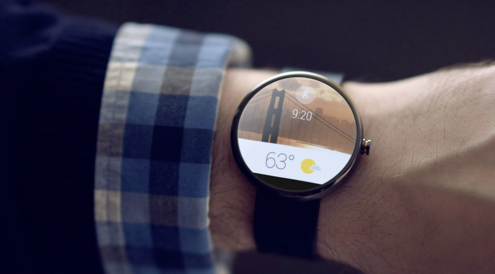
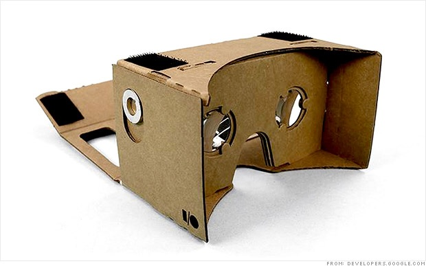

We're not far from the end of our internship now, and close to getting a number of projects out the door. Each day has provided a new challenge or problem, and it's nice to see that we're almost ready to leave what we've been working so hard on out into the wild.

Apart from just coding, I've been looking into what's next for Android as a development platform.

The dust has just about settled after WWDC and Google I/O. Now is the time for getting to grips with what's to come with the new style guidelines and technologies. Android is finally stepping forward in regard to a modern design philosophy, and "L", the current code name for the next instalment of the mobile OS, is set to be a big leap forward for the platform. Not only is the UI being revamped, but a lot of the underlying structure of the OS is set for improvement.

A big talking point of I/O was Material Design, Google's latest design philosophy, taking inspiration from the way we perceive objects in real life and adapting them to a two dimensional screen. This is simply done by giving UI elements relative elevation, so they sit similar to magazines on a coffee table, piled slightly over one another. It clearly shows the difference between foreground and background items, giving a clearer prospective of where you are in an application's flow.

Material design also heavily relies on element animations to give better coherence between different screens of an app. Abruptly jumping a user to a different screen can lead to an unpleasant user experience. What these new animations aim to achieve is to show the user where they are within the app, and display how they came to be at that point. This is something which was greatly lacking in Android up until now. While they did exist, it was hard to achieve fluid and rich animations between elements or screens, unlike in iOS, where animations are a rudimental component of every app. It will be exciting to see what developers achieve with this new animation arsenal.

Android Wear and TV were both huge announcements at I/O, paving the way for wearable computing and smart tv software applications. With all of the new development kits released for these platforms, it's possible to create applications for your TV and control them via your smart watch. Which is kinda cool, and offers a lot of potential for immersive experiences.

Another really interesting project, which aims to conserve battery life, was announced, called project Volta. It monitors every process running on your device, and anything that's gone rogue or is doing more then necessary, is restricted or shut down. This can add a couple of hours to your battery life, which may not sound like much, but at least now action is being taken to police greedy applications!

Finally, in an off the wall move, a biodegradable Eco friendly virtual reality headset was given to each attendee. Cardboard as it was aptly named, is an assemble yourself Oculus Rift type visor, which houses your Android phone, and used in conjunction with the Cardboard app, makes for quite an entertaining VR experience. We were lucky in the office that Rory was at I/O this year, and brought his in for everyone to play with! It's just a small precursor of what's to come with virtual reality, but what they were able to achieve with a few cheap components, is a serious feat in itself! If you can get your hands on one, it's a lot of fun!

Think I've covered enough for one week!

Until next time! Kevin.
