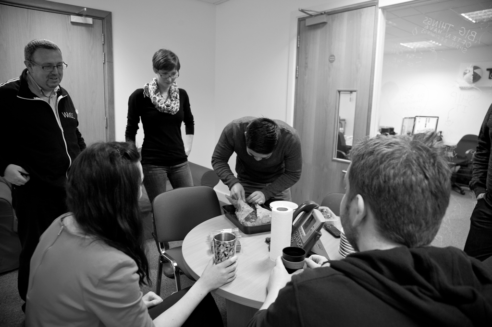
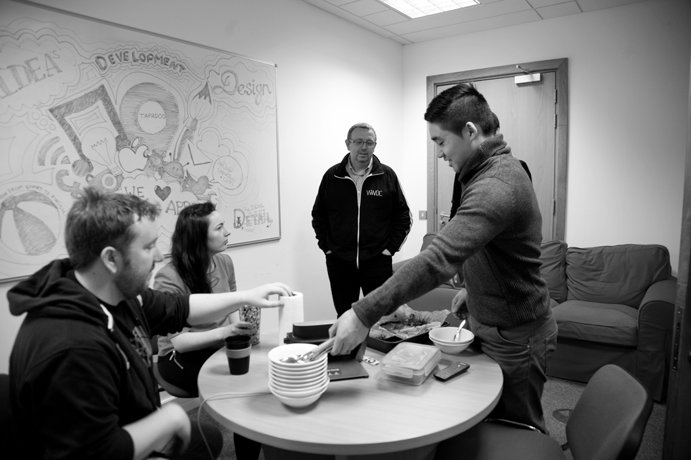
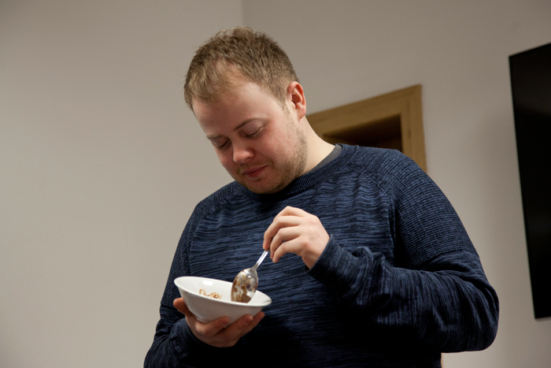

It didn't start as a thing. Neil just made a cake one day and brought it in. Everyone sat around eating cake, and I asked

> so who's up next?

And it snowballed from there. So each week, someone gets a turn. They make a cake and on Tuesday or Wednesday morning we take 20 minutes. To eat cake. And to talk about how the cake was made.

It's just a little break from developing apps. Baking gives you a chance to be creative, try something new and take your head out of a screen for an hour or two. We should all do that from time to time.

