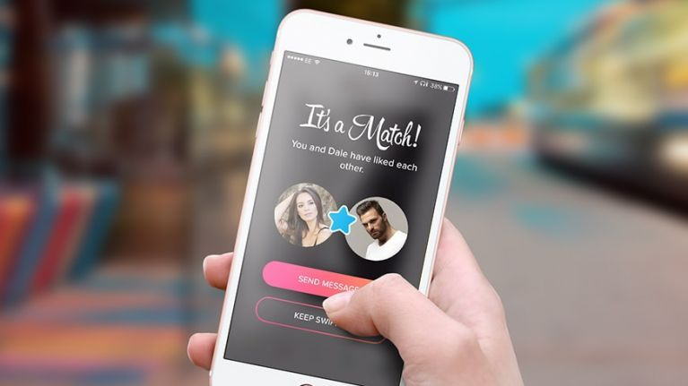
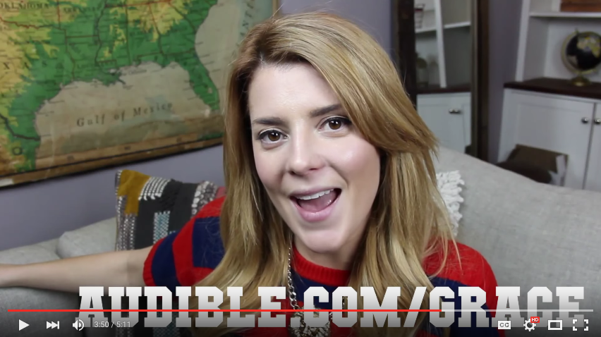
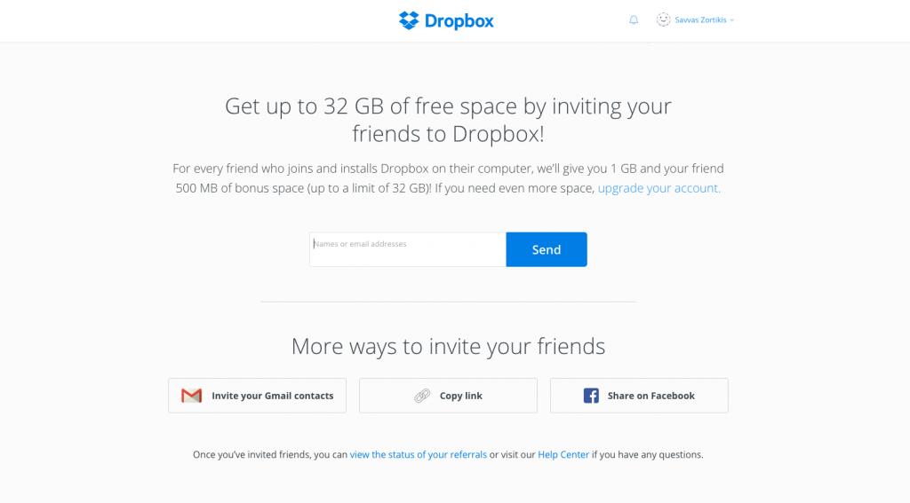
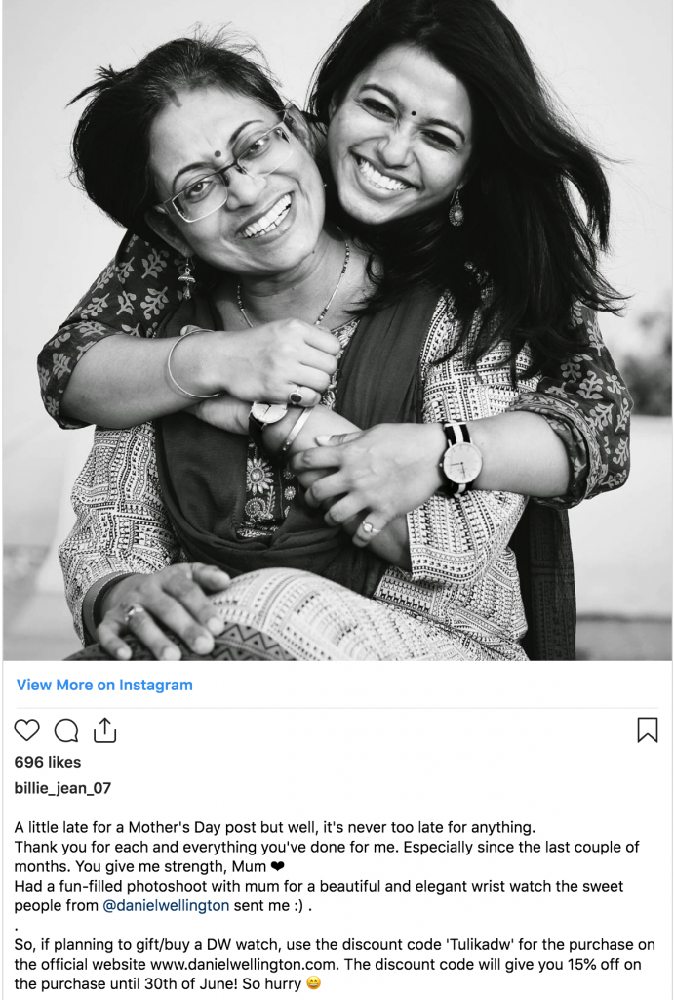

We spoke in a previous [post](https://tapadoo.wpengine.com/?p=4322) on the differences between an [organic word of mouth](https://tapadoo.wpengine.com/?p=4322) marketing campaign versus an [amplified word of mouth](https://tapadoo.wpengine.com/?p=4322) marketing campaign. An amplified word of mouth marketing campaign is where your business initiates the word of mouth marketing campaign.

[McKinsey](https://www.mckinsey.com/business-functions/marketing-and-sales/our-insights/a-new-way-to-measure-word-of-mouth-marketing) says that marketing-induced consumer-to-consumer word of mouth marketing generates more than twice the sales of paid advertising in categories as diverse as skincare and mobile phones.

So let's take a look at ways you can induce a consumer-to-consumer word of mouth marketing strategy to promote your mobile app.

### Word of Mouth Marketing Strategy

#### 1\. Brand Advocates

McKinsey emphasises a marketing-induced campaign generates twice the sales in certain categories. In other words, a marketing campaign that has been designed and developed inhouse with the aim of getting others to promote it. One way to do this is to design a word of mouth marketing strategy aimed at empowering [brand advocates](https://tapadoo.wpengine.com/brand-advocates-mobile-app-marketing/). A campaign whereby you actively engage and entice [brand advocates](https://tapadoo.wpengine.com/brand-advocates-mobile-app-marketing/) to promote your app.

[Brand advocates](https://tapadoo.wpengine.com/brand-advocates-mobile-app-marketing/) can help at all stages of the [marketing funnel](https://tapadoo.wpengine.com/mobile-app-marketing-planning/); brand awareness, [user acquisition](https://tapadoo.wpengine.com/8-user-acquisition-tactics-app-marketing/) and [user retention](https://tapadoo.wpengine.com/user-retention-tactics-mobile-app-marketing/). Develop a fun and engaging [brand advocate](https://tapadoo.wpengine.com/brand-advocates-mobile-app-marketing/) program and you will have a constant flow of users through your [marketing funnel](https://tapadoo.wpengine.com/mobile-app-marketing-planning/).

#### **Some stats on the importance of brand advocates**

> 83% are likely to share information
> 
> 50% are likely to influence a purchase decision
> 
> 90% of consumers report that a word of mouth recommendation is a leading influence on their purchase decision
> 
> 92% of consumers trust recommendations from people they know
> 
> 84% of consumers will take action based on recommendations from people they know
> 
> 90% of advocates write something positive about their purchase experience
> 
> [Source](https://www.jitbit.com/news/customer-advocacy/)

#### Example: Tinder

[Source](https://www.her.ie/life/tinder-released-pictures-top-30-right-swiped-people-428816)

Tinder is a great example of a word of mouth marketing strategy done right. When the app went live it relied solely on brand ambassadors to spread the word. In doing so, it received more than 50 million users in under two years. All through a clever word of mouth marketing strategy aimed at a dedicated crew of brand advocates.

#### 2\. Engage Influencers

Influencer marketing has been on the rise over the last number of years and the latest report from [Influencer Marketing Hub](https://influencermarketinghub.com/influencer-marketing-2019-benchmark-report/) shows that influencer marketing in 2019 would grow to more than double 2017 figures. This is based on a study with more than 800 marketing agencies, brands and other relevant professionals.

Nearly [40%](https://blog.twitter.com/marketing/en_us/a/2016/new-research-the-value-of-influencers-on-twitter.html) of Twitter users say they've made a purchase as a direct result of a Tweet from an influencer. And [59%](https://www.tomoson.com/blog/influencer-marketing-study/) of marketers are planning to increase their influencer marketing budgets over the next 12 months. This is the power of influencer marketing.

We spoke in a previous [post](https://tapadoo.wpengine.com/brand-advocates-mobile-app-marketing/) about how you need to gain influencers trust. Having done this you define your word of mouth marketing strategy on what you want to achieve through influencer marketing.  

#### Example: Audible

[Source](http://mediakix.com/2015/12/influencer-marketing-case-study-audible/#gs.bpgxyh)

Audible ran a very successful word of mouth marketing strategy aimed at influencers on YouTube. They wanted to target a wide variety of audiences in different demographics so worked with a number of influencers across a variety of interests. The categories included Gaming, Entertainment, Film & Animation, People & Blog, Education, How-To & Style, and Science & Technology.

The results; they reached more than [132 million](http://mediakix.com/2015/12/influencer-marketing-case-study-audible/#gs.bpeu6l) people on YouTube and received [83 million](http://mediakix.com/2015/12/influencer-marketing-case-study-audible/#gs.bpeu6l) video views.

#### 3\. Referral program

A referral program is where you reward existing customers for sharing your word of mouth marketing strategy. There are many great and simple examples of referral programs. It can be a relatively easy word of mouth marketing strategy to implement. It's also a great way of reducing the cost of [user acquisition](https://tapadoo.wpengine.com/8-user-acquisition-tactics-app-marketing/).

The biggest element of a referral campaign is being clear on your goals and what you are willing to give to those referring and those you are enticing to use your product or service for the first time.

A successful referral email campaign needs to get your customer or employee excited about what you are offering and make them want to share it with their friends and family.

#### Example: Dropbox

[Source](https://medium.com/inside-viral-loops/how-to-build-a-referral-program-inspired-by-dropbox-85c3a7b3b181)

[Dropbox](https://help.dropbox.com/space/earn-space-referring-friends) had one of the most successful referral program campaigns of all time. Within 15 months they grew their users from 100,000 to 4 million. Dropbox doubled its user base every three months over a two year period. Dropbox’s current valuation is [$7.5bn](https://www.ft.com/content/fc283fac-25e4-11e8-b27e-cc62a39d57a0) and according to founder/CEO [Drew Houston](https://twitter.com/drewhouston), referrals increased signups by 60% permanently.

#### 4\. Engaged social media audience

Social media is very much about engagement with other people. Many businesses forget this, instead preferring to use it as a steady stream for their content marketing. However, engaging your audience on social media can lead to brand loyalty and generate word of mouth marketing. Answering a complaint on social media can increase customer advocacy by [25%](https://www.convinceandconvert.com/social-media-research/5-social-media-customer-service-stats-you-must-know/).

If you don't engage with users on social media the risks are high. Not answering a complaint decreases customer advocacy by as much as [50%](https://www.convinceandconvert.com/social-media-research/5-social-media-customer-service-stats-you-must-know/).

#### Example: Daniel Wellington

[Source](https://www.referralcandy.com/blog/daniel-wellington-word-of-mouth-marketing/)

Daniel Wellington's [Instagram page](https://www.instagram.com/danielwellington/) is beautifully curated with their simple tagline 'minimalistic and elegant...a timeless classic'. They respond to both negative and positive reviews. This helped create an engaged following.

They shunned traditional advertising in favour of using a word of mouth marketing strategy on social media. The brand created a social media campaign in conjunction with the top Instagram influencers from around the world. They encouraged users to create their own images with a Daniel Wellington watch using the hashtag #danielwellington. More than 900,000 posts were created on Instagram. Daniel Wellington sold over one million watches in a year and earned revenue of $220 million. Not bad for a start-up with a $15,000 investment.

#### Conclusion

While marketing generally comes at a cost there are ways to create an effective campaign for a fraction of the price of traditional marketing. A word of mouth marketing strategy is one such way.

Maria Colgan

Digital Marketing Manager
